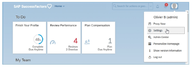
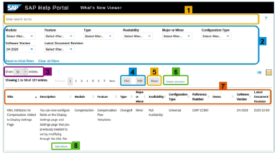
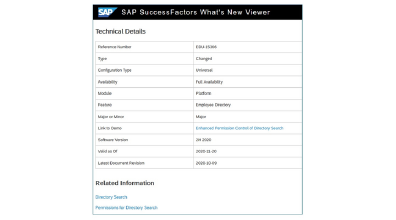

# SAP SuccessFactors HXM 入门

::: tip 本节目标

- 开始和一些可用资源

- 识别What's New查看器中的新特性
:::

## 可用资源 Resources Available To You

- SAP Help Portal
  包含配置指南等
- SAP Support Portal
  基本知识、指南、讨论板等
  与客户一起使用，以确定他们的需求。你负责：  
  - 解释配置工作簿中的可用选项
  - 提供反馈和建议
  - 配置实例
  Used with customers to identify their needs.You are responsible for:
  - Explaining the options available in the configuration workbook
  - Providing feedback and suggestions
  - Configuring the instance to match customer requests documented in the configuration workbook after sign-off

- 解释sf套件的一个关键概念 Explains Key SuccessFactors HXM Concepts
  - 提供一个序列来帮助实现 Provides a sequence to assist in implementation
  - 启动前会议的目的 Purpose of Discovery Pre-Kickoff Meeting
  - 解释SAP激活方法 Explain the SAP Activate methodology
  - 审查客户任何已有的任何现有人力资源流程 Review any existing HR process the customer may already have
  - 帮助您在启动前充分了解客户的计划 Help you build a good understanding of the customer’s plans prior to kick off
  - 回顾常见的讨论主题和范围界定问题 Review common discussion topics and scoping questions
  - 确定哪部分员工将参与人力资源规划流程（即高管、关键岗位等） Determine what portion of the workforce will participate in the HR planning process (i.e. executives, critical job roles, etc.)

- 客户调研 Customer Research
了解客户有助于你预测他们的需求，并提出有针对性的建议。发现更多客户信息的其他想法包括：
  - 审核销售团队收集的信息和文档 Reviewing information and documentation gathered by the Sales group
  - 与之前可能与客户合作过的其他顾问交谈 Conversing with other consultants who may have worked with customer previously
  - 访问客户网站 Visiting the customer website
  - 阅读行业杂志、网站等。 Reading industry magazines, websites, etc.

- Fiori用户体验 Fiori User Experience

    
  SAP Fiori是SAP的一套通用设计原则和UI标准。它在整个HXM套件和其他SAP解决方案中提供了一致的现代用户体验。
- Business Beyond Bias(不知道是啥)
- 数据保护和隐私功能 Data Protection and Privacy Features

  随着2018年第一季度的发布，我们的客户可以使用一些新的数据保护和隐私功能，一些现有功能也得到了增强。

  例如，数据保护和隐私功能包括报告个人数据更改的能力，以及报告应用程序中可用的所有数据主体个人数据的能力。客户还可以选择在国家/地区级别为在职和非在职员工配置数据保留规则，以便从SAP SuccessFactors应用程序中永久清除个人数据。

  客户有责任采用他们认为合适的功能。有关更多信息，请访问SAP帮助门户：<http://help.sap.com/cloud4hr>

- 新功能查看器 What's New Viewer

  为了保持竞争力，SAP SuccessFactors通过每年发布两次来增强产品。让我们的产品知识保持最新，并了解产品增强，以确保工具的最佳使用，这一点很重要。

  What's New Viewer提供我们所有的发布信息，组织在一个可搜索的移动响应网站中。这是我们发布信息的方式

  访问What's New Viewer

  在 SAP Help Portal中公开了: <https://help.sap.com/viewer/product/SAP_SUCCESSFACTORS_RELEASE_INFORMATION/latest/en-US>

  S-user也可以使用它，SAP SuccessFactors社区中的所有发布详细信息和资源：<https://community.successfactors.com/t5/Product-Updates-Blog/First-Half-2020-Release-Resources/ba-p/245094/>

    
  What's New Viewer包含：
  1. 搜索 Search：如果你知道自己在找什么，并且想快速找到，搜索是一个很好的选择。例如，您可以按关键字或参考号进行搜索。
  2. 过滤器 Filter：您可以使用以下一个或多个过滤器来缩小列表  
    a. 模块 Module：此过滤器用于将发布项目限制为特定产品或模块。  
    b. 功能 Feature：此筛选器用于在解决方案内或解决方案之间查找与一组功能相关的发布项。  
    c. 类型 Type：此过滤器用于根据发布项目是变更还是新内容查看发布项目。  
    d. 可用性 Availability：此筛选器用于根据发布项目的可用性状态限制发布项目。
      - 根据客户的配置类型，所有客户都可以使用完全可用的发布项目。大多数发布项目都是完全可用的。
      - 可用性有限的发布项目仅对部分客户可用，通常是因为他们需要额外的协议。  
    e. 主要或次要 Major or Minor：此过滤器用于根据项目对业务的影响来识别项目。  
    f. 配置类型 Configuration Type：此筛选器用于将发布项目限制为具有特定配置类型（通用、管理员opt-in等）的项目  
    g. 软件版本 Software Version：此筛选器用于将发布项目限制为您正在采用的版本中的项目。默认情况下，查看器会预过滤到当前版本。我们在查看器中保留旧版本，以便您可以返回并查看功能或模块随时间而发生的所有更改。
  3. 每页表格行数 Table rows per page：可以选择表格每页显示多少行。选项范围从25行到每页的所有行。下载What's New Viewer内容时，系统仅包括当前页面上显示的项目。
  4. 下载内容 Download the conten：你可以下载表格的内容到csv文件，并使用您最喜欢的电子表格工具打开和编辑它。你也可以下载它作为一个pdf文件。关于下载选项，有两件事需要注意。  
    a. 首先，下载将只包括查看器当前页面上显示的项目。如果要在查看器中下载完整的发布项目集，请选择先显示表中的所有条目。  
    b. 其次，下载只包括每行显示的文本。这意味着下载文件中不包括主题和演示的实际链接。
  5. 共享 Share：您可以使用共享功能通过电子邮件向同事发送链接。如果在共享表之前已对其应用了筛选器，则当收件人跟随链接时，这些筛选器仍将存在。如果收件人希望查看所有发布项目，只需清除过滤器即可轻松查看。
  6. 显示或隐藏列 Show or Hide Column：我们可以选择要在What's New Viewer中显示的列。当您下载What's New Viewer的内容时，无论您的列显示设置如何，系统都会包含所有列。
  7. 排序 Sort：我们可以在任何列中按升序或降序对项目进行排序。
  8. 完整主题的链接 Links to full topic：What’s New Viewer表中的每一行代表一个完整的发布信息主题。要查看完整主题，请选择“查看更多”链接。要从主题返回表格，请使用浏览器的“后退”按钮。

  相关信息的例子 Example of Release Information  
  有关特定增强功能的发布信息可能包括以下组件：  
  •发布项目的标题和简短描述，它们都出现在What's New Viewer表中。这些告诉你这是什么东西。  
  •我们为什么建造这个项目。  
  •前后行为。有时候，通常是照片。  
  •技术细节是查看器表中的所有其他字段。  
  技术细节可能包括演示的链接。演示通常很短，没有音频。  
  当产品指南中有更详细的信息时，会包含指向这些主题的链接。
    

- Additional Resources  
  SAP SuccessFactors An SAP Company website: <http://www.successfactors.com> Road map   
  explorer: <https://roadmaps.sap.com/board>  
  Online system help  
  Task-specific lab guides  
  SAP SuccessFactors Customer Community, <http://community.successfactors.com/>  
