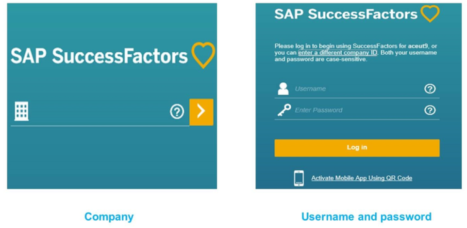
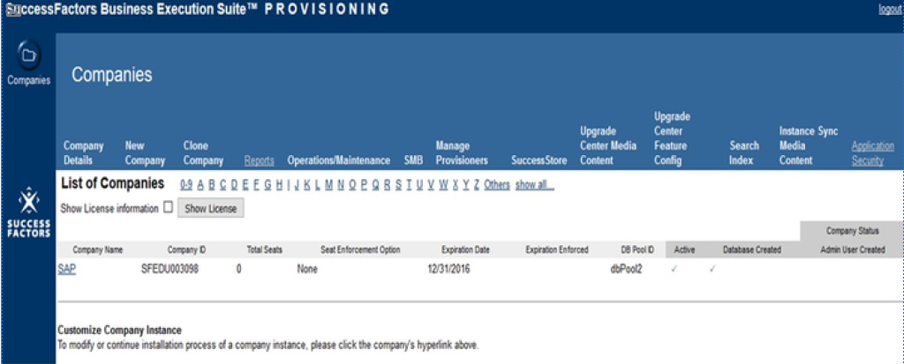
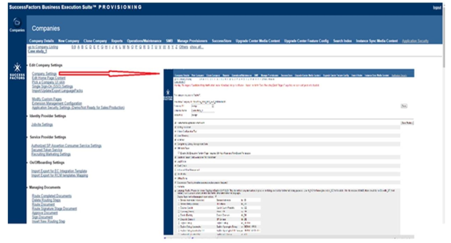
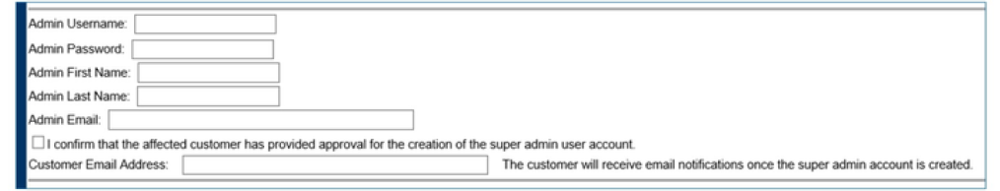

# 配置 SuccessFactors: Instance and Provisioning Access Management

[[toc]]

::: tip 本节目标

- 描述一个instance(实例)

- 描述provisioning

- 功能获取管理 Provision Access Management

- 描述如何讲一个实例和provisioning关联
:::

## 进入实例 Instance Access

  

实例是SAP SuccessFactors系统平台的前端或面向客户的视图。SAP SuccessFactors客户与专业服务顾问（实施者）合作，配置自己的SAP SuccessFactors实例。

顾问、管理员和最终用户都可以看到相同的界面，但就像其他系统一样，对工具的访问权限因配置的内容而异。

在配置期间，实施者将使用管理中心来设置和配置实例中的一些基本系统功能。这些措施包括：

- 定制实例的外观，包括公司颜色、徽标和主页的定制

    including company colors, logo, and customization of the Home Page

- 启用和自定义电子邮件通知模板

    Enabling and customizing Email Notification Templates

- 替换文本以匹配公司特定术语

    Replacing text to match company-specific terminology

配置完成后，管理员将使用管理中心修改实施期间配置的任何功能（如果需要），并启动和管理公司流程和周期，以及维护系统数据和用户。这些措施包括：

- 启动报表 Launching forms
- 导入和更新用户信息 Importing and updating user information
- 重置用户密码和帐户 Resetting user passwords and accounts

在本单元的后面部分，您将了解更多有关管理中心(Admin Center)常见任务和功能的信息。
公司ID(Company ID)是实例的唯一标识符。用户名和密码是与每个用户关联的登录凭据。

## 资源配置 Provisioning

Provisioning是SAP SuccessFactors用来控制客户实例许多方面的关键配置工具。本质上，Provisioning是系统的后端。

::: warning note
客户从不使用Provisioning，也无权访问Provisioning。
:::

实施者、顾问和支持代表将Provisioning用于以下目的：

- 修改公司设置，例如启用新功能 To modify company settings, such as enabling new features
- 打开或关闭已购买的模块 To turn purchased modules on or off
- 创建管理员帐户 To create administrator accounts
- 下载和上载包含自定义配置的模板以启用语言包 To download and upload templates that contain custom configuration To enable language packs

## 进入公司设置 Company Settings Access

  

登录到Provisioning时，在实施者的Provisioning帐户下可以看到公司实例列表。这些是特定实施者可以访问的公司实例。

| 实例 Instance | 实例ID Instance ID |
| ------------- | ------------- |
| 实例是前端或面向客户的视图。  | 每个实例都有一个称为实例ID的唯一标识符。每当客户使用用户名和密码登录到系统前端时，都会使用该实例ID。  |

单击“公司名称(Company Name)”链接开始配置公司设置(Company Settings)。

## 公司设置 Company Settings

Provisioning用于所有SAP SuccessFactors模块，该工具中有许多设置和选项。其中有一些特定于特定模块不同的配置、上载和导出的模板。其他功能用于启用或禁用全局或特定于模块的设置。

在Provisioning中配置的功能、设置和模板最终会控制实例前端上可供用户查看和使用的内容。其中许多都是在Provisioning中的公司设置中配置的。

公司设置中有许多元素与SAP SuccessFactors的不同模块相对应。为了更容易找到元素，请使用浏览器搜索功能
（Ctrl+F）并使用关键字进行搜索。对特定部分进行更改后，单击该部分的“保存功能(Save Feature)”按钮。在保存更改之前，系统将提示您输入公司ID。

### 创建管理员账户 Administrator Account Creation

Provisioning的另一个功能是可以创建新的管理员帐户。如果公司的常规管理员帐户被锁定，备份管理员帐户很有用。

要创建管理员帐户，请执行以下步骤：

1. 提供必要的详细信息（用户名和密码不能相同），然后单击创建管理员。  
Supply the necessary details (username and password can not be the same) and click Create Admin.
2. 使用具有公司ID的新凭据登录到前端。  
Use the new credentials with the company ID to log in to the front end.

如果您已配置单一收件人电子邮件功能，则无法通过设置创建超级管理员(Super Admin)，您将收到“创建管理员用户时出现异常：无法发送电子邮件(Exception in creating an Admin user: failed to send email)”消息。要继续，您可以暂时禁用该功能以创建超级管理员。

链接至“从资源调配创建管理员用户”视频：<https://sapvideoa35699dc5.hana.ondemand.com/?entry_id=1_b11ffdch>

## 练习1

### 添加新的管理员账户 Add a New Administrator Account

Business Example
You need to create an Administrator account.

1. 在“公司设置”屏幕上，使用以下详细信息创建管理员  
On the Company Settings screen, use the following details to create an Administrator
    - 帐户（滚动到公司设置屏幕的底部，找到输入此信息的位置）。 account
    - 管理员用户名-admin2 Admin Username
    - 管理员密码-CloudHXM1 Admin Password
    - 管理员名字–您的名字 Admin First Name
    - 管理员姓氏–您的姓氏 Admin Last Name
    - 管理员邮件-你的电子邮件地址 Admin Email
    - 勾选复选框-我确认客户已批准创建超级管理员用户帐户 Check box next to I confirm that customer has provided approval of Super Admin user account creation
    - 将您的电子邮件地址添加为客户电子邮件 Add your email address as customer email  
::: warning note
对于真正的项目，您需要在最后一个字段中输入客户的电子邮件地址。因为这是一种训练，你可以用你的。
:::

    点击创建管理员 Create Admin
2. 系统将要求您输入公司ID以确认更改。请滚动至页面顶部，查看公司ID。你会看到上面列出的公司ID。

::: warning note
对于其余的练习，除非另有说明，请使用管理员用户（HR Coordinator），而不是备份的admin2。
:::

## 查看和控制对实例的Provisioning访问 View & Control Provisioning Access to Instance(s)

作为管理员，您可以使用Admin Center中的管理Provisioning访问工具查看和控制谁有权访问您的实例。您可以查看具有设置访问权限的用户列表，还可以向任何用户授予设置访问权限或从中删除设置访问权限。只有您授予访问权限的用户才能访问您实例的Provisioning。
这是一项通用功能，可供所有SAP SuccessFactors客户使用。但是，它需要基于角色的权限，要访问此工具，必须首先授予您管理Provisioning访问权限。

::: warning note
Provisioning访问是特定于实例的。如果SAP SuccessFactors系统（开发、测试、生产）中有多个实例，则需要分别管理每个实例中的Provisioning访问。
:::

## 练习2

### 授予查看和管理资源调配访问权限 Granting Permissions to View and Manage Provisioning Access

Your customer wants to start with Role Based Permissions (RBP) and needs access to the tools.

1. 使用功能搜索(Action Search)导航到管理权限角色(Manage Permission Roles)并选择管理员角色(Administrators role)。  
a） 单击权限按钮 Click the Permission button  
b） 在管理员权限部分，选择管理系统属性链接 In the Administrator Permissions section select the Manage System Properties link
2. 授予管理员以下权限：查看设置访问权限(View Provisioning Access)、控制设置访问(Control Provisioning Access)权限  
a） View Provisioning Access使用户能够查看具有设置访问权限的用户  
b） Control Provisioning Access使用户能够控制哪些用户具有Provisioning访问权限。为了查看RBP所做的更改，您需要注销实例并重新登录。
c） View Provisioning Access。
d） Control Provisioning Access。
e） 点击完成。
f） 保存更改。

### 查看具有资源调配访问权限的用户 Viewing Users with Provisioning Access

授予适当的权限后，您可以查看有关对您的实例具有Provisioning访问权限的用户的信息。您还可以使用过滤器查找特定用户或具有相同状态的用户。

::: warning note
这是说明不是练习哦
:::

1. Go to Admin Center-> Manage Provisioning Access
2. 查看对您的实例具有Provisioning访问权限的所有用户的列表。您可以看到有关每个用户的以下信息：
    - ID
    - Username
    - Email
    - Status
3. 要按ID查找特定用户，请执行以下操作
    - a. 单击过滤器图标
    - b. 在Include部分，在第一个下拉菜单中选择ID或Status  
    ::: warning note
    只能使用“包含(Include)”操作和“等于”表达式进行筛选。不要在第二个下拉菜单中使用“排除(Exclude)”或更改表达式类型。
    :::
    - c. 在文本字段中，输入要查找的用户的ID
    - d. 点击OK
4. 要按状态查看用户列表，请执行以下操作：
    - a. 单击过滤器图标
    - b. 在Include部分，在第一个下拉菜单中选择ID或Status  
    - c. 在文本字段中，选择Active或Locked以查看具有该状态的用户列表
    - d. 点击OK
5. 要查看更多用户，如果列表很长，请滚动到页面底部，然后单击“更多”

### 批准一个Provisioning用户 Approving a Provisioning User

对Provisioning的访问受到严格控制。只有完成所需培训的SAP员工和合作伙伴才能获得Provisioning用户帐户。当您在管理Provisioning访问工具中批准用户时，他们不会立即获得对您实例的Provisioning的访问权限。他们仍然需要提交一份内部访问请求，以验证培训和其他要求。当您在管理Provisioning访问(Manage Provisioning Access)工具中“添加”用户时，您的批准将在此过程中被记录和验证。

### 删除一个Provisioning用户 Removing a Provisioning User

拥有适当权限后，从一个或多个Provisioning用户中删除对实例的Provisioning访问。

1. Go to Admin Center-> Company Settings->Manage Provisioning Access
2. Select one or more users
3. Click the delete icon
4. Confirm that you want to remove the specified Provisioning users by clicking OK

指定的Provisioning用户无法再通过Provisioning访问您的实例。

## Instance and Provisioning

实例是系统平台的前端，而Provisioning是后端。
配置，例如谁可以访问Compensation模块，都是在实例中完成的。但是，打开Compensation模块并使其在实例中可访问的配置是在Provisioning中完成的。

该表比较了谁有权访问实例和Provisioning，以及这两个入口点的用处。

| | 实例 Instance | 实例ID Instance ID |
| ------- |------------- | ------------- |
| 访问 Access | 实施者 Implementers 管理员 Administrators 最终用户 End-users  | 实施者 Implementers  SF客户支持 SuccessFactors Customer Support |
|用处 Uses|定制显示 Customize tiles 管理权限 Manage permissions 监管用户信息 Oversee user information 生成报表 Generate reports 启动和管理公司流程和周期 Initiate and manage company processes and cycles|配置系统功能 Configure system features 启用已购买的模块 Enable purchased modules 上传模板 Upload templates|
