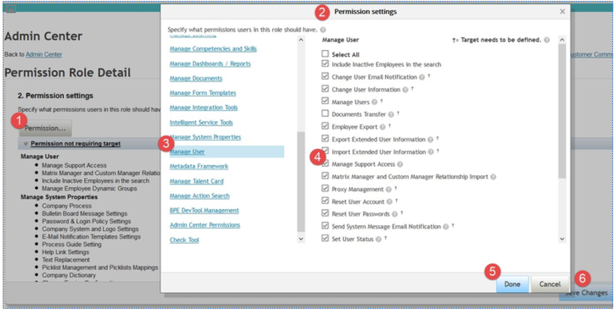

# 管理员基础

[[toc]]

::: tip 本节目标

- 识别管理员任务

- 解决用户登录问题

- 介绍 SAP Cloud Identity Authentication服务 (IAS)
:::

## 典型SF系统管理员的角色和职责 Roles and Responsibilities of a Typical SAP SuccessFactors System Administrator

不同的 SAP SuccessFactors 管理员具有不同的角色和职责。

以下职责与系统所有者或拥护者(System Owner or Advocate)相关：

- 作为系统用户和其他内部系统之间的主要联系人。  
Serves as the primary contact between system users and other internal systems Primary 
- 用户和系统之间的主要联系人  
contact between users and the system
- 及时了解系统功能的所有更新  
Stay current with all updates to system functionality
- 与公司负责人沟通，并向公司所有者推荐业务流程  
Communicate with and recommend business processes to the company owners

以下职责与系统管理(System Administration)相关：

- 管理和监督用户信息（例如，数据导入、密码和通知）  
Management and oversight of user information (for example, data imports, passwords and notifications)
- 管理用户权限和特权  
Management of user permissions and privileges
- 管理表单、能力、角色和系统通知  
Management of forms, competencies, roles and system notifications

以下职责与用户支持(User Support)相关：

- 为所有人力资源 (HR) 经理提供必要的协助和支持  
Provision of necessary assistance and support for all Human Resource (HR) managers 
- 实施新功能  
Implementation of new functionality
- 培训新功能并与用户沟通  
Training and communication to users of new functionality
- 为人力资源和管理用户提供报告协助  
Provision of reporting assistance to HR and management users Provision of coaching 
- 为经理和员工提供指导帮助  
assistance to managers and employees

### 特定于 SAP SuccessFactors 的通用术语 Common Terms Specific to SAP SuccessFactors

| 术语 Terms | 定义 Definition |
| ------------- | ------------- |
| 仪表盘 Dashboards  | 这是 SAP SuccessFactors 中的一种报表，包含图像、图表或 Portlet。  |
| 所有员工组 All Employees Group |  该组包含导入到 SAP SuccessFactors 且有权登录的所有个人。 |
| 员工数据文件 Employee Data File | 此文件包含所有用户记录。此文件中包括创建目标、评估或评估他人的员工。  |
| 表单模板 Form Templates | 这些模板包含每个表单的布局、部分和工作流。它们由 SAP SuccessFactors 顾问在实施期间创建。它们用于为群体创建单个表单。模板“类型”确定表单模板的用途。  |
| 表单 Forms |  表单也称为文档。它们从表单模板创建，用于记录信息，包括审核周期中的员工绩效评估。每个员工收到的表单都包含其所基于的表单模板的所有元素。分配表单的流程称为 启动 。 |
| 实例 Instance | 这是 SAP SuccessFactors 服务器上的客户空间。每个客户都与专业服务顾问共同配置自己的实例。  |
| 工作代码 Job Code | 这分配给每个员工，以便“映射”其角色的资格到工作代码。  |
| 视线 Line of Sight | 这描述了 SAP SuccessFactors 中个人的报告可见性。例如，经理可以查看直接下属及以下下属。  |
| 门户组件 Protlets | Portlet 为用户提供资源、图表或功能图，帮助他们完成流程。Portlet 是用于描述显示用户数据的图表或图像的术语。  |
| 评分量表 Rating Scale | 这确定了用户能够在评估期间选择的值和值的含义。  |
| 角色名称 Role Names | 这些代码也称为代码。角色名称用于多个模块并控制各种权限： ● E - 员工 ● EM - 员工经理 ● EH - 员工的人力资源代表 员工导入文件中提供的数据决定终止 EM 或 EH角色。如果客户在其实例中启用了基于角色的权限 (RBP) ，则还可以设置自己的角色。 |
| 流转步骤 Route Maps | 流转步骤建立工作流和员工在业务流程中遵循的步骤。流转步骤指定表单从一个员工移动到另一个员工的顺序，以及员工在每个步骤中可以进行的操作。  |

## 登录问题

### 重置密码 Reset Passwords

有三种重置用户密码的选项：

1. 重置单个用户密码（使用提供的密码）：将一个用户的密码重置为特定的新密码。
2. 重置单个用户密码：将一个用户的密码重置为系统生成的密码。
3. 重置用户组密码： 将特定用户组的密码一次重置为系统生成的密码。将显示组中选择的用户数。

::: warning Note
在 “重置单个用户密码（提供密码）” 页面和 “重置单个用户密码” 页面上， “登录方法” 列可用。  
为一组用户重置密码时，管理员可以查看受影响的 PWD 用户和 SSO 用户的计数。  
重置 SSO 用户的密码时，消息指示密码仅影响 Basic-Authentication 和基于令牌的 SSO。
:::

重置密码后，用户会收到系统电子邮件通知。用户登录系统时，会弹出 密码更改 窗口，要求用户更新其密码。如果已在实例中启用“安全问题”，则会提示用户在输入新密码之前选择安全问题。

### 重置锁定的用户帐户 Reset Locked User Accounts

仅当公司的密码策略设置允许用户在账户锁定前进行特定次数的失败登录尝试时，重置用户帐户才适用。

当用户超出允许的失败登录尝试次数时，系统会自动锁定用户帐户。

帐户锁定后，在管理员重置帐户之前，用户无法再次登录。重置科目后，只能重新激活科目以便用户可以重新登录。无需进行其他更改。

用户帐户故障排除

当用户超出允许的失败登录尝试次数时，系统会自动锁定用户帐户。这意味着一旦帐户锁定，用户将无法再次登录，直到管理员重置该帐户。重置账户时，只能重新激活账户，以便用户可以重新登录；不会进行其他更改。

作为管理员，您可以轻松快速地重置锁定的用户帐户。

- 在“管理员中心”中，单击 重置用户帐户 。
- 您将直接转到一个页面，您可以在其中按部门、部门、组或位置筛选员工，或者只需输入他们的姓名或职位代码。输入搜索条件并单击 搜索用户 。
- 系统生成符合条件的用户列表。已锁定用户显示在列表上，状态列中显示为红色 X。
- 通过单击用户名称旁边的复选框，选择要重置的用户。
- 单击 重置所选用户 以重置和解锁其用户帐户。

### 单点登录(SSO) Single Sign On (SSO)

单点登录 (SSO) 是多个相关但独立的软件系统的访问控制属性。使用此属性，用户登录一次并获得对所有系统的访问权限，而不会收到登录每个系统的提示。SuccessFactors 提供了多个 SSO选项，允许用户在不输入其 SuccessFactors 用户名和密码的情况下访问应用程序。

SSO 打开时访问和实例

客户启用单点登录后，将无法再登录其实例。以下步骤允许您使用辅助登录/安全访问登录到 实例。这是访问这些实例的建议方法。您无需启用部分组织 SSO 或要求客户通过其 SSO 门户登录。
启用辅助登录访问（管理支持访问）所需的步骤

- 进入您需要访问的公司 ID 的“配置”。
- 转到 公司设置 。
- 选中 “启用辅助登录功能” 框，然后单击 “保存” 。

以管理员身份登录或指导客户管理员完成以下步骤以启用“管理支持访问”：

::: warning Note
如果您自己进行更改，仍应确保客户 管理员 了解流程。他们可能希望在将来禁用此访问。
:::

访问要向其添加 “管理支持访问” 权限的角色。

- 转到管理员工
- 设置用户权限
- 管理权限角色并选择角色

::: warning Note
最佳实践是将此权限添加到客户的 系统管理员 角色。
:::

1. 选择权限设置
2. 选择管理员权限
3. 选择管理用户
4. 选择 “管理” “支持访问”
5. 单击 完成
6. 保存更改

启用指定用户的登录访问权限

您需要启用指定用户帐户的登录访问权限。为此，请转到 管理员中心 ，在 管理支持访问 中输入，然后输入用户信息和 搜索用户 。单击复选框选择权限并决定用户是否具有无限制或时间限制访问权限，然后选择 授予支持管理员访问帐户的权限 。

如果启用，在您禁用访问之前，支持管理员对用户帐户将具有不受限制的登录访问权限。客户可以遵循相同的流程，但选择 禁用支持访问 以拒绝我们访问用户。

使用启用的帐户登录 实例（仅限顾问/合作伙伴）

辅助登录与配置工具集成。转到 配置 工具并访问 客户实例访问 下的客户实例。

::: warning Note
您必须具有 配置访问权限 才能使此 生效。没有特殊配置。它只是正常配置访问的一部分。
:::

警告：此操作可从任意浏览器运行。不仅限于 SuccessFactors VPN。唯一的保护是配置登录名和密码。使用此工具时，请采取适当的预防措施。

## SAP Cloud Identity Authentication 服务 (IAS)

所有 SAP SuccessFactors 系统均可设置为使用 SAP Cloud Platform Identity Authentication服 务。它由 SAP 云解决方案（如 SAP SuccessFactors HXM Suite）以及 SAP Cloud Platform 应用程序和企业预置应用程序使用。

IAS 的一些优势包括连接到其他 SAP 解决方案以及更多安全性的能力。

IAS 还提供了比当前 SAP SuccessFactors 部分 SSO 选项更好的登录体验：

- 首次登录不需要密码特定的 URL
- 如果用户清除 cookie，则需要再次输入电子邮件或用户名

可根据基于风险的规则将 IAS 设置为需要不同的登录方法，例如密码、双因素验证或社交登录。

管理员能够使用升级中心中的功能从旧身份验证服务迁移到 IAS。目前，客户没有义务拥有 IAS，但必须遵循分阶段迁移计划。

有关 IAS 的详细信息，请参阅帮助门户：(<https://help.sap.com/viewer/> 568fdf1f14f14fd089a3cd15194d19cc/latest/en-US)
