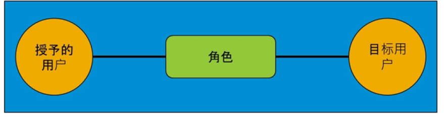
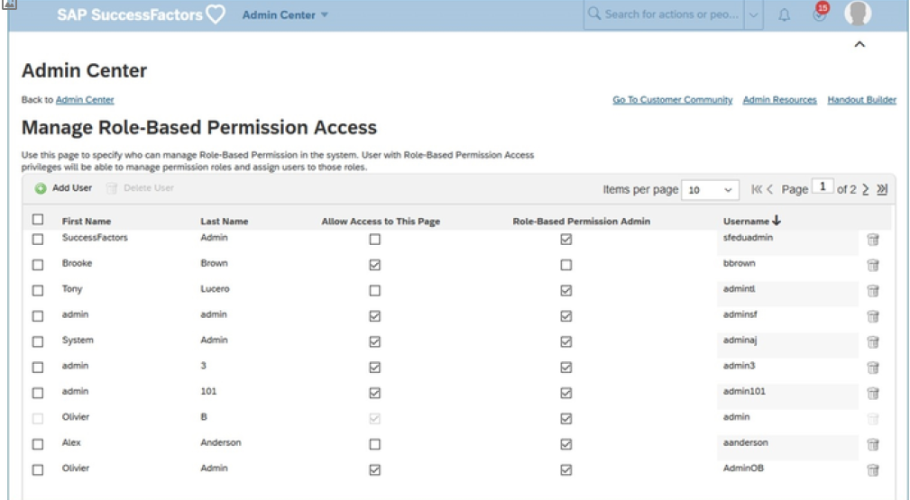

# 使用SAP SuccessFactors 中的基于角色权限 (RBP)管理用户控制

[[toc]]

::: tip 本节目标

- 使用SAP SuccessFactors 中的基于角色权限 (RBP)管理用户控制

- 创建权限组

- 创建权限角色
:::

## 管理员 Administrators

SAP SuccessFactors 提供不同的管理级别来管理每个用户在系统中的控制数量。系统管理有三个基本级别：

- 超级管理员 Super Administrator  
超级管理员在配置中创建。此管理员向他人授予成为超级管理员、安全管理员或常规管理员的权限。
- 安全管理员 Security Administrator  
安全管理员负责通过基于角色权限(role-based permission)框架中的角色(roles)和权限组(permission groups)管理所有安全性。
- 管理员 Administrators  
管理员是有权访问 SAP SuccessFactors 中的 管理中心(Admin Center) 页面的用户。

超级管理员 首次登录时， 管理员权限(Administrator Permissions) 页面上只有一个链接可见。这是管理基于角色的权限访问(Manage Role-Based Permission Access)。选择链接，向员工分配权限以作为安全管理员工作。

## 基于角色的权限 (RBP) Role-Based Permissions (RBP)

RBP 允许公司根据公司需求在 SAP SuccessFactors 中具有尽可能多的角色，并为每个角色授予不同粒度级别的权限。

在许多传统系统中，同一组的所有成员（如人力资源 (HR) 经理）在系统中具有相同的权限和访问权限。通过 SAP SuccessFactors 中的 RBP 框架，可以根据每个个人或组的工作授予权限。RBP还确定特定个人或组可以访问的人员组。例如，您可以创建仅负责薪酬和福利的角色，并将其授予美国和欧洲的区域经理。您可以对角色应用更多限制，例如，仅允许管理分配到特定角色的地区的全职员工。通过 SAP SuccessFactors 中的 RBP 框架，授予的权限及其范围都受到限制和控制。

在需要更高管理效率的大型公司中，您可以指定自动授予规则。例如，您可以将角色（如区域 HR人才经理）授予美国人力资源部的所有员工。这将自动化权限管理，以便向系统添加更多员工数据时，权限会自动调整为与美国 HR 部门以及美国员工匹配的规则。

### 基于角色的安全概念 Role-Based Security Concepts

- 该角色定义对数据和功能的访问。在此处定义您希望角色在 SAP SuccessFactors 中执行的操作。例如，是否应允许角色查看仪表盘？ The role defines access to data and functionality.
- 定义角色后，将角色授予由 授权用户圈子(Granted Users circle) 代表的用户组。 Once the role is defined, you grant the role to groups of users represented by the Granted Users circle.
- 最后，将授予的用户限制为对目标用户执行该角色。  例如，您可以决定经理（授权用户圈子）可以在其团队 目标用户 周期中查看仪表盘（在角色中定义）。 Lastly, you restrict the granted users to perform the role on target users. 
- 组可以是动态的，允许我们自动分配权限。例如，一组授予的用户可以是“销售部门中的所有员工”。  员工转岗或调出销售部门后，其权限将自动调整。 Groups can be dynamic which allows us to automate the assignment of permissions.
- 管理员可以定义多个角色。 Administrators can define many roles.

### 授予基于角色的权限 Granting Role-Based Permissions

这是在 SAP SuccessFactors 中授予 RBP 的简单流程：

1. 创建组：创建组并为其授予所需的权限，然后创建由具有这些权限的用户管理的组。  
Create Groups: Create a group and grant it the required permission, then create groups to be managed by users with those permissions.
2. 创建权限角色：定义不同的角色。权限角色定义对数据和应用程序功能的访问。  
Create a Permission Role :Define the different roles. Permission roles define access to data and application functionality.
3. 将角色授予用户或组：添加第二步中创建的角色到第一步中创建的目标组。这也称为将角色与目标群体相链接。  
Grant the Role to a User or GroupA: Add the target group created in step one with the roles created in step two. This is also referred to as linking the role to a target population.

将此流程视为谁（权限组）可以对目标人群执行什么（权限角色）或针对谁（目标人群）。  
Think of this process as who (the permission group) can do what (permission role) to, or for whom (the target population).

SAP Help portal 上提供的 SAP SuccessFactors 基于角色的权限实施指南包含 SAP Successfactors HXM 套件中使用的 RBP 的完整列表。

### 管理基于角色的权限访问 Manage Role-Based Permission Access

要访问功能“管理权限组(Manage Permission Groups)”、“管理权限角色(Manage Permission Roles)”、“用户角色搜索(User Role Search)”和“查看用户权限(View User Permissions)”，必须将用户添加到允许访问“操作搜索”中提供的“管理基于角色的权限访问(Manage Role-Based Permission Access)”功能的用户组中。

单击“添加用户(Add User)”并授予权限时，新用户将出现在列表中，并选中“基于角色的权限管理员(Role-Based Permission Admin)”框。

如果选中 允许访问此页面(Allow Access to This Page) 复选框，则用户将能够从具有此功能访问权限的组中添加/删除其他用户。作为安全预防措施，建议至少有两个用户访问此页面。

RBP 管理员无法取消选中此页面的权限（因为这将禁止他/她查看此页面，因此无法重新授予访问权限）。复选框需要始终选中且无法更改（以灰色标记）。

链接到“管理新管理员用户的 RBP 访问”视频：<https://sapvideoa35699dc5.hana.ondemand.com/?entry_id=1_gthua883>

## 权限组 Permission Groups

本部分提供有关权限组以及管理员如何在 SAP SuccessFactors 中创建、修改和删除权限组的常规信息。

在 SAP SuccessFactors RBP 框架中，权限组用于定义具有相同权限组的员工组。例如，您可以创建名为“美国薪酬经理”的权限组，以包括所有有权访问薪酬信息的美国经理。同样，您可以创建权限组，以定义授予的用户组或用户可访问的目标群体。例如， 美国薪酬经理 组监督的 美国员工 组。

权限组还允许您对符合预定义条件的员工进行分组。可以通过单个参数（如 HR 部门的 HR）创建此条件。或者，您可以具有多个条件。例如，您可以创建带有部门和地点条件的美国人力资源组，以创建仅包含美国人力资源员工的组。您可以添加更多参数以细化组。例如，要限制 US HR组仅包括有权访问财务部门的美国 HR 员工，这将创建 US HR Finance。

::: warning Note
SAP SuccessFactors 允许管理员通过应用程序编程接口 (API) 管理 RBP 安全设置更改，例如将用户分配到角色和创建权限组。
:::

### 动态组的创建 Dynamic Group Creation

要创建动态群组，请转到 管理中心->管理群组(Manage Groups) ，然后单击 新建(Create New) 。在 组名称(Group Name) 字段中，输入动态组的名称。通过从“人员库(People Pool)”下拉菜单来选择群组成员。如果需要，您可以在同一组中包括多个人员库。然后选择要从组中排除的人员。完成后，单击 完成(Done) 。

定义权限组时可以使用的字段是下列任何标准字段，在启用 Employee Central 时也可以是 HRIS字段。可用的标准字段仅限于以下列表。

权限组中允许用作过滤器的标准字段：

如何指定更多要使用的字段？

您可以通过在继任数据模型(Succession Data Model)中编辑 `<dg-filters>` 元素的 `<permission-group-filter >`子元素来指定显示用于定义权限组的字段。`<dg-filters>` 标记表示动态组过滤器。示例 XML 片段显示在下方，后面是这些 XML 标记的描述。

如果未在 `<dg-filters>` XML 配置中指定任何字段，则 RBP 将缺省显示上表中列出的所有可能字段。

对于非常大的组织（超过 100,000 名员工），它有助于性能限制用于定义组的字段数量。至少，如果客户不想使用所有可用字段，则移除您确定不需要的字段。

上述 XML 标记的工作方式如下：

`<dg-filters>` 标记具有两个子标签，`<my-filter>`和 `<permission-group-filter>` :

- `<permission-group-filter>`  
用于指定可显示在 RBP 权限组 UI 中的字段。通过添加 `<standard-element-ref >`或 `<hris-element-ref>` 子元素（如果已启用 Employee Central）在此指定字段。
- `<my-filter>`
用于指定“我的组(My Groups)”功能中使用的字段，这是独立且不相关的功能。

### 权限组修改 Permission Group Modification

您可以随时修改权限组的参数。以下列表包括一些附加修改：

- 权限组名称 Permission group name
- 确定权限组成员的条件 The conditions that determine the members of the permission group
- 将成员纳入权限组 Inclusion of members to the permission group
- 从权限组中排除成员 Exclusion of members from the permission group

### 权限组合并 Permission Groups Merge

公司进行更改以改变某些系统的访问要求或 SAP SuccessFactors 中的组织更改时，需要修改权限组。例如，如果公司将两个部门（美国财务部门和加拿大财务部门）合并到一个新的北美财务部门，则管理员可以通过将加拿大财务员工纳入美国财务组来修改美国财务权限组到北美财务 。

最好修改组而不是删除组。仅删除未分配员工的组。以新北美财务部门为例，只有在验证所有员工都包含在北美财务组中并且所有先前角色都重新分配到新组后，之前的“加拿大财务”组才有资格删除。

要修改动态组，请从要修改的组的“执行操作(Take Action)”下拉菜单中选择操作。通过选择或排除新组成员来编辑组。还可以复制、删除、查看汇总或查看组的变更历史记录。完成更改后，单击 完成 。

静态权限组存储用户的静态列表，而不是基于动态条件的列表。更改用户信息不会刷新组成员。可将静态组用作 RBP 访问组或目标组。

目前，您可以使用静态权限组执行以下操作：

- 查看、添加和删除静态权限组的成员。  
View, Add, and Delete members of static permission groups.
- 通过 CSV 文件导入静态权限组。可以是完整导入，也可以是替换导入。  
Import static permission groups via CSV file. This can be either a full or replacement import.

创建静态权限组必须在Admin Center -> Manage Permission Groups->Import Static Groups中通过文件导入。

可以通过 UI 编辑组来添加或删除成员。

## 权限角色 Permission Roles

RBP 使用权限角色对一组权限进行分组。将权限分组到角色后，可以将角色分配给一组用户，授予他们访问系统中特定任务和功能的权限。

权限角色由一组权限组成，授予员工访问员工或员工组的权限。因此，授予权限角色的员工或组可以访问 SuccessFactors 应用程序的特定方面或员工数据方面。通过此访问，他们可以在应用程序中为其他员工组执行功能。

基于角色的权限允许您向特定员工、经理、组或公司中的所有员工授予角色。这些角色可以提供非常细化的权限，如下例所示：  
示例：可能有“人力资源薪酬和福利经理(HR Compensation and Benefits Manager)”、“人力资源销售经理(HR Manager for Sales)”和“人力资源学习和发展经理(HR Learning and Development Manager)”等角色。虽然这三者都是 HR 经理，但是他们的角色已经明显分明 - 一个处理薪酬和福利，另一个处理销售团队，第三个处理学习与发展。

当你的权限角色由一个或多个需要目标群体的权限组成时，你需要指定一个目标来完成角色的创建。需要目标人群的角色将包含权限，该权限授予组执行操作或查看其他员工信息的权限。  
示例：经理可能具有一种角色，其中一个权限允许经理修改其所有直接下属的工资。在此示例中，经理的直接下属代表权限角色所需的目标群体。

客户可以拥有与公司所需数量一样多的权限角色。

### 权限角色创建 Permission Role Creation

本部分介绍 SAP SuccessFactors 权限角色及其使用方法：

- 创建权限角色
- 修改、复制和删除权限角色
- 查看用户权限

在 SAP SuccessFactors 中，权限角色控制允许员工或员工组执行特定功能的访问权限。他们还可以控制谁可以查看属于其他员工的数据。通过 SAP SuccessFactors RBP 为特定员工、经理或组分配角色。还可以为公司中的所有员工分配角色。

授予权限角色之前需要考虑的一些主题如下：

- 公司中的不同角色 The different roles in the company
- 分配到每个角色的员工 The employees who are assigned to each role
- 员工可访问的数据 Whose data the employees can access

解决所有问题后，权限角色创建相当容易。限制创建的权限组和角色的数量非常重要。如果创建的角色过多，则存在权限重叠和组内访问不一致的风险。这使得修改和删除权限变得更加困难，因为每个重叠角色都需要研究以验证是否全部更改或删除，以满足新要求。

### 授予权限角色 Grant Permission Roles

您可以将权限角色分配给每个人或员工子集，由权限组、目标群体或关系确定。在 RBP 中定义角色时，可以将角色分配到已创建的组，也可以根据层次结构关系分配角色。某些角色将要求您同时分配目标群体，这些目标群体仅对角色中的特定权限是必需的，并且系统会在需要目标群体时通知你。

- 权限组 Permission groups：将权限角色分配给已定义的用户组。但是，关系也可以在此处发挥作用，因为您可以定义授予用户的经理具有相同的权限。还可以定义要在层次结构中授予此权限的级别数量。  
::: warning Note
如果要将角色授予指定用户，首先必须创建组并将用户添加到此组。然后，您可以将角色授予刚创建的组。
:::
- 目标群体 Target Population：根据角色中包含的权限，您可能还必须定义目标群体。并非所有权限都需要你定义目标群体。例如，如果权限仅包含对应用程序的访问（例如学习访问权限），则无需添加目标组。对于某些权限，必须在“权限设置”屏幕中定义目标群体。这由权限名称旁边的“t”图标标识，并显示以下文本：t= Target needs to be defined.。
- 关系 Relationships：可使用派生自工作关系对象的关系（例如，经理 - 员工关系）定义访问组。这些关系可以是分层关系，也可以是非分层关系。  
::: warning Note
如果允许各个经理具有相同的权限，则可能会对性能产生负面影响。然后，只要此类管理器尝试访问以这种方式授予的元素，就必须检查层次结构。
:::

将权限角色分配给每个人或动态组后，您将具有以下目标群体选项：

- 所有人 Everyone
- 以下项的目标群体： Target Population of:
  - 授权用户的部门 Granted User's Department,
  - 授权用户的部门 Granted User's Division,
  - 授权用户的位置 Granted User's Location,
  - 授权用户的经理 Granted User's Manager,
  - 授予用户的同级人员和 Granted User's Peers and
  - 授权用户（自身） Granted User (Self)
- 您可以选择权限组

还有一个选项是“将授予的用户排除在自己具有权限访问权限之外(Exclude granted users from having the permission access to themselves)”。例如，当我们谈到潜力时，这对一些组织来说是一个有趣的选择。一组人力资源经理应该能够看到其所在位置的每个人的潜力信息，但不能看到他们自己的潜力评级。

### 向组授予角色 Granting Roles to Groups

创建角色后，必须将该角色分配给一组员工。这样可以确保为员工授予执行任务所需的权限。

1. 使用操作搜索导航到 管理权限角色(Manage Permission Roles) 。
2. 选择您创建的其中一个权限角色。
3. 在“权限详细信息(Permission Detail screen)”屏幕的“将此角色授予(Grant this role to)”部分，单击 添加(Add) 。
4. 显示“将此角色授予(Grant this role to)”屏幕时，选择 权限组(Permission Group) 。
5. 单击 选择(Select) 以选择要分配到此权限角色的访问组。  
您可以允许经理拥有相同的权限，并定义您希望授予此权限的层次中的级别数。但是，允许各经理拥有相同的权限可能会对性能产生负面影响。然后，只要此类管理器尝试访问以这种方式授予的元素，就必须检查层次结构。
6. 排除授权用户(Exclude Granted Users)：对于某些权限，可能需要从对自己应用权限时排除授予的用户。为此，选择排除授权用户对其自身具有访问权限 。  
示例：  
如果角色授予编辑工资的权限，您希望阻止此权限组的成员也能够编辑自己的工资。
7. 单击 完成 将此角色分配给定义的用户。您将返回到 权限角色详细信息(Permission Role Detail) 页面。
8. 单击 保存更改 以完成创建角色。

后续步骤：

如果需要，为角色分配目标群体。

目标群体分配到需要代表其他员工执行任务的角色。

1. 使用操作搜索导航到 管理权限角色(Manage Permission Roles) 。
2. 选择您创建的其中一个权限角色。
3. 在“权限详细信息(Permission Detail screen)”屏幕的“将此角色授予(Grant this role to)”部分，单击 添加(Add) 。
4. 选择 所有人(Everyone) 或选择 目标群体(Target population of) 以选择组。
5. 单击 选择 以选择要分配到此权限角色的目标组。
6. 排除授予的用户 ：  
对于某些权限，可能需要排除授予的用户对其自身应用权限。为此，选择 排除授权用户对其自身具有访问权限 。  
示例：  
如果角色授予编辑工资的权限，您希望阻止此权限组的成员也能够编辑自己的工资。
7. 单击 完成 将此角色分配给定义的用户。您将返回到 权限角色详细信息 页面。
8. 单击 保存更改 以完成创建角色。

### 使用关系授予角色 Using Relationships to Grant Permission Roles

有些关系可以通过员工字段指定，并通过员工数据等工具进行管理。

常规关系类型 (General Relationship Types)：层次结构关系的特征是授予用户与目标用户之间的直属部门。这些是员工及其经理、员工及其第二经理或备选经理之间的关系。另一方面，非层次结构关系是单级关系。其中包括员工与 HR 经理、跨部门经理和自定义经理的关系。尽管每个员工只能有一个经理、一名第二经理和一名人力资源经理，但他们可以拥有多个跨部门经理和自定义经理。

仅员工中心 (Employee Central Only)：如果员工具有全球分配（即其他国家/地区的职位），则他们既有国内经理，又有外派地经理。此外，他们还有一位国内人力资源经理和一名外派地人力资源经理。所有经理都需要访问员工的家庭工作，以及员工的主工作。全局分配的以下附加关系类型涵盖这一点：

| 五大关系类型 The Five Genera Relationship Types | 仅员工中心:全局分配的关系类型 Employee Central Only: Relationship Types for Global Assignments |
| ----------- | --------------------- |
|经理 Manager|定居地经理 Home Managers|
|第二/备选经理 Second/Alternate Manager|定居地人事经理 Home HR Managers|
|人力资源经理 HR Manager|外派地经理 Host Manager|
|跨部门经理Matrix manager|外派地人事经理 Host HR Manager|
|自定义经理 Custom Manager| |

链接到“创建权限角色并将此角色授予组”视频：<https://sapvideoa35699dc5.hana.ondemand.com/?entry_id=1_cuq4tlrs>

### 权限角色修改 Permission Roles Modification

创建权限角色后，可以修改以下项目：

- 角色名称 Role name
- 角色描述 Role description
- 分配给角色的权限 Permissions assigned to a role
- 已分配角色的人员组。 The group of people to whom a role has been assigned
- 授予用户组可访问的目标人群（如果适用） The target populations accessible to the granted user group, if applicable

### 权限角色复制 Permission Roles Copying

如果公司具有复杂的角色并且需要新的类似角色，则通过复制和修改现有角色来节省大量时间，而不是从头开始创建新角色。为此，请复制角色定义，然后根据需要添加或删除权限。

::: warning Note
由于一个员工可以同时成为多个权限组的一部分，因此复制角色时应小心谨慎。如果忽略权限，或者添加或删除权限被遗忘，新角色将不会按预期运行。
:::

### 权限角色删除 Permission Roles Deletion

随着公司的发展，某些权限角色不再需要。为确保不会意外使用过时的角色，有时最好删除角色。仔细检查考虑删除的权限，并询问以下问题：

- 是否有人仍在使用此角色？
- 是否可以修改角色而不是删除？

::: warning Note
如果存在仍使用该角色的用户，或者最好修改角色，请不要将其删除。
:::

### 查看用户权限 View User Permissions

您可以通过查看 SAP SuccessFactors 中特定用户的权限来轻松检查工作。您可以通过 Admin Center->Set User Permissions 并使用 查看用户权限(View User Permission) 功能执行此操作。

在 查看用户权限(View User Permission) 页面中，使用 高级搜索(Advanced Search) 搜索用户或用户组。

要查看用户的权限，请选择 查看权限(View Permission) 。

您可以更改个人的权限，然后从 查看权限 页面验证更改。

### 权限设置 Permission Settings

公司信息访问(Company Info Access) 和 用户搜索角色(User Search Role) 部分包含 公司信息访问(Company Info Access) 权限和 用户搜索目标群体(User Search Target Population) 权限。公司信息访问(Company Info Access) 权限控制对 公司信息(Company Info) 页面的访问。“用户搜索目标群体”权限为没有单独权限控制的任何用户搜索提供目标群体。它还控制对人员搜索功能的访问。

如果用户没有 用户搜索(User Search) 权限，则不会显示以下搜索相关的功能：

- 顶部导航用户界面 (UI) 中的全局人员搜索功能 The global people search feature in the top navigation user interface (UI)
- 设置-> 代理 Settings-> Proxy
- 设置-> 组 Settings->Groups

### 比较权限角色 Compare Permission Roles

您可以使用 用户角色搜索(use User Role Search) 快速搜索和比较在基于角色的权限中分配给指定用户的权限角色。

1. 转到 管理中心 。
2. 在 “管理员工Portlet(Manage Employees)” 中，选择 “设置用户权限(Set User Permissions)” 。
3. 在 设置用户权限(Set User Permissions) 部分中，选择 用户角色搜索(User Role Search) 。
4. 在工具的 选择(Selection) 会话中，输入您正在比较其角色的 访问用户(Access Users) 。
5. 单击 搜索角色(Search Roles Button) 按钮。搜索结果将显示哪些角色（如果有）将指定的权限授予任一用户。在以下示例中，你可以看到两个选定的访问用户都有查看地址数据的权限。
6. 如果用户没有指定的权限，则显示为no result.。
7. 您还可以指定一个目标用户，以查看两个访问用户中是否有指定目标的指定权限。

### RBP 的一般最佳实践 General Best Practices for RBP

计划客户的 RBP 设置时，请牢记对系统性能和维护工作的影响。此外，就进一步变革的治理进程达成一致至关重要。我们建议以下内容：

管理流程：

- 从大多数通用角色开始 Start with most ge-neric roles  
我们建议从最通用的角色（如“所有员工角色”）开始，并尽可能扩大网络范围，以包括应授予每个人的所有权限。例如，在此角色中，包括“员工档案”中的所有公共可查看字段。  
We recommend starting with the most generic role such as an "All Employees Role” and casting the net as wide as possible to include all of the permissions that should be given to everyone. For example, in this role include all of the publicly-viewable fields in the Employee Profile.

- 避免冗余 Avoid redundancy  
对于其他角色，在例外情况下工作，并且仅包括角色应具有的非重复额外权限。此做法将有助于减少系统中的角色数量，这样既易于维护，又有助于提高系统性能。  
For additional roles, work on an exception basis and include only the unique extra permissions that the role should have beyond other roles. This practice will help reduce the number of roles in the sys-tem, which will both be easier to maintain, and will help improve sys-tem performance.  
::: warning Note
请记住，更强大的权限始终胜出，这一点很重要。
:::

- 角色之间无重叠 No overlap between roles  
用户不应从不同角色中获得相同的权限。如果用户具有多个角色，并从不同角色获取相同的权限，则会降低这些用户的系统响应时间。  
A user should not get the same permission from different roles. If users have multiple roles and get the same permissions from differ-ent roles, this slows down the system response time for these users.

- 限制组和角色的数量 Limit the number of groups and roles  
通常，尽可能减少组和角色的数量。这将减少维护工作量，并在出现任何问题时简化故障排除。请记住，您可以将一个角色授予多个组，因此不必只是将角色分配给不同的组即可重复这些角色。  
从性能角度来看，我们建议最多 1000 个动态权限组。动态组基于规则，而静态组则包含命名用户。这些静态组不计入 1000 条建议。请注意，这不是硬性限制，而是指导建议。系统将允许您超过 1000 个动态组，但超过 1000 个动态组的结果是降低系统性能。  
In general, keep the number of groups and roles as low as possible. This will both reduce the maintenance effort and ease the trouble-shooting in case of any issues. Remember, that you can grant a role to multiple groups, so you do not have to duplicate roles just to as-sign them to different groups.  
From a performance point of view, we recommend a maximum of 1000 dynamic permission groups. Dynamic groups are based on rules in contrast to static groups which contain named users. These static groups do not count against the 1000 recommendation. Note that this is not a hard limit, it is a guidance recommendation. The sys-tem will allow you to exceed 1000 dynamic groups, but the conse-quences of exceeding 1000 dynamic groups will be to reduce system performance.

- 命名规则 Naming Conventions  
同意组和角色的命名约定。这使得维护更加容易，尤其是对于大型实施。例如，对于组，您可以使用前缀“Granted:和”“Target:”  
Agree on a naming convention for groups and roles. This makes the maintenance much easier, especially for large implementations. For groups, you could for example use the prefixes "Granted:" and "Target:"

- 有意义的组名称、角色名称和角色描述 Meaningful Group Names, Role Names, and Role Descrip-tions  
有意义的组和角色名称以及角色描述有助于客户稍后在维护及故障排除期间识别正确的组和角色。角色描述应明确说明角色的目的，而不仅仅是重复角色名称。此外，通知客户在角色描述字段中维护变更日志。其中应包括变更、日期以及变更的执行人和批准人。“查看变更历史记录” 功能还提供此信息；但是，查找描述字段的速度更快。  
Meaningful group and role names and role descriptions help custom-ers to identify the correct groups and roles later during maintenance and troubleshooting. The role descriptions should state clearly the purpose of the role and not just repeat the role name. Additionally, advise the customers that they maintain a change log in the role de-scription field. It should include the change, the date, and who made and approved the change. The "View change history" function also delivers this information; however, looking up the description field is much quicker.

- 治理 Governance  
关键在于客户在项目中尽快定义 RBP 管理。他们应定义将来如何处理对RBP 的更改：谁应该能够进行更改？如何请求更改？谁需要对其进行审核，并需要参与决定是否进行更改？在部门彼此分离的大型组织中，这些问题尤为重要。如果一个部门请求更改，这也可能对其他部门产生影响，因此所有相关方都需要就此达成一致。  
一些客户可能还想引入职责分离的概念，以管理 RBP。有关如何实现此目的，请参阅 特殊要求：RBP 管理中的职责分离 章节。  
It's key that customers define a governance on RBP as soon as possi-ble within the project. They should define how changes to RBP will be handled in the future: Who should be able to make changes? How can a change be requested? Who needs to review it and needs to be in-volved in deciding whether to make the change or not? These ques-tions are especially important in large organizations where the de-partments tend to be separated from each other. If one department requests a change, this might also have an impact on other depart-ments, so all parties need to agree on it.  
Some customers may also want to introduce the concept of separa-tion of duties for the administration of RBP. How to achieve this is de-scribed in the Special Requirement: Separation of Duties in RBP Ad-ministration chapter.

- 运行 RBP 检查工具 Run the RBP Check Tool  
本指南中的 RBP 检查工具部分提供了如何运行 RBP 检查以及保持良好系统性能的信息。此工具提供用于突出显示特定 RBP 配置设置的所有潜在风险的报表。  
The RBP check tool section in this guide provides information on how to run RBP checks and maintain good system performance. This tool provides a report that highlights all potential risks for the specific RBP configuration settings.
