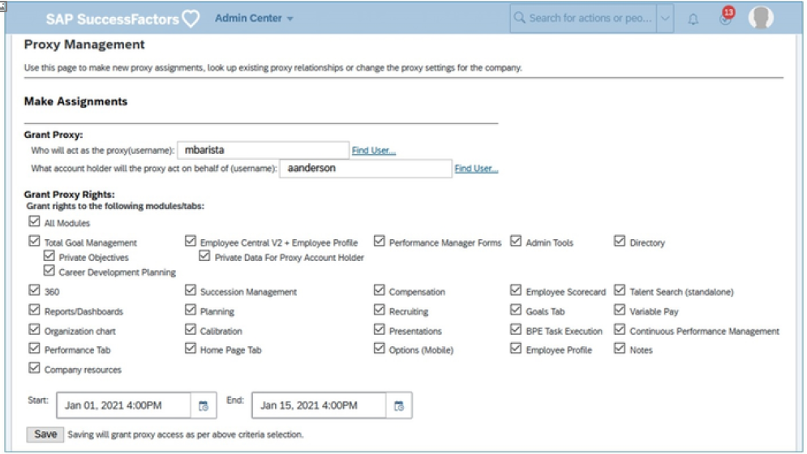
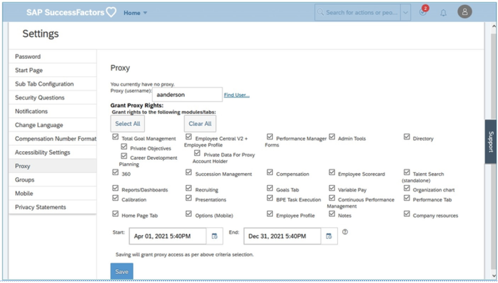

# 管理代理

[[toc]]

::: tip 本节目标

- 在 SAP SuccessFactors 中使用代理

- 分配和移除代理
:::

## 使用代理的功能和优势 Function and Benefits of Using Proxy

在 SAP SuccessFactors 中，代理功能允许一个员工代表另一个员工进行操作。例如，如果员工在表单到期时将不可用或缺勤，则可以分配代理以代表他/她完成表单。

代理由管理员大量使用。在新流程周期的测试阶段，使用代理可以查看配置和更改如何影响表单、用户和代理到多个用户账户的视图，而无需每次注销。代理还可以用于解决用户问题；例如，如果员工由于无法查看表单而联系管理员，则管理员可以作为该用户代理以查看员工所看到的具体内容。此外，管理员可以使用代理代表员工完成操作。

::: warning Note
此代理与 SAP SuccessFactors 学习管理系统 (LMS) 中的代理无关。有关 LMS 中代理的详细信息，请参阅 LMS 培训。
:::

代理人是代表某人操作的员工；帐户持有人是代理代表其进行操作的员工。例如，John 将休假， Sarah 被指派代表他行事。John 是帐户持有人，Sarah 是代理。可以将一个或多个代理分配给单个客户，并且可以将一名员工分配为多个客户的代理。作为管理员，您可能是许多账户持有人的代理。代理可以打开、查看、编辑和发送他/她具有权限的任何项目，就像他/她是账户持有人一样。

代理可能具有以下任何一种访问权限（可用选项可能因公司使用的模块而异）：

- 所有模块    All Modules
- 总体目标管理    Total Goal Management
  - 个人目标    Private Objectives
  - 职业发展规划    Career Development Planning
- 360    360
- 报表/仪表盘    Reports/Dashboards
- 组织结构图    Organization Chart
- 员工参数文件    Employee Profile
- Employee Central V2 + 员工个人资料    Employee Central V2 + Employee Profile
  - 代理账户持有人的私人数据    Private Data for Proxy Account Holder 
- 继任管理    Succession Management
- 计划    Planning
- 校准    Calibration
- 注释    Notes
- 绩效经理表单    Performance Manager Forms
- Compensation    Compensation
- Recruiting    Recruiting
- 绩效标签    Performance Tab
- 公司资源    Company Resources
- 管理中心    Admin Center
- 员工计分卡    Employee Scorecard
- 目标选项卡    Goals Tab
- 主页选项卡    Home Page Tab
- 目录    Directory
- 人才搜索（独立）    Talent Search (standalone)
- 浮动工资选项    Variable Pay Options

## 组织的代理注意事项 Proxy Considerations for the Organization

以下是使用代理时的一些注意事项：

- 如果将多个代理分配给一个账户，则所有代理都可以同时编辑数据。最后一个代理的更改将覆盖所有其他代理的更改。  
If multiple proxies are assigned to an account, all proxies can edit data at the same time. The changes of the last proxy overwrite changes of all other proxies.
- 审计跟踪将明确表示代理已执行此操作。  
Audit trails will clearly indicate that the action was taken by a proxy.

## 使用代理管理分配和移除代理 Using Proxy Management to Assign and Remove Proxies

具有代理管理权限的管理员可以使用代理管理或代理导入为任何账户分配和移除代理。管理员可以授予其他员工通过“公司设置(Company Settings)”分配代理的权限。如果“公司设置”下允许，所有员工都可以为自己的帐户分配代理。

请注意，在此之前，此材料仅讨论了分配和移除代理的管理功能。

### 代理分配 Proxy Assignment

管理员可以单独分配代理，也可以一次分配多个代理。分配代理时，管理员必须考虑以下事项：

- 代理可以打开、查看、编辑和发送账户持有人账户中的任何项目。  
The proxy is able to open, view, edit, and send any item in the account of the account holder.
- 管理员可以指定代理是否可以访问帐户持有人的个人目标。  
The administrator can specify whether the proxy has access to the private goals of the account holder.
- 如果将多个代理分配给一个账户，则所有代理都可以同时编辑数据。在这种情况下，用于保存文档的最后一个代理的更改将覆盖所有其他代理所做的更改。  
Where multiple proxies are assigned to an account, all the proxies can edit data at the same time. In this case, the changes of the last proxy to save a document, overwrites the changes made by all other proxies.
- 在 SAP SuccessFactors 中采取的任何操作都会自动伴随审计跟踪清楚地表明代理执行的操作。  
The audit trail that automatically accompanies any action taken in SAP SuccessFactors clearly indicates actions carried out by a proxy.
- 管理员可以为用户的特定工具或客户区域分配代理权限。此外，对于绩效经理表单，还可以选择特定的表单模板。  
Administrators can assign proxy rights to a user for specific tools, or areas of an account. Additionally, for Performance Manager Forms, there is an option to select a specific form template.
- 代理权限可以基于时间。  
Proxy rights can be time-based.

::: warning Note
管理员可以选择代理可在账户持有人账户中查看的绩效管理表单。
:::

要从 操作搜索 中启动分配单个代理的流程，请转到 代理管理(Proxy Management)

在 代理管理 页面的顶部，确定代理和账户持有人。选择模块。（可选）选择日期范围。单击 保存 。

### 基于时间的代理分配 Time-Based Proxy Assignments

代理分配可通过指定的时间范围进行限制。这一项为可选项。缺省情况下，代理分配在创建后立即开始，除非指定日期，否则没有结束日期。

可以添加开始日期和/或结束日期。在指定的时间范围内，分配的代理只能访问目标用户账户。可以使用 代理管理 或 代理导入 为新的或现有的代理分配设置时间范围。开始和结束时间显示在报告中，例如 People Analytics 中的 代理分配更改 审计报告和故事。

开始和结束时间基于代理管理员的本地时区，代理管理员按照参数文件中所示对其进行设置。

::: warning Note
从个人用户设置分配代理时，无法添加开始或结束日期。时间范围只能由代理管理员集中添加。
:::

### 代理移除 Proxy Removal

要删除或移除代理，请查找现有代理分配。为此，打开 代理管理 页面，然后在 查找现有分配 部分中输入用户名。当用户名未知时，单击 查找用户... 进行查找。查找现有代理分配的方法有多种：

- 搜索代理并查看所有有权访问的用户。  
Search for a proxy and see all of the users to whom they have access.
- 搜索帐户持有人，并查看为其分配的所有用户。  
Search for an account holder and see all of the users to whom they are assigned.

搜索完成后，删除代理选项变为可用。

### 使用代理导入分配和移除代理

除了手动设置和删除代理外，您还可以上载逗号分隔值 (.csv) 文件以导入多个代理分配和删除。
在执行此上载之前，请确保文件包括此流程所需的字段。要下载空白 .csv 模板以确保正确完成此操作，请单击 操作搜索->代理导入(Proxy Import)。

#### 代理导入文件 Proxy Import File

代理导入文件包含 USERID、ASSIGNMENT_ID_USERID、PROXYID、ASSIGNMENT_ID_PROXYID、START_DATE(yyyy-MM-dd HH:mm)、END_DATE(yyyy-MMddHH:mm)、All、Remove All 和单个模块头的列标题。

- USERID： 是由用户 ID 标识的帐户持有人。
- PROXYID： 是代理，由用户标识标识。可以在代理 USERID 之间使用“|”（管道符号）将多个代理分配给单个帐户持有人。
- ASSIGNMENT_ID_USERID 和 ASSIGNMENT_ID_PROXYID：或者，可通过分配标识而不是用户标识来标识员工。要使用分配标识，请将 USERID 和 PROXYID 留空并在ASSIGNMENT_ID_USERID 和 ASSIGNMENT_ID_PROXYID 列中输入值。
- START_DATE(yyyy-MM-dd HH:mm) 和 END_DATE(yyyy-MM-dd HH:mm：) 这些列是可选的。对于每一行，设置代理分配的时间范围。可以添加 yyyy-MM-dd HH:mm格式的START_DATE 、END_DATE 或两者。
- 缺省情况下，代理分配在创建后立即开始，并且没有结束日期。使用此选项将代理分配限制为指定的时间范围。
- 全部 ：用于将代理权限分配给 SAP SuccessFactors 中账户持有人的所有工具。
- 全部删除 ：删除指定用户帐户持有人的用户代理权限。

工具标头允许通过工具分配代理访问。要授予代理访问权限，请在“全部”列或任何特定工具列中输入“是”。“否”由空白字段表示，不输入到文件中。要移除代理访问，请在 REMOVE_ALL 列中输入 YES 。

### 使用设置分配和移除代理 Using Settings to Assign and Remove Proxies

您的组织可以选择允许用户分配自己的代理，也可以锁定此功能，以便代理只能由管理员分配。

此控件在“管理员中心”的“Action Search —> Company System and Logo Settings”中进行管理。设置名称为：禁用没有代理权限的用户的代理访问。

- 如果选中，则只有管理员可以授予和删除用户的代理访问权限。  
If checked, only administrators can grant and remove proxy access to users.
- 如果未选中，组织中的每个用户都可以分配和移除自己的代理。  
If unchecked, each user in the organization can assign and remove their own proxies.
- 作为管理员，在这种情况下，您还可以授予和移除代理访问。  
As an administrator, you can also grant and remove proxy access in this case.

取消选中此选项允许用户分配自己的代理时，员工将通过转到 Name Menu —> Settings —> Proxy 访问该页面以分配和移除代理。在此，员工可以 分配代理 以允许其他员工代表他/她进行操作，或者 成为代理人 作为通过“设置”中的 代理管理 、 代理导入 或 分配代理 为其授予代理访问权限的员工的代理人。

使用个人账户设置时，用户还可以在分配代理以代表他们进行操作时，将代理分配限制为指定的时间范围。在 设置 页面上分配代理时，他们可以添加开始日期、结束日期或同时添加两者。在指定的时间范围内，分配的代理只能访问其用户账户。

出于合规性目的，许多客户要求代理分配具有结束日期。

单击 成为代理人 时，员工将看到他/她可以代理的用户的下拉菜单。

立即代理

如果选中“代理管理”中的“启用高级代理管理（立即代理和代理导入）”复选框，则具有代理权限的用户还可以通过“名称”菜单访问代理。
