# 定制 SAP SuccessFactors 实例

[[toc]]

::: tip 本节目标

- 自定义主题
- 管理主页
- 设置公司徽标
- 定制资源、帮助和教程
- 配置自定义导航
:::

## 创建、编辑和修改主题 Create, Edit, and Modify Themes

主题管理器中的 管理主题(Manage Themes) 页面列出了所有 SAP SuccessFactors 标准和自定义主题。列表列出向员工显示的主题。要访问主题管理器，请转到 管理中心 并导航到 Company Settings > Theme Manager 。

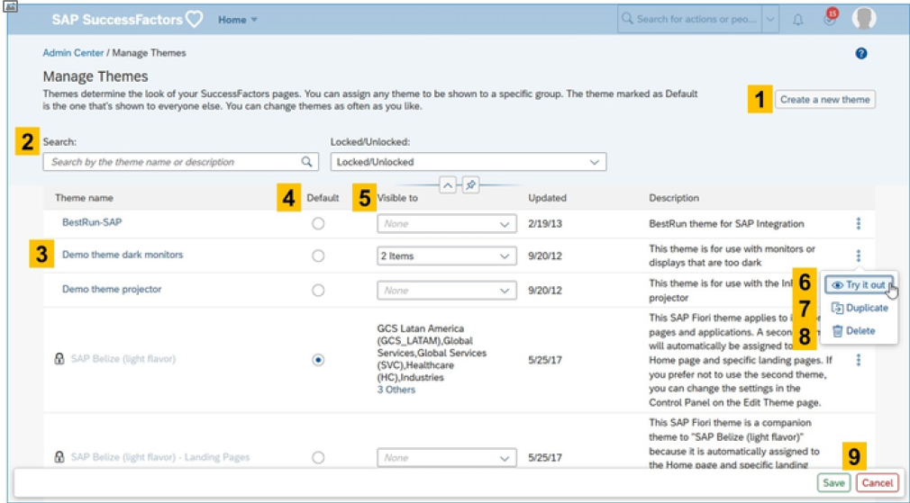

作为管理员，您在处理主题时有多个选项。

|#|选项 Option|描述 Description|
|---|----------|--------|
|1|创建新主题 Create a new theme|您可以从头开始创建新的自定义主题 You can create new custom theme from scratch|
|2|搜索 Search|您可以通过开始输入主题名称或过滤已锁定(标准)或已解锁(自定义)主题来搜索主题 You can search for a theme by starting to type its name or by filtering on locked (standard) or unlocked (custom) themes.|
|3|编辑 Edit|您可以通过单击主题名称来编辑自定义主题。标准主题名称以浅色显示，并且与锁定图标相关联，因为它们无法编辑。 You can edit the custom themes by clicking on the theme names. The standard theme names appear in a lighter color and are associated with a lock icon because they cannot be edited.|
|4|缺省值 Default|每个实例只能有一个缺省主题。除非在“可见”列中添加的组中，否则这是对员工可见的主题 There can only be one default theme per instance. This is the theme that will be visible to the employees unless there are in a group added in the column “Visible to”|
|5|可见性 Visible to|您可以添加将看到与缺省主题不同的主题的员工组。 用于将用户分组为主题的字段可以从Provisioning > Company Settings > Field used to group users to themes中选择。有三个选项：部门、分部和地点。 You can add groups of employees who will see a theme different than the default theme. The field used to group user to theme can be selected from Provisioning > Company Settings > Field used to group users to themes. There are three options: depart-ment, division and location.|
|6|试用 Try it out|选择此选项时，实例将采用主题。你可以在整个实例中导航，以查看如果选择此主题，不同页面的外观。但是，此选项不会应用主题。它仅对作为管理员的管理员尝试显示，如果决定应用主题，将显示其外观。 When selecting this option, the instance takes on the theme. You may navigate throughout the instance to see what the different pages would look like if you selected this theme. However, this option does not apply the theme. It only displays for you as an administrator trying it, what the theme would look like if you decided to apply it.|
|7|复制 Duplicate|此选项允许您复制现有主题。如果您喜欢现有主题的大多数详细信息，但希望在保留原始版本的同时进行细微更改，这可能很有用。 This option allows you to copy an existing theme. This may be useful if you like most of the details of an existing theme, but want to make minor changes while keeping the original version.|
|8|删除 Delete|单据此选项将删除主题。只能删除自定义主题 Clicking this option will delete the theme. Only custom themes can be deleted.|
|9|保存或取消 Save or Cancel|这些按钮允许您根据您的决策保存或取消更改。它们始终显示在浏览器底部，您无需向下滚动即可使用。 These buttons allow you to save or cancel the changes based on your decision. They are always visible at the bottom of the browser and you do not need to scroll down to utilize them.|

### :tada:练习一 应用一个主题 Apply a Theme

主题决定了SuccessFactors实例的颜色和外观。您的公司主题是在配置期间创建的，但是您可以编辑和修改它。您可以自定义整个公司的屏幕显示方式，也可以根据组选择不同的屏幕显示方式。  
Themes determine the colors and look of your SuccessFactors instance. Your company theme was created during configuration, however you can edit and modify it. You can customize how screens display across your company, or you can choose to have screens display differently according to group.

在本练习中，将使用主题管理器对实例应用不同的主题。  
In this exercise, you apply a different theme to your instance using the Theme Manager.

1. Apply a different theme to your instance using the Theme Manager.
    a) Use the Action Search to navigate to Theme Manager.
    b) On the Manage Themes screen, click the Dark / Gray & Blue / Metalic Gradient radio button in the Default column to set this as the default theme.
    c) Click Save.
    d) In the Save Changes dialog box, click Yes.
    e) Log out and log back in to see the changes.

### :tada:练习二 使用主题管理创建一个主题 Create a Theme using the Theme Manager

在SuccessFactors中，您可以使用标准主题，也可以创建自己的主题。您被要求创建一个新主题，用于SuccessFactors实例。  
In SuccessFactors you can use standard themes, or you can create your own theme. You have been asked to create a new theme for use in your SuccessFactors instance.

在本练习中，将创建一个自定义主题。  
In this exercise, you create a custom theme.

1. Create a theme using the Theme Manager.
    1. Use the Action Search to navigate to Theme Manager.
    2. On the Manage Themes screen, click Create a new theme.
    3. On the Create a Theme screen and in the Theme name field, enter SF Theme.
    4. Click the Page background color field, enter #9608FC .
    5. In the Accent color scheme based on field, enter #9C81AA.
    6. Click the Generate button to create additional shades based on the #9C81AA color value. Then click Generate again in the pop up window.
    7. Click Save and then click Save again in the pop up window. Click on Try it out.
2. Make this theme the default theme.
    1. Use the Action Search to navigate back to Theme Manager.
    2. Click on the SF Theme radio button to make this the default theme.
    3. Click Save and then click Yes in the pop up window.

### 主页主题化 Theming the Home Page

主页是 SuccessFactors 套件中两个基于磁贴的“登录页面(landing pages)”之一以及“下一代(next gen)”管理员中心主页。主题管理器 可用于创建和应用专门针对登录页面的主题。除了所有常规的主题设置功能外，还有两个登录页面选项：

- 分配登录页面主题：这允许您创建不同的背景或占位符，以便仅用于登录页面。  
Assigning a landing page theme: This allows you to create, for example, a different background or placeholder for use on landing pages only.

- 将主题设置应用到登录页面磁贴： 这允许您配置登录页面上的磁贴使用的颜色。  
Applying theming to a landing page tiles: This allows you to configure the colors used by tiles on landing pages.

### :tada:练习三 为主页应用主题 Assigning a Theme to the Home Page

您的公司希望通过为用户选择的登录页添加新外观来更改您刚刚创建的主题。登录页由每个用户在设置菜单中从主页上的名称下拉列表中选择。  
Your company would like to change the theme you have just created, by adding a new look to the chosen landing page for the user. The landing page is chosen by each user in the Settings menu from the name drop down on the home page.

1. Go to Theme Manager and open the theme that you created during the previous exercise.
2. Change the landing page to another theme.
    1. Go to Fine Tune->Landing Page Theme.
    2. Select a theme from the drop-down to use on the landing pages in your instance. You can select any of the themes that exist in your instance.
    3. Click Save to save your changes.
    4. Log out from the instance and log back in to check if your changes were applied.

### :tada:练习四 删除一个自定义主题 Delete a Custom Theme from the Theme Manager

你的公司已经建立了一个自定义主题库。您已被指定删除不再使用的主题。在本练习中，将删除自定义主题。  
Your company has built up a repository of custom themes. You have been assigned to delete themes that are no longer in use. In this exercise, you delete a custom theme.

1. Delete a custom theme.
    1. Use the Action Search to navigate to Theme Manager.
    2. Make the theme SAP Belize (light flavor) Gradient the default.
    3. Click Save and in the Save Changes dialog click Yes.
    4. Log out and log back in.
    5. Go back to the Theme Manager and delete the theme you created in the previous exercise SF Theme.

## 主页概览 Home Page Overview

SuccessFactors 主页是 SAP SuccessFactors HXM Suite 的默认开始页面。在主页上，您可以查看待处理的截止日期、未决问题以及有价值的团队指标和业务分析。它提供 SAP SuccessFactors HXM Suite 中的活动概览，并帮助您在必要时快速采取措施。

作为员工，主页是 SAP SuccessFactors 应用程序的主要入口点，通常它是您登录后首先看到的内容。您的个人待办事项列表显示分配给您的任务，从学习活动到目标设置截止日期到 HR 更改。

作为经理，您可以在主页上跟踪团队的进度并查看有价值的团队见解。您还可以查看实时分析标题和显示对业务至关重要的实时数据的仪表盘。

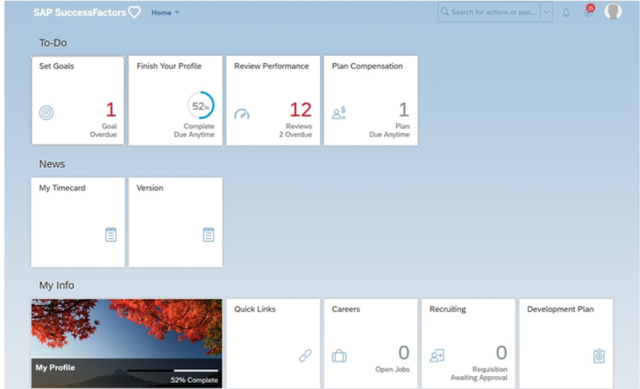

如果您是 HR 业务伙伴，主页会提醒您需要审批的变更请求以及其他需要您注意的 HR 数据问题。您还可以向主页添加链接，以便快速访问收藏的管理工具和报表。

### 主页磁贴 Home Page Tiles

主页磁贴是主页上的内容块。可通过这些磁贴访问主页上的所有内容和功能。

作为管理员，您可以管理默认主页上显示的磁贴。您可以控制默认可见的磁贴，以及用户可以添加或删除哪些磁贴来创建自己的个人主页。您可以从 SuccessFactors 提供的标准磁贴中进行选择，也可以创建自己的自定义磁贴。
主页磁贴使用 管理主页(Manage Home Page) 配置工具进行管理。

一系列标准主页磁贴显示 SAP SuccessFactors HXM Suite 中的信息和操作。作为管理员，您可以创建自定义磁贴并将其添加到实例的 SuccessFactors 主页。

这是重要主页磁贴的列表：

- 成就 Achievements  
此功能板块允许直接访问员工为实现其目标而完成的活动。  
This tile provides direct access to activities that an employee has accomplished toward their goal.

- 管理员警报2.0 Admin Alert 2.0  
此功能板块提供直接访问管理员提醒 2.0 的权限。还会通知用户他们具有所需权限的待处理警报的数量。  
This tile provides direct access to Admin Alerts 2.0. It also notifies users of the number of open alerts for which they have the required permissions.  
::: warning Note
对于某些应用程序，例如警报类型 时间评估 的工作流或时间管理，管理员可以将管理员警报分配给自己或其他人。  
With some applications, like Workflows or Time Man-agement for the alert type Time Valuation, administra-tors can assign admin alert to themselves or to others.
:::  

- 管理员收藏夹 Admin Favorites  
此功能板块为 HR 管理员提供了他们在“管理中心”中喜爱的管理工具列表。  
This tile provides HR administrators with a list of their favorite ad-min tools in the Admin Center.  
::: warning Note
如果使用“下一代管理”，您还可以查看最近访问的管理工具列表。此功能在较旧的 OneAdmin UI 中不可用。  
If you use Next Gen Admin, you can also view a list of recently-accessed admin tools. This functionality is not available with the older OneAdmin UI.
:::

- 分析和仪表盘 Analytics and Dash-boards  
这些磁贴显示分析数据和度量。  
These tiles display analytics data and metrics.

- 生日和工作纪念日 Birthday and Work An-niversary  
此功能板块用于向经理通知其团队中的生日和纪念日。  
This tile notifies managers about birthdays and anniversaries on their team.

- 招贤纳士 Careers  
此功能板块提供对公司内职位搜索和发布的直接访问。  
This tile provides direct access to a job search and postings within the company.

- 公司文档 Company Documents  
此拼贴显示在 管理文档 页面上上载的公司文档列表。  
This tile displays a list of company documents uploaded on the Manage Documents page.

- 自定义磁贴 Custom tiles  
您可以创建和添加自己的自定义磁贴。在指定日期范围内，您可以将自定义磁贴设置为对组织内的所选组可见。  
You can create and add your own custom tiles. You can make cus-tom tiles visible to selected groups within your organization, during a specified date range.

- 提供反馈 Give Feedback  
此磁贴可用于提供反馈。  
This tile can be used to provide feedback.

- 目标 Goals  
此功能板块提供直接访问用户的“目标计划”的权限。  
This tile provides direct access to the user’s Goal Plan.

- 管理我的团队 Manage My Team  
此功能板块为经理提供有关其团队活动的信息，并支持他们快速采取行动。  
This tile provides managers with information about their team’s ac-tivities and enables them to take quick action.  
使用此磁贴，您可以跟踪团队的进度并在必要时采取措施。您可以链接到有关其中一个报告的详细信息，例如他们的档案、1:1 页面、绩效评价、目标计划或职业工作表。您还可以“提醒”您的一个报告，以完成分配给他们的待办事项。  
Using this tile, you can track your team’s progress and take action when necessary. You can link to more information about one of your reports, such as their profile, 1:1 page, performance review, goal plan, or career worksheet. You can also ‘nudge’ one of your re-ports to complete a to-do that is assigned to them.

- 移动应用 Mobile Application  
此功能板块提供直接访问移动设备注册的权限。  
This tile provides direct access to mobile device registration.

- 我的个人资料 My Profile  
此功能板块提供对用户配置文件的直接访问。还会显示参数文件信息，例如完成百分比。  
This tile provides direct access to the user’s profile. It also displays profile information, such as percentage of completion.

- 快速链接 Quick Links  
此拼贴显示管理员提供的有用链接列表。员工可以将链接添加到应用程序中最常用的页面。作为管理员，您还可以添加对所有员工可见的自定义链接。  
This tile displays a list of useful links provided by administrators. Employees can add links to their most frequently used pages in the application. As an administrator, you can also add custom links that are visible to all employees.

- 报表 Reports  
此功能板块显示适用于经理和 HR 专员的可用报表列表。  
This tile displays a list of available reports, for managers and HR specialists.

- SAP Jam  
此功能板块提供直接访问 SAP Jam 的权限。  
This tile provides direct access to SAP Jam.

- 套件导航 Suite Navigation  
这些磁贴提供对 SAP SuccessFactors 应用程序的各个部分的直接访问。这些磁贴可以显示一个或两个数据点，但不包括附加功能。  
These tiles provide direct access to various parts of the SAP Suc-cessFactors application. These tiles may display one or two data points but do not include additional functionality.
套件导航磁贴包括：  
  - 管理中心  Admin Center
  - 校准  Calibration
  - Compensation  Compensation
  - 发展计划  Development Plan
  - Learning  Learning
  - 组织结构图  Organization Chart
  - 绩效  Performance
  - 演示  Presentations
  - 奖励和表彰  Rewards and Recognition
  - Recruiting  Recruiting
  - 继任  Succession
  - 考勤表  Time Sheet

- 休假 Time Off  
此功能板块提供对用户“休假”信息的直接访问。您可以查看帐户中剩余的天数，以及距下次休假的天数。  
This tile provides direct access to the user’s Time Off information. You can view the number of days remaining in your account and the number of days until your next vacation.

- 待办事项 To-Do  
您可以在主页上查看已分配和待处理的待办事项，并使用提供的链接完成所需任务。您可以查看每个待办事项到期的时间，以及完成该项目的剩余天数。  
You can view your assigned and pending to-do items on the home page and use the provided link to complete the required task. You can see when each to-do item is due and how many days you have remaining to complete it.  
::: warning Note
仅显示未清待办事项。不显示进行中和已完成的待办事项。
Only open to-do items are displayed. In progress and completed to-do items are not displayed.
:::

某些磁贴或选项依赖于实例中激活的模块。

主页磁贴的完整列表和更新后的列表在 帮助门户(Help Portal) 的 主页 指南中提供。

### 管理主页 Managing the Home Page

作为管理员，您可以配置缺省主页，因为它将对 SAP SuccessFactors 系统的新用户显示。从 操作搜索 中，转到 管理主页(Manage Home Page.) 。

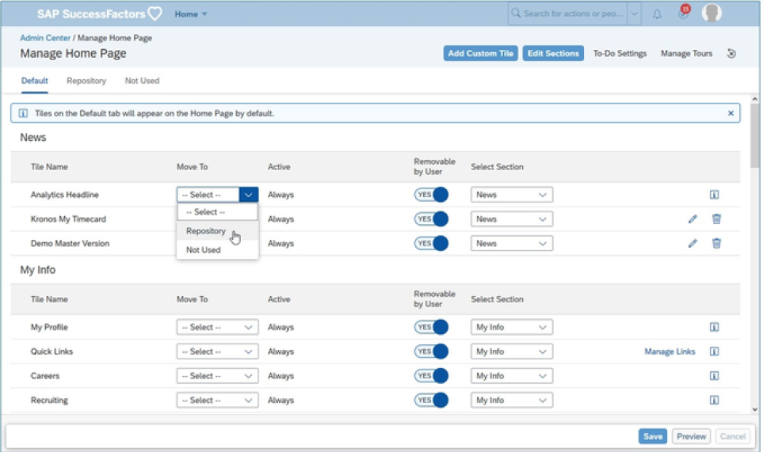

磁贴可以位于以下三个部分之一：

- 默认 Default：默认情况下在主页上可见的磁贴。对于 缺省 标签上的每个磁贴，根据需要设置 可由用户移除(Removable by User) 切换按钮。  
如果用户应具有使用资源库添加或移除磁贴的选项，则设置为 是 。  
如果不应使用资源库移除磁贴，则设置为 否 。可由用户移除(Removable by User) 仅与 缺省(Default) 标签上的磁贴相关。该列显示在其他选项卡上，但处于禁用状态，无法设置。

- 资源库 Repository: ：用户可以选择添加或移除此磁贴。

- 未使用 Not Used：如果根本不应在主页上使用此磁贴。

对于显示的每个磁贴，使用最后一列中的编辑链接（文本或图标）访问该磁贴的其他配置设置。

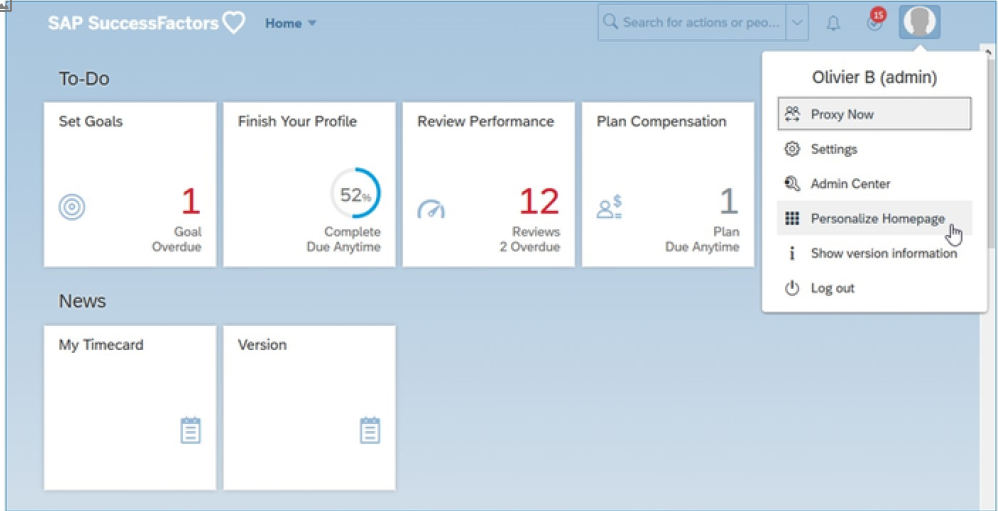

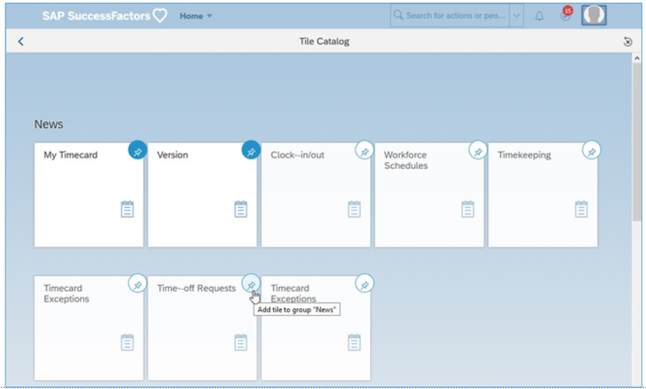

作为最终用户，您可以添加图块（可从资源库中获取）或从name menu > Personalize Homepage 中移除图块（如果设置为可移除）。

### 待办事项显示设置 To-Do Display Settings

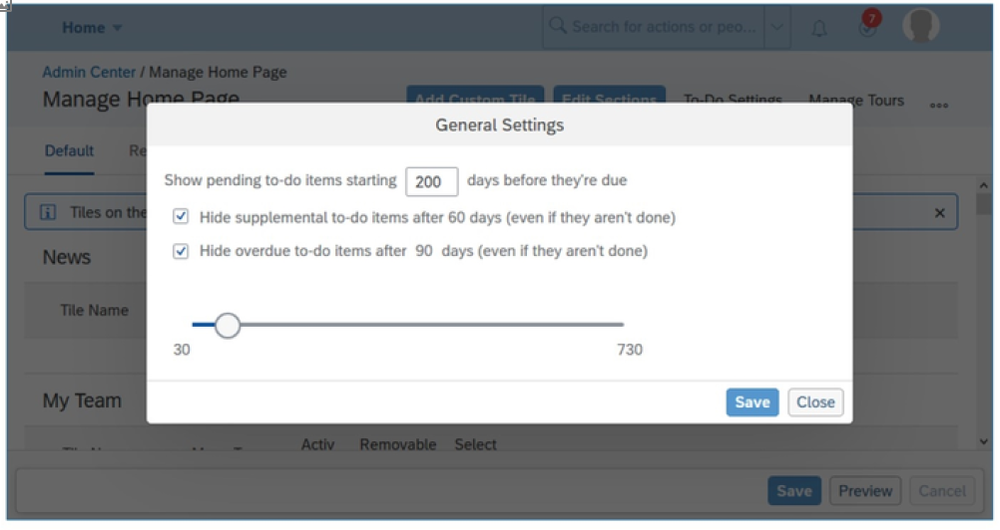

管理员可以控制如何在主页上显示和分类磁贴。特别是，管理员可以：

- 设置截止日期之前的天数，待定项目显示在主页上。  
Set the number of days before the due date that pending to-do items appear on the Home Page.

- 60 天后隐藏补充待办事项（即使它们未完成）  
Hide supplemental to-do items after 60 days (even if they aren't done)

- 设置到期日期之后的天数以隐藏逾期待办事项。随着时间推移累积的逾期待办事项会导致待办事项部分展开，这将通过主页上的导航方式获得。隐藏它们将有助于用户更好地跟踪其任务。某些拼贴中的某些过期待办事项不受影响，如“入职任务”或“学习审批”
。  
Set the number of days after the due date to hide overdue to-do items. Overdue to-do items accumulated over time cause the to-do section to expand, which gets in the way of navigation on the Home Page. Hiding them will help users keep better track of their tasks. There are some overdue to-do items in some tiles that are not affected like the Onboarding Tasks or the Learning Approval.

从“操作搜索(Action Search)”中，转到“管理主页(Manage Home Page)”，单击“待办事项设置(To-Do Settings)”并选择“常规设置(General Settings)”。

#### 补充待办事项项目 Supplemental To-Do Items

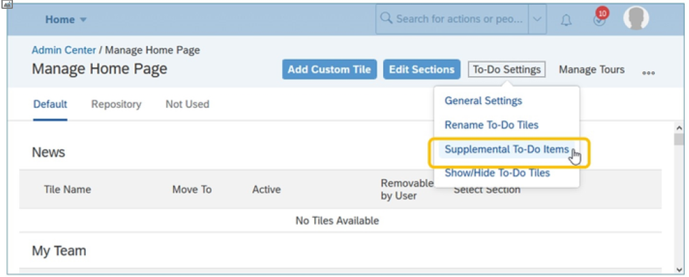

补充待办事项是管理员手动创建的任务，并添加到特定角色或组的主页。此任务用于补充系统生成的待办事项，这些项目由 SAP SuccessFactors 应用程序创建和添加。

要创建补充待办事项，请从 操作搜索 转到 管理主页 ，单击 管理待办事项设置(Manage To Do Settings) 和 补充待办事项项目(Supplemental To-Do Items) 。

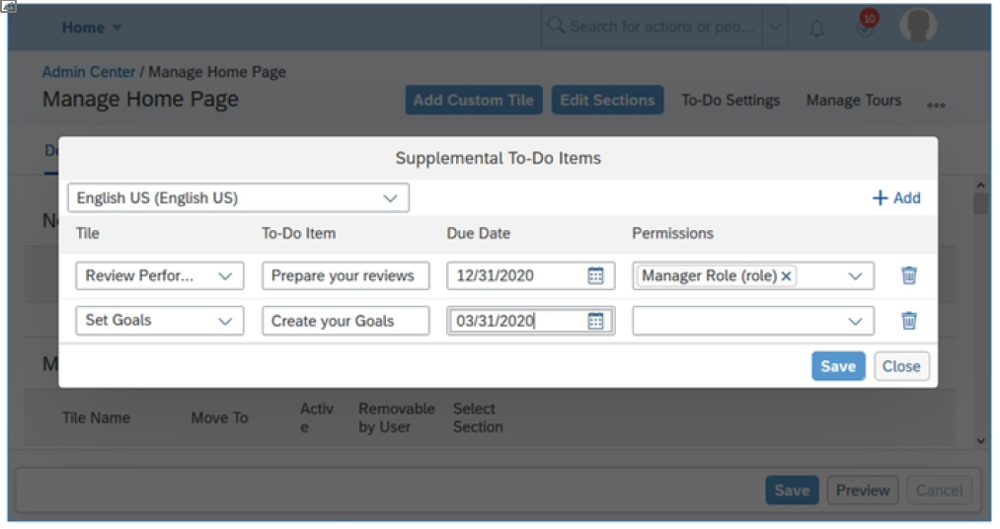

验证或从下拉列表中选择正确的区域设置，然后单击 + 添加(Add) 。

在 磁贴 列中选择类别，并输入新补充待办事项的名称。

选择到期日期。

（可选）将新补充待办事项分配给特定权限角色或组。仅当为管理员授予“管理基于角色权限访问”时，才能为补充待办事项设置目标受众。否则， 权限(Permissions) 列不可见。如果未在 权限(Permissions) 列中选择任何内容，则补充待办事项可用于整个组织。

保存更改。

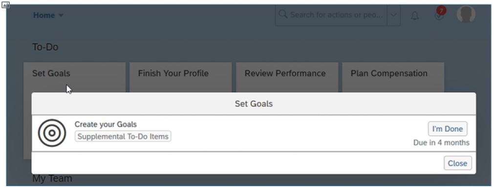

该项目将显示在员工的 To-Do 部分中。单击项目后，将显示一个窗口，其中包含更多详细信息，以及指向系统相关区域的链接。然后，用户可以在项目完成时选择“我已完成”。

链接到“创建补充待办事项(Create a Supplemental To-Do)”视频：<https://sapvideoa35699dc5.hana.ondemand.com/?entry_id=1_4wtxcn9n>

#### 待办事项警报和面板 To-Do Alerts and Panel

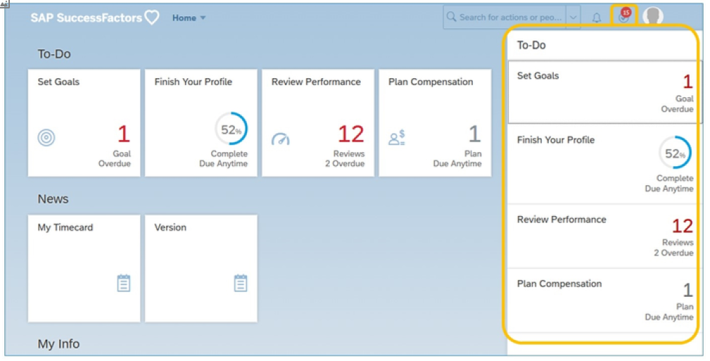

使用主页，您还可以在每页的顶部看到待办事项警报，用复选标记图标表示。该图标显示您拥有的待定待办事项数。

您可以单击任意页面上的图标，打开页面一侧的待办事项面板。待办事项面板显示所有待办事项，并允许您从任何页面执行操作，而无需导航回主页。

### :tada:联系五 创建一个自定义磁贴并移动一个部分 Creating a Custom Tile for the Home Page and Moving a Section

客户要求您创建带有其特定公司信息的欢迎贴。他们向您提供了一个他们希望您在互动程序中包含的消息示例。  
The customer has requested that you create the Welcome tile with their specific company message. They have provided you with an example of the message that they want you to include in the tile.

要在主页上创建自定义互动程序，请完成以下步骤：  
To create a custom tile on the home page, complete the following steps:

1. Use the Action Search to navigate to Manage Home Page.
2. Click Add Custom Tile to open the Create Custom Tile wizard.
3. Go through the steps of the wizard:
    1. Properties settings include the tile name and description.
        1. Tile name is Welcome
        2. Description: The Welcome tile displays messages from your HR team
        3. Click Next
    2. Tile settings define how and when the tile appears on the home page to end-users.
        1. Type: Static
        2. Title: Welcome
        3. Subtitle: Welcome to ACME (Note the difference between the Title and the Subtitle in the Preview.)
        4. Icon: Pick any available icon
    3. Navigation settings determine how the tile behaves and what content appears when end-users interact with the tile.
        1. Tile target: Popover
        2. Width: Medium
        3. Template: Select first radio button
        4. Rule-based: OFF
        5. Language: English US
        6. Content: Review the supplied sample message below. Use the editor to make the Welcome tile match the customer's sample:  
            Welcome to ACME Boot’s new welcome page system. Here is what you need to accomplish to help get you started:  
            • Immediately Access your Profile: Navigate to My Employee File and verify all applicable information you find listed.  
            • Set at least 3 goals to accomplish within the next 30 days.
        7. Make the words "Immediately Access your Profile" a hyper-link link to the Profile by clicking the link icon near the top of the rich text editor window. Hint: Make sure this link does not open in  a new window. <https://pmsalesdemo8.successfactors.com/xi/ui/peopleprofile/pages/index.xhtml>
        8. Click Next
    4. Assignments settings determine where a custom tile appears on the home page and who can see it
        1. Section: My Info
        2. User Group: All Employees (default)
        3. Active: Select Always radio button.
        4. Click Save to save your changes.
4. Click Edit Sections at the top of the Manage Home Page tool to move My Info section to the top of the Home Page.
5. Find My Info section and drag and drop it to the top of the list, just below the To-Do section.
6. Click Save.
7. Scroll down and click Save again.
8. Navigate to home page to make sure your Welcome page has been created and published.

自定义欢迎互动程序现在显示在管理主页工具中，可以像其他标准互动程序一样进行管理。例如，您可以设置磁贴状态，或使最终用户可以移除磁贴。
The custom Welcome tile now appears in the Manage Home Page tool and can be managed just like other standard tiles. For example, you can set the tile status or make the tile removable by end-users.

### :tada:练习六 创建一个补充待办事项 Create a Supplemental To-Do

在本练习中，您将为待办事项列表创建一个自定义项。  
In this exercise, you will create a custom item for the To-Do List.

1. Go to Manage Home Page.
2. Click To-Do Settings on the upper right side of the screen.
3. Click Supplemental To-Do Items .
4. Click+ Add.
5. Select Set Goals in the column Tile.
6. Write "Create your Goals" in To-Do Item field.
7. Select any date next month.
8. Do not select any group or role in the Permissions column.
9. Click Save.
10. Scroll down and Click Save.
11. View your new To-Do on the Home page.

### 主页新体验 Home Page New Experience

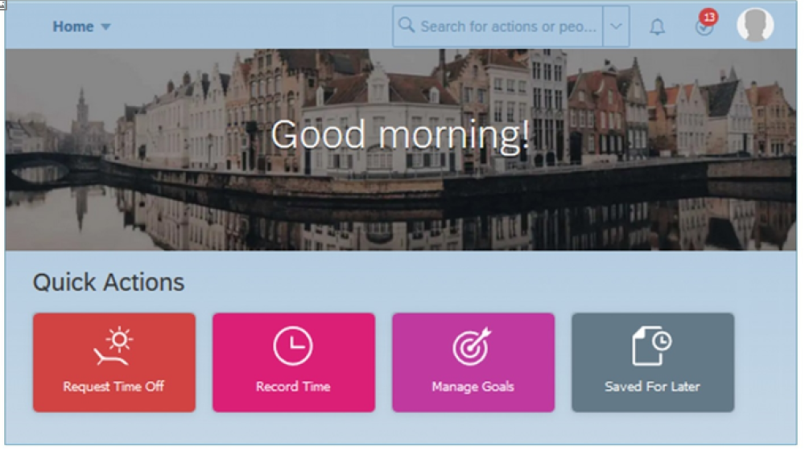

重新设计了主页用户体验，使其更易于使用和更具吸引力。它可以从升级中心启用，并且可以从基于角色的权限中控制访问。

最新主页体验包括：

- 快速访问频繁或重要的操作  
quick access to frequent or important actions

- 为用户提供动态、个性化内容  
dynamic, individualized content for the user

- 组织的自定义内容  
custom content for the organization

- 在 Web 和我们的移动应用的所有设备上提供一致的体验  
a consistent experience on all devices, both on the Web and in our mobile app

- 商标的横幅图像  
a banner image for branding

- 简化的管理体验  
a simplified administration experience

虽然可以使用仅含自定义内容的最新主页，但对于系统生成的内容最有用。以下产品区域当前在最新主页上显示内容：

- 薪酬，包括浮动工资和即时奖励  
Compensation, including Variable Pay and Spot Awards

- Employee Central Payroll  
Employee Central Payroll

- Employee Central 休假和时间表  
Employee Central Time Off and Time Sheet

- 绩效和目标，包括目标管理、持续绩效管理和持续反馈  
Performance and Goals, including Goal Management, Continuous Performance Management, and Continuous Feedback

- 入职  
Onboarding

- Recruiting  
Recruiting

::: warning Note
旧主页将于 2021 年 5 月 21 日结束维护，并将于 2022 年 5 月 20 日删除。如果客户当前未使用最新主页，则应计划升级。
:::

## 最新主页 Latest Home Page

### 最新主页入门 Getting Started with the Latest Home Page

要首次设置最新的主页，请完成以下步骤：

1.从升级中心(Upgrade Center)启用新的主页体验。

旧主页的现有配置（包括自定义拼贴和基于角色的权限）不受升级影响。您可以像以前一样继续为您的组织中的任何组使用旧版主页，并且可以随时撤销升级，不会影响现有配置。

::: warning Note
您可以确定组织的采用策略。与旧版主页不同，您可以使用基于角色的权限控制对最新体验的访问。只有您明确授予权限的人才能看到。其他人都看到了传统体验。这样，您可以决定是逐步采用最新的主页，一次采用一个组，还是针对整个组织一次性采用所有组。
:::

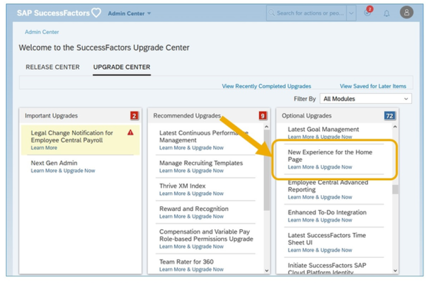

2.启用指定角色以查看和管理 RBP 中的最新主页。管理员应具有 管理系统属性(Manage System Properties) 下的 管理最新主页(Manage the Latest Home Page) 权限。

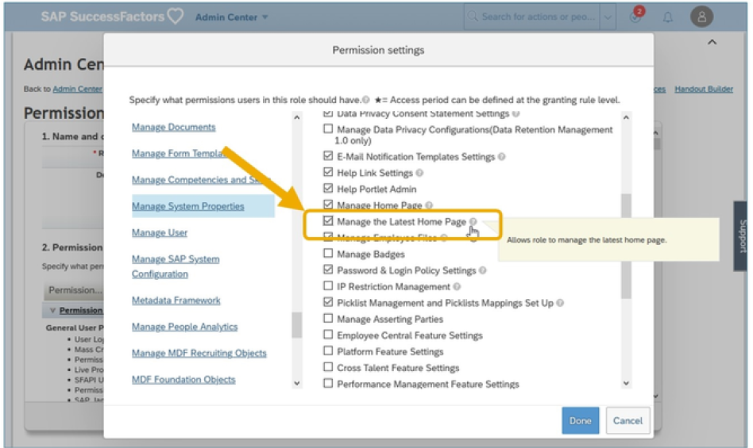

用户应具有 常规用户权限(General User Permission) 下的 访问最新主页(Access the Latest Home Page) 权限。

具有 访问最新主页(Access the Latest Home Page) 权限的角色现在只能看到最新主页体验。他们无法再访问旧版主页。他们仍可以在页眉中查看其待办任务，并使用操作搜索导航系统。

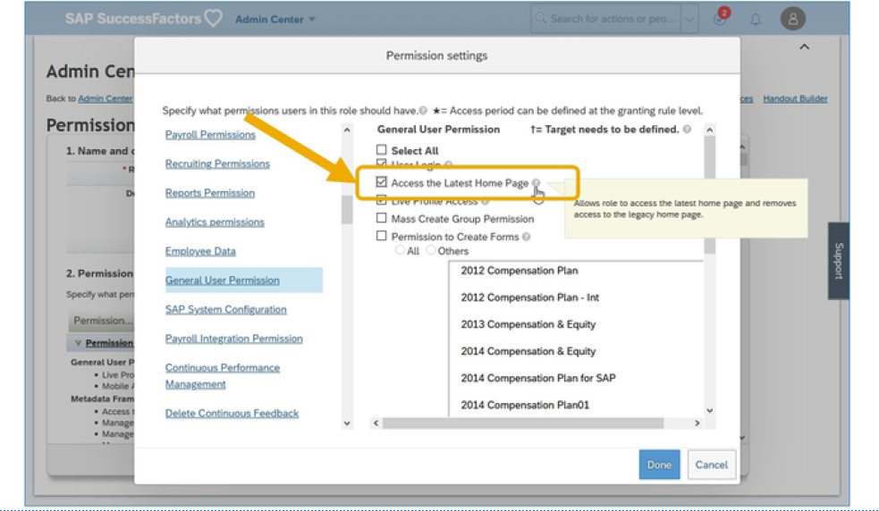

3.如果不想使用缺省图像，请更改页面顶部的横幅图像(banner image)。

从 操作搜索 中，转到 管理主页 。

查找主页横幅图像(Home Page Banner Image)，然后选择钢笔图标。

选择一个要在主页顶部显示的图像

- 选择 “使用默认横幅图像” 以使用提供的默认图像  
Select Use default banner image to use the provided default image

- 取消选择 “使用默认横幅图像” ，然后选择 “上载” 以使用自己的图像。  
Deselect Use default banner image and choose Upload to use your own image.

为获得最佳结果，请遵循屏幕上有关图像文件大小和纵横比的建议。

选择 Save 和 OK

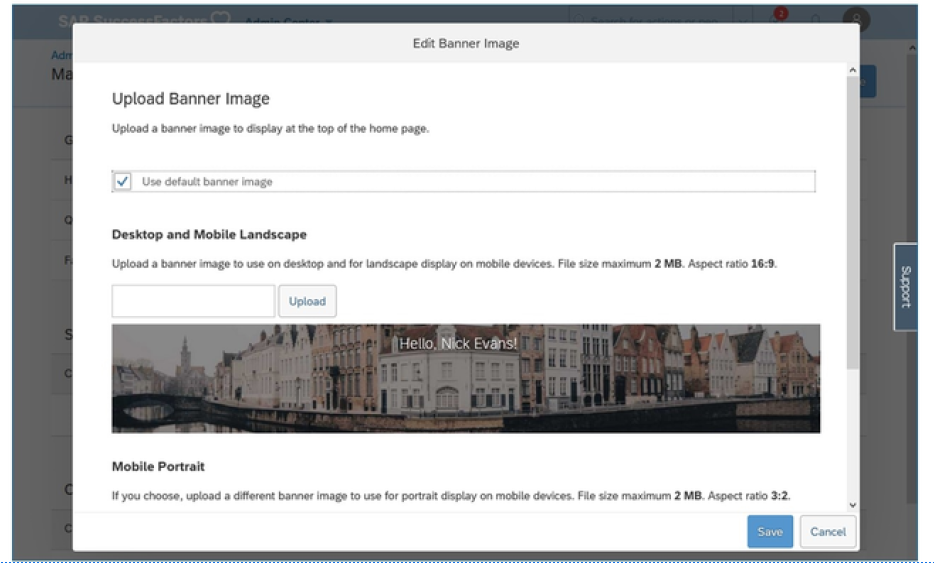

4.导入要从旧版主页保留的自定义磁贴。

从 操作搜索 中，转到 管理主页 。

选择 从旧版主页导入自定义磁贴(Import Custom Tiles from Legacy Home Page) 。

成功导入的自定义磁贴现在在 组织更新(Organizational Updates) 部分中显示为自定义卡片。现在，可以像任何其他自定义卡片一样为最新主页激活、停用或编辑自定义卡片。

为从“静态”类型自定义磁贴转换的自定义卡选择新图像。转换期间，图标将替换为占位符图像，但您可能希望选择新的图标。

对最新主页上的自定义磁贴有一些限制。特别是，管理主页屏幕上最多可以有 100 个自定义卡片。对于任何一个用户，主页本身最多可以显示 12 个自定义卡片。

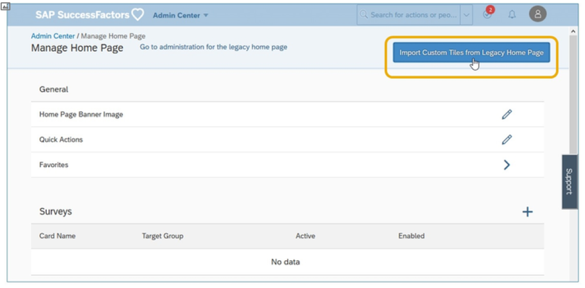

5.导入要从旧版主页保留并显示在 收藏夹(Favorites) 快速操作上的自定义链接（从 快速链接(Quick Links) 磁贴）。您可以将自定义链接从旧版主页导入到最新主页。然后根据需要添加或编辑目标组。

从 操作搜索 中，转到 管理主页 。

查找 收藏夹(Favorites) 并单击 图标以管理收藏夹。

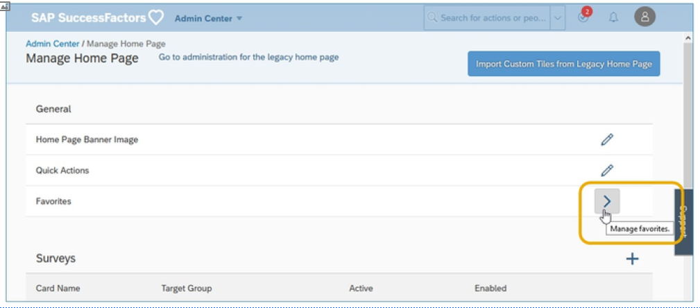

“管理收藏夹(Manage Favorites)” 页面上将显示成功导入的链接。

最新主页上的快速操作 Quick Actions on the Latest Home Page

缺省情况下，选择所有可用的快速操作。作为管理员，您可以选择隐藏不想使用的收藏项，收藏夹和稍后保存除外，始终可见。

在您选择要显示的操作中，单个用户只能看到与其角色相关的快速操作，总计最多 8 个。如果他们有权查看您选择的 8 个以上的快速操作，则系统会决定最相关的快速操作。

在管理主页上，单击快速操作(Quick Actions)的笔图标。

取消选择您不想使用的快速操作。您始终可以选择任何快速操作再次显示。

选择保存。

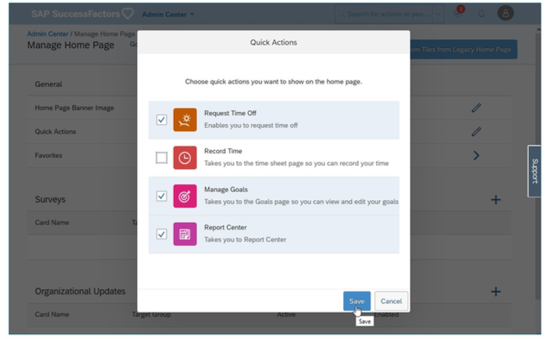

根据基于角色的权限和系统配置，可以看到快速操作。如果已在系统中配置且与人员角色相关，则以下快速操作可用：

- 创建活动 快速操作使您可以在“持续绩效管理”中创建活动。  
Create Activity quick action enables you to create an activity in Continuous Performance Management.

- 报告中心 快速操作会将您转到 报告中心 页面。  
Report Center quick action takes you to the Report Center page.

- 通过收藏夹快速操作，您可以查看可用链接列表并选择收藏夹，以便您可以在主页上快速访问这些链接。  
Favorites quick action enables you to review a list of available links and select your favorites, so that you have quick access to them on the home page.

作为管理员，您可以将自定义链接添加到最新主页上的 收藏夹 快速操作。

自定义链接是可选的。如果将其添加或从旧主页导入，则这些内容将包含在 可用 列表中，以及我们默认提供的标准链接。您可以配置一个或多个可以查看每个链接的目标组。您还可以为系统中的每种语言添加本地化链接名称和描述。

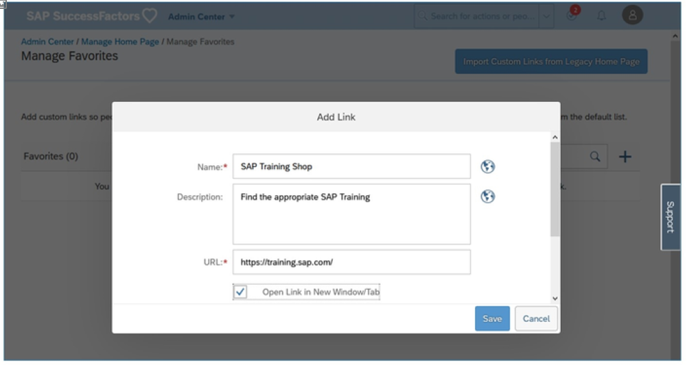

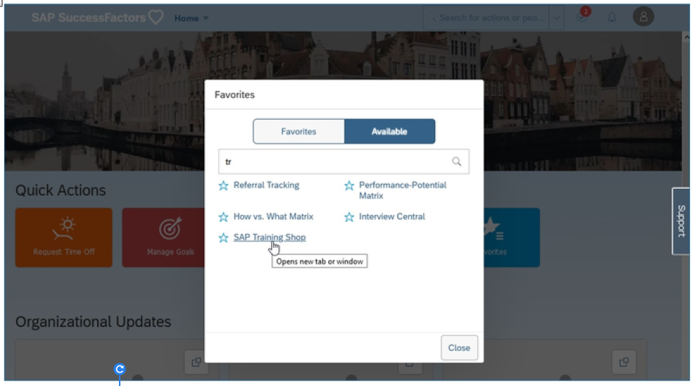

### 上载公司徽标 Company Logo Upload

您的公司徽标已在配置期间设置；但是，作为管理员，您可以随时修改公司徽标。徽标将显示在SAP SuccessFactors 中所有页面的右上角。您可以将徽标上传到 SuccessFactors 服务器（推荐），也可以指向 SuccessFactors 服务器外部的 URL 上的徽标。

::: warning Note
我们建议您在 SAP SuccessFactors 服务器上托管徽标，以确保环境安全一致。为获得最佳结果，我们建议按以下方式准备徽标：

- 文件格式：透明 GIF
- 像素：210 宽 x 40 高
- 颜色模式：RGB
:::

要上传要在 SAP SuccessFactors 服务器上托管的公司徽标，请转到Admin Center > Company Settings > Upload Company Logo，然后浏览计算机上的图像文件。选择图像，然后单击 保存 按钮。如果您具有现有公司徽标，则此徽标在更改前将显示在此页面上。

#### 使用URL作为徽标 Point to a Logo on a URL

在 SAP SuccessFactors 中配置公司徽标的另一种方法是将徽标位置设置为其托管的特定 URL，例如企业服务器。为了在 SAP SuccessFactors 中显示您的徽标，必须在 Web 服务器上发布该徽标以供访问。

为此，请转到 Admin Center > Company Settings > Company System and Logo Settings 。在提供的字段中输入公司徽标的URL，然后单击 设置公司徽标 URL(Set Company Logo URL) 。

::: warning Note
使用此方法可能会导致向用户显示警告消息，因为 SAP SuccessFactors 是一个安全网站，您的徽标发布在该安全环境之外的站点上。
:::

### “自定义资源”页面 Customize the Resources page

可将 资源(Resources) 页面配置为向最终用户显示有关公司的附加信息。您可以在此页面中放置文本、图像和链接。要访问“资源”，请从“主页”下拉菜单中选择“公司信息”，然后单击顶部的“资源”选项卡。

您可以通过单击 公司资源 框右上角的编辑图标来创建和编辑内容。

### 定制帮助和教程 Customize Help & Tutorials

用户可通过单击 SAP SuccessFactors 大多数页面页眉中的 帮助和教程(Help & Tutorials) 图标获取在线帮助。但是，这在主页和某些产品（如校准或持续绩效管理）中不可用。您可以通过导航到所需页面，单击图标Help & Tutorials > Disable，按实例中的模块（或页面）启用/禁用此链接。

作为管理员，您可以通过添加自定义内容在 帮助和教程 页面中编辑用户可用的信息。与添加 “资源” 类似，单击每个 Portlet 右上角的编辑图标以更改对用户可见的文本。

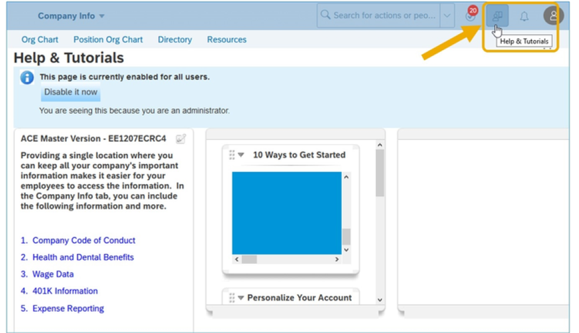

### :tada:练习7 更新公司资源页面 Update the Company Resource Page

“资源”屏幕可供想要了解贵公司更多信息的用户使用。您可以放置指向公司信息的内容和链接，并编辑内容以确保其是最新的。  
The Resources screen is available to users who want to find out more information about your company. You can place content and links to your company information, and edit the content to ensure that it is current.

在本练习中，您将更新公司资源屏幕。  
In this exercise, you update the Company Resources screen.

1. Navigate to the Company Resources screen.
    1. From the Home drop-down menu, click Company Info .
    2. On the Company Info screen, click the Resources link.
2. Update the Company Resources screen and assign the link to SuccessFactors Help.
    1. On the Company Resources tile, click the Edit icon.
    2. Highlight the word SuccessFactors in the first sentence on the page.
    3. Click the Hyperlink icon.
    4. In the Link dialog box, in the URL field, enter www.sap.com
    5. Click Target.
    6. In the Target field, select New Window (_blank) as the target.
    7. Click OK.
    8. Click Done.

### 配置自定义导航

自定义导航 提供导航到新位置（例如外部 URL 或自定义报表）的功能，无法使用缺省系统选项进行访问。自定义导航可显示在“操作搜索(Action Search)”、主导航菜单(the main Navigation Menu)、人员档案(People Profile)、“跳转至(Jump TO)”和“员工记录(Employee Records)”中，也可显示在员工快速卡片的“执行操作(Action Search)”和“转到(Go To)”中。这为公司定制其 SAP SuccessFactors 实例提供了极大的灵活性，因为他们现在可以无缝地访问 SAP SuccessFactors 之外的其他工具，从而集中化工作区。

必须在配置中启用自定义导航。

要在 实例中配置自定义导航，导航到 Admin Center > Company Settings > Configure Custom Navigation。下表描述了配置选项：

- 菜单项目标签 Menu Item Label  
这是链接在用户界面中的显示方式。对于自定义操作，这将成为 操作搜索 中的“显示标签”。  
This is how the link appears in the user interface. For custom ac-tions, this becomes the "display label" in Action Search.

- 标识 ID  
可以是任意文本或数值。您可以使用任何想要的规则，但每个自定义导航链接（无论其位置如何）都必须具有唯一标识。  
This can be any text or numeric value. You can use any convention you wish, but every custom navigation link, regardless of its location or locations, must have a unique ID.

- 链接类型 Link Type  
在 操作 搜索 中创建的自定义操作不会反映这些设置。操作搜索仅支持 “相同浏览器”行为。内部和外部自定义导航操作在同一浏览器标签中打开。  
Custom actions created in Action Search do not reflect these set-tings. Action Search only supports "same browser" behavior. Both internal and external custom navigation actions open in the same browser tab.
对于其他自定义链接，您可以选择：  
For other custom links, you can select:  
  - 内部链接  Internal Link  
    与 URL 字段中的 SAP SuccessFactors 深层链接一起使用  Used with a SAP SuccessFactors deep link in URL field
  - 外部链接 - 相同浏览器  External Link - Same Browser  
    与外部 URL 一起使用。在同一浏览器窗口中打开 。  Used with an external URL. Opens in the same browser window.
  - 外部链接 - 新浏览器  External Link - New Browser  
    与外部 URL 一起使用。在新的浏览器窗口中打开 。  Used with an external URL. Opens in a new browser window.

- URL  
输入要在操作搜索中可用的 URL 或深度链接。  
Enter the URL or deep link that you want to make available in action search.

- 菜单位置 Menu Location  
要创建自定义操作，请在下拉菜单中选择 操作 搜索 。对于自定义操作，建议在此菜单中只选择一个位置 操作搜索 。这是因为在操作搜索中，本地化和链接类型的处理方式与其他自定义链接位置的处理方式不同。对于其他链接位置，您可以选择一个或多个位置。  
To create a custom action, select Action Search in the dropdown menu. For custom actions, it is recommended that you only select one location, Action Search, in this menu. This is due to the fact that localization and link types are handled differently in action search than with other custom link locations. For other link locations, you can select one or more locations.

- 权限 Permissions  
该下拉列表显示 RBP 中配置的权限角色和组。只有选定的选项才能看到“自定义导航”。  
This dropdown displays the permission roles and groups configured in RBP. Only those selected will see the Custom Navigation.
