# 管理公司设置和文本

[[toc]]

::: tip 本节目标

- 管理公司系统设置
- 配置 V12 组织结构图
- 修改密码和登录策略设置
- 定制系统语言
:::

## 描述并定义常用的公司系统设置

您可以使用 公司系统和徽标设置(Company System and Logo Settings) 配置 SAP SuccessFactors 的多个功能。这些设置适用于组织中的所有用户。虽然这似乎与权限类似，但实际上您并不授予或撤销对软件区域的访问权限，只是为用户打开或关闭功能。

更改公司系统设置非常简单。从“管理员中心”导航到Company Settings > Company System and Logo Settings。在那里，有许多设置可供使用，更改这些设置就像检查/取消选中相应的框一样简单。

常用公司系统设置

|设置|描述|
|-----|----|
|与 Outlook 日历集成 Integration with Outlook Calendar|这允许用户通过单击电子邮件图标直接从 SAP SuccessFactors 将目标和表单相关的提醒添加到 Outlook 日历。 This allows users to add reminders associat-ed with goals and forms to their Outlook Cal-endar directly from SAP SuccessFactors by clicking on an email icon.|
|允许经理访问文档的修订历史记录 Allow Manager Access to a Document’s Revi-sion History|在 SAP SuccessFactors 中的工作流中修改和移动表单时，会创建审计跟踪。选择此选项后，只有经理可以在表单上查看更改的 FULL历史记录，而员工只能查看其自身更改的历史记录。 As forms are modified and moved through the workflow in SAP SuccessFactors, an au-dit trail is created. With this option selected, only the manager can view the FULL history of changes on the form, and employees are only able to see the history of their own changes.|
|每个人都可以访问文档的修订历史记录 Everyone Can Access a Document's Revision History|在 SAP SuccessFactors 中的工作流中修改和移动表单时，会创建审计跟踪。选择此选项后，参与表单操作的所有角色都可以访问表单上的完整更改历史记录。 As forms are modified and moved through the workflow in SAP SuccessFactors, an au-dit trail is created. With this option selected, all roles who participated in form actions can access the full history of changes on the form.|
|启用 HTML 电子邮件通知 Enable HTML Email Notifications|这允许 SAP SuccessFactors 向用户发送格式化消息。此消息也以纯文本形式发送，因此移动用户或不允许 HTML 消息的用户可以读取。This allows SAP SuccessFactors to send for-matted messages to users. This message is also sent in Plain Text so it can be read by mobile users or by users who have not al-lowed HTML messages. |
|启用增强的书写助手 UI Enable the Enhanced Writing Assistant UI|此工具可帮助用户提供可在审阅表单中放置的有用文本。这通常对所有用户启用。 This tool assists users with helpful text that could be placed in the review form. This is typically enabled for all users.|
|禁用无代理权限的用户的代理访问 Disable Proxy Access for Users without Proxy Rights|如果您的公司选择仅允许管理员进行代理分配，则应选择此选项。如果希望允许用户分配自己的代理，则保留此代理为未选中状态。也就是说，用户将能够分配自己的代理。 If your company chooses to only let adminis-trators make proxy assignments, this option should be selected. If you wish to allow users to assign their own proxies, leave this un-checked. That is, users will be able to assign their own proxies.|
|配置公司范围内的电子邮件设置 Configure Company-wide Email Settings|此选项允许在公司范围内设置用户是否将接收电子邮件通知。如果选中该复选框，则所有用户都将收到所有工作流相关流程的电子邮件。也就是说，选择此选项将阻止用户选择是否从SAP SuccessFactors 接收电子邮件通知。如果未选中，则每个用户都可以选择打开或关闭通知。 This option allows a company-wide setting on whether users will receive email notifications. If the checkbox is checked, then all users will receive email on all workflow related process-es. That is, selecting this option prevents users from choosing whether or not they re-ceive email notifications from SAP Success-Factors. If not checked, then each user has an option to turn notifications on or off.|

## 组织结构图配置 Org Chart Configuration

V12 组织结构图为用户提供了组织层次结构和报告关系（包括矩阵经理）的交互式视图。此视图允许用户打开具有动态水平或垂直布局的多个团队。V12 组织结构图构建在 HTML5 中，以支持在移动浏览器中使用。

使用升级中心启用 V12 组织结构图后，作为管理员，您可以从Admin Center > Company Settings > Org Chart Configuration配置组织结构图设置。在此，您可以打开 V12 组织结构图并控制基本组织结构图功能，包括是否显示照片。

## 调整密码策略设置 Adjust password policy settings

管理员可以自定义其实例的登录、帮助和登录帮助 UI。要更改登录设置，请选择 Company Settings > Password & Login Policy Settings。

在本部分中，您将了解如何启用忘记密码？与忘记用户名？

### 忘记密码策略设置

启用忘记密码功能并选择无需管理员干预即可重置用户密码的选项。通过启用此功能，用户将能够通过以下方式重置密码：

- 接收链接，通过与其登录相关的电子邮件重置密码。此外，您可以允许用户提供电子邮件以将密码链接发送到 。  
Receive a link to reset their password via the email associated with their log in. Additionally, you may permit users to provide an email to send the password link to.

- 通过提供链接通过与其登录相关的电子邮件重置密码之前，通过回答安全问题重置密码。  
Reset the password by answering security questions prior to providing a link to reset their password via the email associated with their log in.

- 在提供密码重置链接之前，通过回答安全问题重置密码。正确回答安全问题后，此选项会将用户重定向到安全问题页面以重置密码。  
Reset the password by answering security questions prior to providing a link to reset their password. This option redirects users to the security question page to reset their password after answering the security questions correctly.

要为用户创建安全问题以进行响应，请选择 管理安全问题(Manage security questions) 链接。

#### 调整密码策略设置的其他选项 Other options to Adjust Password Policy Settings

使用“长时间未使用密码的密码过期(Password Expiration for Long Time Unused Passwor)”选项，管理员现在可以定义将未用于登录系统的密码过期超过的期限。以年为单位定义。我们可以选择“不适用(N/A)”来禁用此选项。

通过为 忘记密码页面启用CAPTCHA(Enable CAPTCHA for the Forgot Password page) 选项，管理员可以在一分钟内通过 忘记密码 页面指定允许连续尝试重置密码的次数。达到阈值后，系统会提示 CAPTCHA。要禁用此选项，请从下拉列表中选择 “不适用(N/A)” 。创建此选项是为了防止向用户或电子邮件服务器发送电子邮件被淹没的潜在风险。

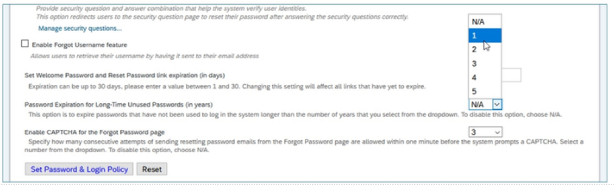

#### 控制可用功能和帮助中的日志 Control the Log in Features and Assistance Available

密码和登录策略设置(Password & Login Policy Settings) 页面上的 管理安全问题...(Manage security questions...) 链接提供了安全问题和设置的库，供用户重置密码。

使用此页面，管理员可以：

- 选择用户必须正确回答多少问题才能重置密码。  
Select how many questions the user must answer correctly before they are able to reset their password.

- 从预填充的系统安全问题和语言列表中进行选择。  
Select from a list of pre-populated System Security Questions and language.

- 选择 添加新问题 以创建您自己的安全问题。  
Select Add New Question to create your own security questions.

### 忘记用户名政策设置 Forgotten Username Policy Settings

启用忘记的用户名功能，以允许用户通过与登录相关的电子邮件检索其用户名。

## 文本替换工具 Text Replacement Tool

您可以使用“管理员中心”中的“文本替换(Text Replacement)”工具在 SAP SuccessFactors HXM Suite 中直接定制某些 UI 标签。

缺省情况下，文本替换页面显示应用程序缺省语言的 UI 标签。通过单击文本替换页面上 选择语言(Select Language) 下提供的相应链接，您可以导航到应用程序中支持的其他语言。

文本替换工具在语言包（TEXT_REPLACEMENT_KEYS 和ADMIN_TEXT_REPLACEMENT_KEYS ）中使用两个可定制的键值。在文本替换页面上保存 UI 标签的自定义值时，只要应用程序中使用 UI 标签，UI 标签的缺省值都会替换为新值。当您使用一种语言定制 UI 标签时，更新仅适用于该语言，不适用于应用程序中支持的其他语言。

例如，您将 UI 标签“Home”更新为“Homepage”（英语：US）。仅当应用程序的默认语言为美国英语时，才会显示更新的标签。如果将缺省语言更改为法语，UI 标签“Homepage”将更改为法语的 UI 标签的默认值：“Acueil”。

::: warning Note
在文本替换工具中，可用于定制的 UI 标签列表因语言而异。例如，可以用美国英语定制的 UI 标签可能不可用于法语定制。
:::

您在 文本替换 页面上定义的自定义 UI 标签会覆盖 UI 标签的默认值，无论它们在应用程序中的显示位置如何。

虽然有许多选项可以用英语更改 文本替换(Text Replacement) 中的系统文本，但其他语言不一定有这么多选项。使用 文本替换 时，重要的是要了解您只进行文本替换，这不会更改相关字符串中与语言特定语法有关的任何内容。如果未正确使用自定义 UI 标签，则可能会造成语言问题。

使用文本替换(Use Text Replacement)视频链接：<https://sapvideoa35699dc5.hana.ondemand.com/?entry_id=1_r6mnlodv>

### 管理语言工具 Manage Languages Tool

您可以使用 管理语言(Manage Languages) 工具覆盖任何语言（美国英语或 SAP SuccessFactors 当前支持的任何语言）的 UI 标签值。

管理语言更改请求通常在两种情况下出现：

- 您想要更改 UI 文本（例如，系统文本）的缺省值，以便更好地反映您的特定业务实践和文化。  
You want to change default values of UI text (e.g., system text) to better reflect your particular business practices and culture.

- 系统文本存在问题（例如，语法、语法、关键术语）。“管理语言”允许在等待后续补丁或版本中更新系统文本时以实现更快的周转。  
There is an issue with system text (e.g., grammar, syntax, key terms). Manage Languages allows for a quicker turnaround while waiting for the system text to be updated in a subsequent patch or release.

限制

- 值替换限制：使用“管理语言”，每个区域设置最多可以覆盖 10,000 个值。默认替换限制设置为 25 个值，您可以使用页面底部的 更新(Update) 选项手动增加到 10,000。  
Value replacement limit: You can overwrite up to 10,000 values per locale using Manage Languages. The default replacement limit is set to 25 values, which you can manually increase up to 10,000 using the Update option at the bottom of the page.

- 自定义语言包 CSV 文件大小限制：CSV 文件大小限制为 10 MB。如果尝试上载大于 10MB 的文件，系统将超时并且不会上载文件。  
Custom language pack CSV file size limit: The CSV file size limit is 10 MB. If you try uploading a file, which is anything more than 10MB, the system will time out and the file will not be uploaded.

- 文本替换语法：在整个系统中需要文本替换语法来替换单词。否则，包含字符串的每个字符串都需要通过 “管理语言” 替换。  
Text substitution syntax: You need the text substitution syntax to replace a word throughout the system. Otherwise, each string that includes the string will need to be replaced through Manage Languages.

### 添加、移除、导出和导入公司字典 Add, remove, export, and import Company Dictionary

"公司词典(Company Dictionary)"允许您添加贵公司特有的单词。例如，公司名称、贵公司产品名称和其他特定术语。运行系统拼写检查器时，如果在实例中开启了拼写检查器功能，则不会将这些术语标记为不正确。您可以一次添加和删除一个单词。还可以使用文本文件批量添加和删除文字。

在 公司流程和周期(Company Processes & Cycles) 部分下，单击 公司设置(Company Settings) 并选择 公司字典(Company Dictionary ) 。

您可以批量添加和删除公司词典中的文字。下载公司字典文件，修改字典中包含的单词，然后导入更新后的文件。

要将您的公司名称添加到“公司字典”，请执行以下步骤：

- 从“公司设置”中，选择“公司词典”。  
From Company Settings, select Company Dictionary.

- 单击 Add or Remove a Word 。  
Click Add or Remove a Word.

- 输入公司名称。  
Type in the company name.

- 单击 添加 。  
Click Add.

- 使用公司名称填充文本框后，单击 完成 。  
When the textbox is populated with the company name, click Done.

### :tada:练习八 自定义文本替换设置 Customize Text Replacement Settings

公司文化要求使用特定于公司的术语，而不是成功因素中使用的一些词汇。您被分配了自定义文本替换设置的任务。  
The company culture requires the use of company-specific terms instead of some of the words used in SuccessFactors. You are assigned the task of customizing the text replacement settings.

在本练习中，将为SuccessFactors实例自定义文本，并显示自定义文本以验证文本替换。  
In this exercise, you customize the text for your SuccessFactors instance, and display the customized text to verify the text replacement.

1. Change the variants of the word employee with the associate following the table below:  
    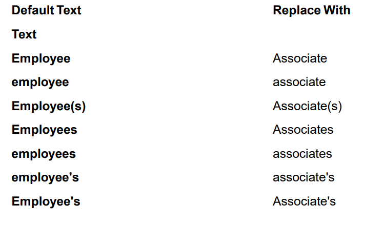
    1. Use the Action Search to navigate to Text Replacement.
    2. On the Text Replacement screen, enter the data in the table provided.
    3. Click Save.

2. Display the customized text to verify the text replacement. (Please note: you may need to log out and back in to see the changes.).  
    1. On the Home Page screen, click the Home drop-down menu.
    2. Verify that the option My Employee File is now called My Associate File.

3. Revert the changes you have made by deleting all the variants of the word associate in the customized text column.

您为SuccessFactors实例自定义了文本，并验证了替换文本的显示。
You customized the text for your SuccessFactors instance, and verified the display of the replacement text.

## 管理语言 Manage Languages

客户如何更改文本替换中不可用的特定区域设置中的标签？

客户可以使用 管理中心 中的 管理语言(Manage Languages) 工具覆盖 SAP SuccessFactors 支持的任何语言的 UI 标签值。

管理语言 工具在以下两种情况下尤其有用：

- 可以更改系统文本的缺省值，以便更好地反映特定的业务实践和文化。  
Default values of system text can be changed to better reflect a particular business practices and culture.

- 当前系统文本存在问题（语法、语法、关键术语等）。“管理语言”允许在等待后续补丁或版本中更新系统文本的同时进行快速周转。客户仍应联系 客户支持，以便在未来构建中使用系统级别文本解决问题。  
There is an issue with the current system text (grammar, syntax, key terms, etc.). Manage Languages allows for a quick turnaround while waiting for the system text to be updated in a subsequent patch or release. Customers should still contact Customer Support so that the issues can be addressed with system level text in future builds.

前提条件

Provisioning中有两个前提条件（语言包和启用管理语言工具(Language Packs and Enable Manage Languages tool)）。

另一个前提条件是 RBP 中的 文本替换(Text Replacement ) 权限。在 Action Search > Manage Permission Role > Administrator Permissions > Manage System Properties > Text Replacement 中。

限制

- 值替换限制：使用“管理语言”，每个区域设置最多可以覆盖 10,000 个值。缺省替换限制设置为 100 个值。使用 管理语言 页面底部的 更新 选项，可将数量手动增加到 10,000。  
Value replacement limit: It is possible to overwrite up to 10,000 values per locale using Manage Languages. The default replacement limit is set to 100 values. This can manually be increased up to 10,000 using the Update option at the bottom of the Manage Languages page.

- 自定义语言包 CSV 文件大小限制：CSV 文件大小限制为 10 MB。如果文件表示超过 10 MB，系统将超时，不会上载文件。  
Custom language pack CSV file size limit: The CSV file size limit is 10 MB. If the file represents more than 10 MB, the system will time out and the file will not be uploaded.

- 文本替换语法：在整个系统中需要文本替换语法来替换单词。否则，包含该字符串的每个字符串都需要通过 “管理语言” 替换。  
Text substitution syntax: You need the text substitution syntax to replace a word throughout the system. Otherwise, each string that includes that string will need to be replaced through Manage Languages.

- 更改标签此时不会更新移动应用程序中使用的语言短语。  
Changing labels does not update the language phrasing used within the Mobile Application at this time.

步骤

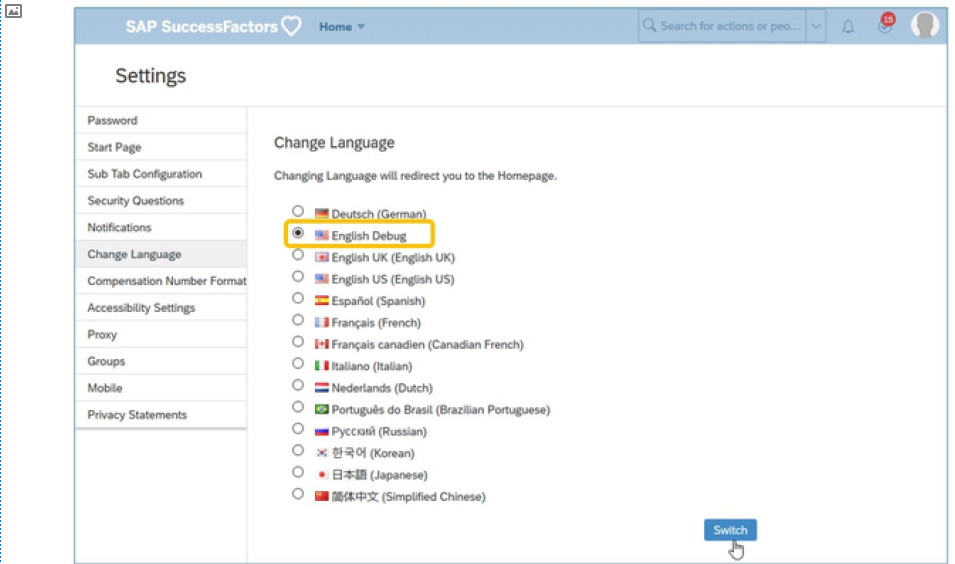

1. 使用 英语调试(English Debug) 来确定要替换的系统文本的令牌(token)。从Name Menu中，转到Settings > Change Language > English Debug > Switch。  
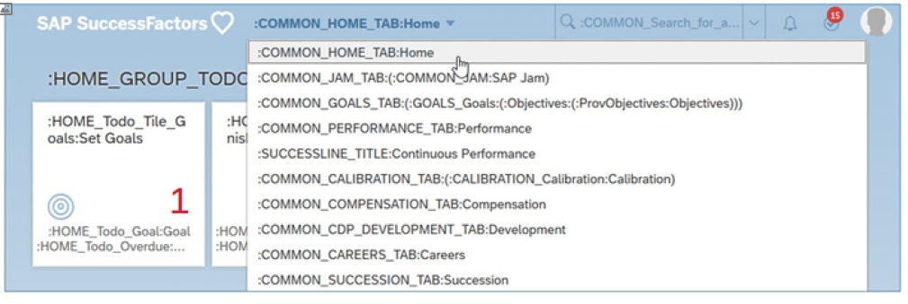

2. 转到要更改标签的页面。在此示例中，我们将从主导航菜单中更改主页的标签。获取冒号之间的值。在本示例中，将为： COMMON_HOME_TAB

3. 返回到name menu > Settings > Change Language，然后再次选择缺省语言并单击 切换(Switch) 。

4. 从“操作搜索”转到“管理语言(Manage Languages)”  
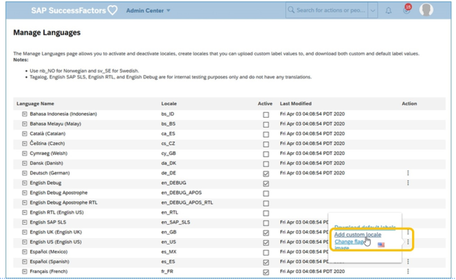

5. 如果自定义区域设置不存在，则需要创建一个。在 操作(Action) 列下，单击与语言包对应的 添加自定义区域设置(Add custom locale)  
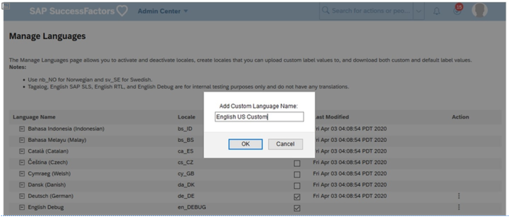

6. 需要为自定义语言包输入新名称（如English US Custom），然后单击 确定 。自定义语言包将附加到原始语言包。  

7. 现在， “+”按钮出现在您创建自定义区域设置的语言前。单击它。  
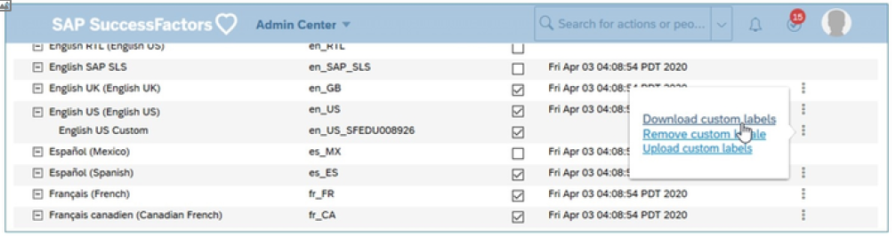

8. 下载自定义。  
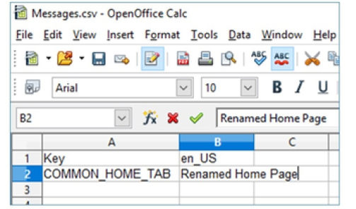

9. 将文件保存到计算机。在第一行中，单词 Key 已位于列 A 中。在列 B 中添加区域设置代码。在此示例中，它是 en_US 。然后在第二行中，添加密钥 COMMON_HOME_TAB 和您想要查看的标签，例如 重命名的主页(Renamed Home Page) 。  
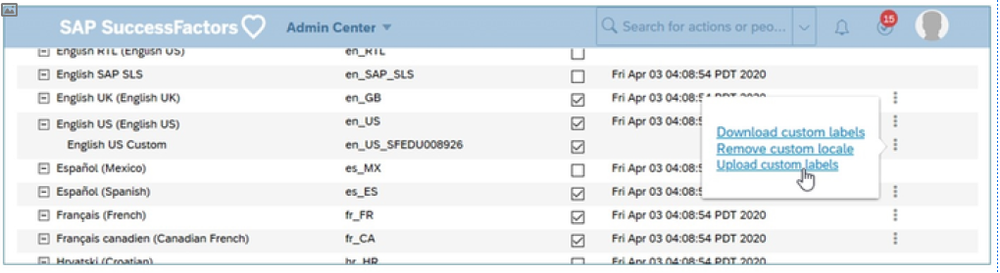

10. 将文件另存为 V2。保存为.csv 格式非常重要。然后，导入并使用 上载自定义标签(Upload custom label) 选项将其上载到系统中。选择您创建的文件。  
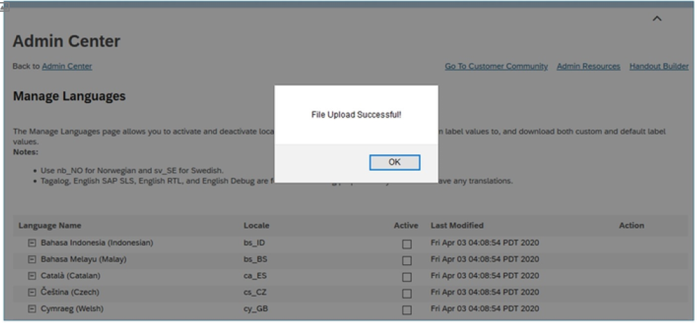

11. 消息将指示文件已成功上载。单击 确定(OK) 。  
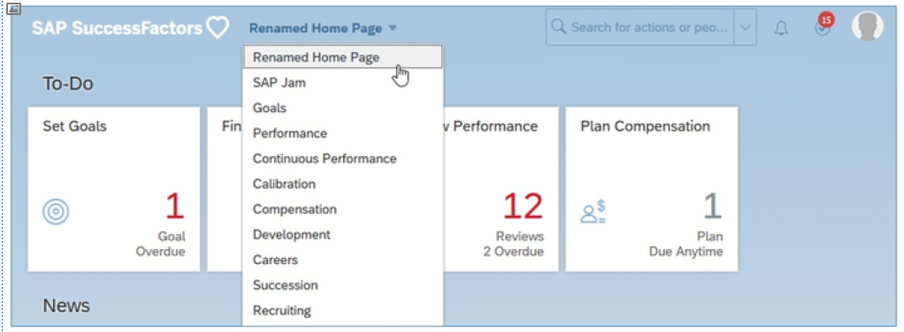

12. 为了测试更改，请确保使用进行更改的语言。您需要注销并返回到实例，某些情况下，完全关闭浏览器甚至删除缓存会很有帮助。

::: warning Note
请谨慎操作！

如果键值已存在于此文件中，并且您希望对其他系统文本进行更多更改，则始终从系统中下载自定义标签的最新文件，并将新键值添加到列表，但在上载时保留已存在的文件。如果只是将要更改的密钥放在此文件中并移除其他密钥，则将删除为其他密钥设置的自定义。

当键值已存在时，单元格 1B 将具有语言代码下划线和进行更改的实例的公司标识。要将此文件上传回系统，您只需在此单元格中保留语言代码，从而删除最后一个下划线和公司编号。
:::

### 原始语言包 Original Language Pack

在某些情况下，例如在屏幕上很难读取密钥时，下载完整的原始语言包可能会有所帮助。为此，请执行以下步骤：

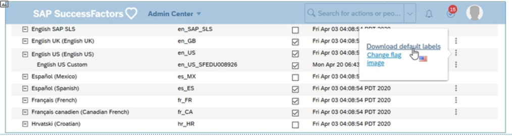

1. 下载原始语言包的 CSV 文件。它具有所有缺省系统标签。  
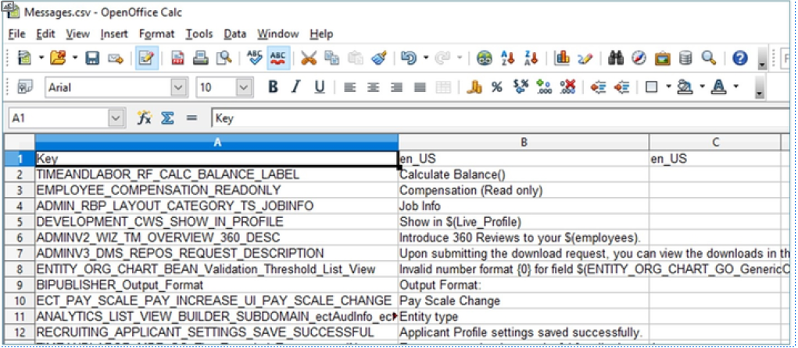

2. 将文件保存在一个文件夹中，您可以在计算机上轻松找到该文件。可以使用 Open Office、 Notepad 或 Notepad++ 打开 csv 文件。此文件是原始 CSV 文件，包含键值（ 键值 ）及其相应UI 标签的完整列表。文件应类似于上面的屏幕截图。

### 修改合法性扫描库 Modify Legal Scan Library

除公司字典(Company Dictionary)外，SAP SuccessFactors 还具有可向其添加术语的法律扫描库。此工具伴随拼写检查器，并检查文本中是否存在任何潜在的冒犯语言。标记任何有问题的语言，而不是替换。

您可以使用 合法扫描(Legal Scan) 功能修改内容，以检查检查表单中不可接受的文本。

您可以访问库并通过 公司设置 工具对其进行添加或修改。添加文本并保存表单，以便在意外或故意键入可疑词时发出警报。导航到 Admin Center > Company Settings > Legal Scan Library 进行修改。
