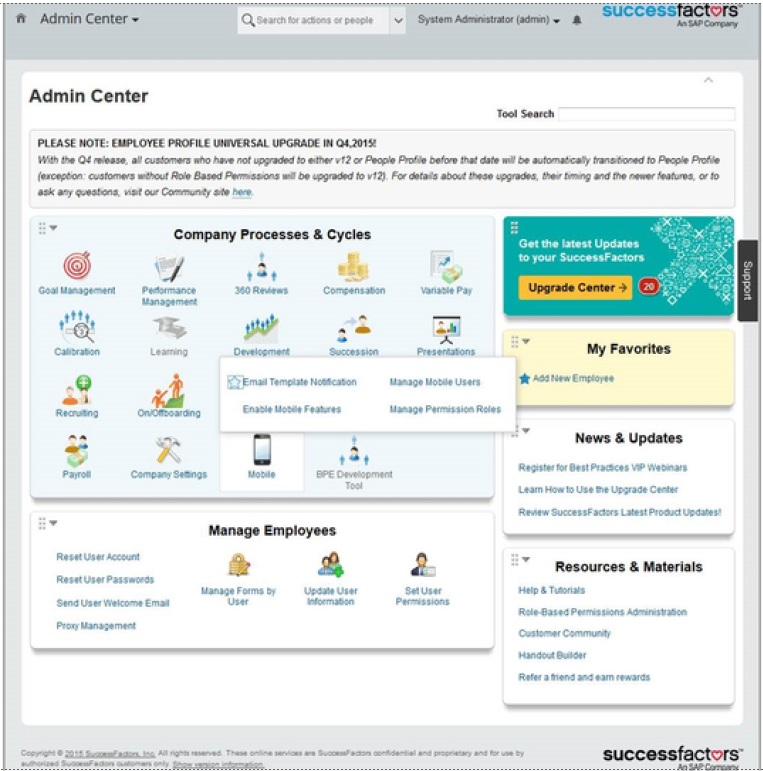
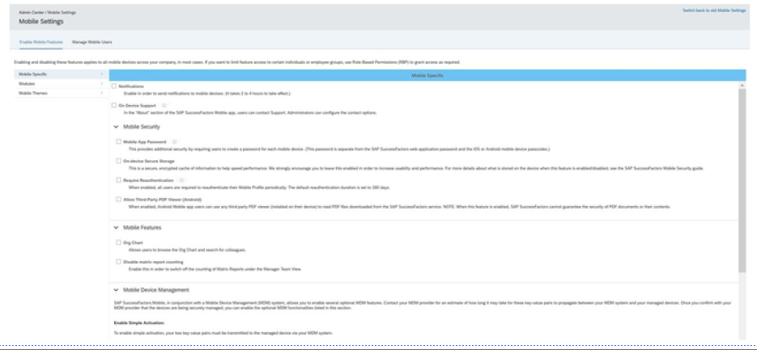
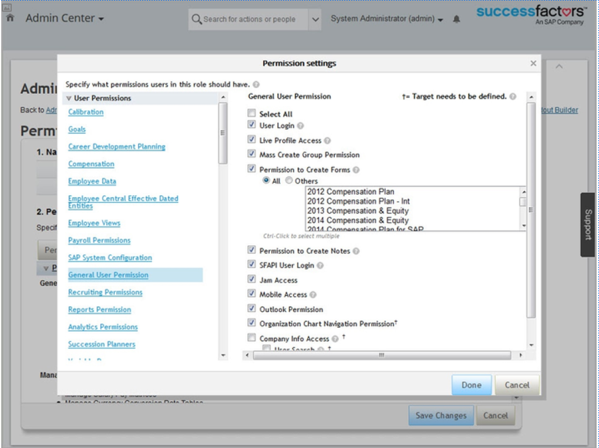
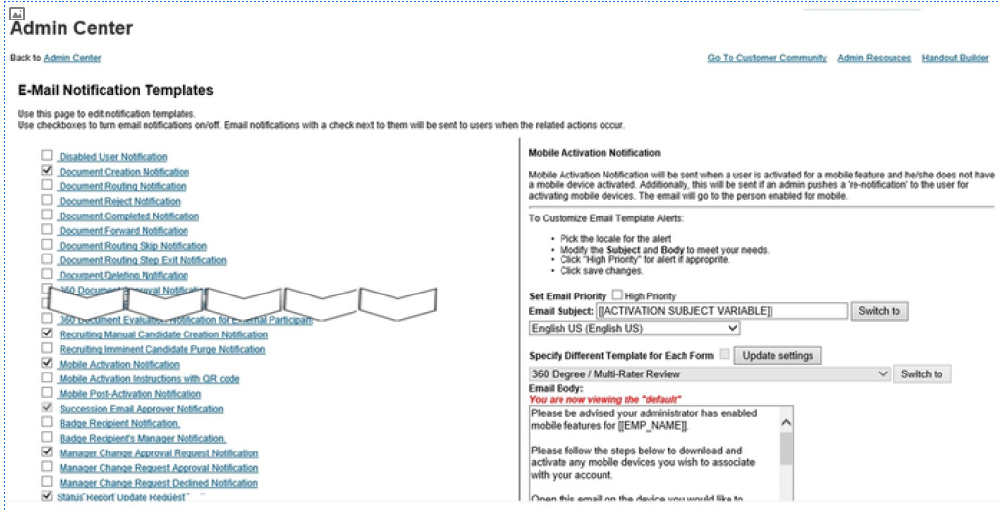
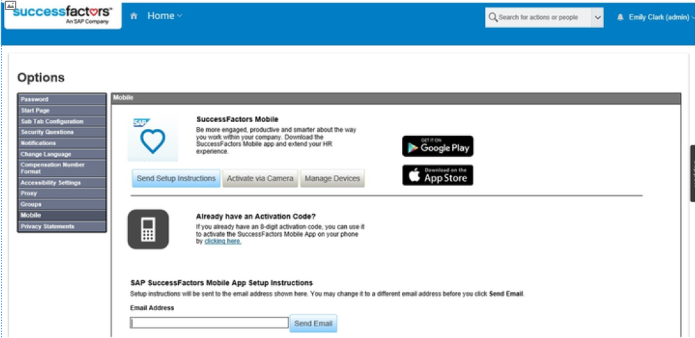

# 管理移动设置

[[toc]]

::: tip 本节目标

- 管理移动设置
:::

## 移动设置管理 Management of Mobile Settings

SAP SuccessFactors 目前支持市场上最受欢迎的移动平台。作为管理员，您可以启用或禁用公司员工的移动设备设置。移动功能可通过 SAP SuccessFactors Human eXperience Management (HXM) 应用访问。

移动管理在移动管理面板(Mobile Administration Pane)中简单化和汇总化。在此面板中，您将看到四个主要功能，可帮助您部署和管理公司的 Mobile：

- 启用移动功能  
Enable Mobile Features

- 管理权限角色  
Manage Permission Roles

- 电子邮件模板通知  
Email Template Notifications

- 管理移动用户  
Manage Mobile Users

在本节中，您将了解如何启用移动功能、选择移动访问权限以及如何停用移动设备。

### 移动功能启用 Mobile Feature Enablement

通过转到Action Search  > Enable Mobile Features ，并选择要启用的移动功能来启用移动设置。此功能可帮助您选择可用于移动用户的模块。功能包括：使用移动访问代码访问移动设备和启用移动广告。

启用移动功能(Enable Mobile Features) 具有以下不同部分：

- 移动特定： 本部分中的功能允许您查看和控制基本移动功能。（例如，主题化、设备支持、 PIN 等）  
Mobile Specific: The features in this section allow you to view and control basic mobile functionality. (For example, Theming, on device support, PIN, and so on)

- 模块： 在此部分中，您可以查看当前在实例中部署且移动功能可用的所有 SAP SuccessFactors 模块。  
Modules: In this section, you can view all the SAP SuccessFactors modules that are currently deployed in your instance and have mobile capabilities available.

选中该复选框将为所有授权移动用户开启该功能。取消选中该复选框将关闭所有授权移动用户的功能。

移动功能表

|功能 Feature|描述 Description|
|------|-----|
|主题设置 Theming|作为管理员，可以定制 iPad BizX 移动应用程序的标题颜色和标题徽标。将显示所有最终用户的自定义标题 As the admin, the header color and header logo of the iPad BizX Mobile app can be cus-tomized. The customized header will display for all End Users|
|SF通知 SF Notification|启用以将通知发送到移动设备 Enable to send notifications to mobile devises|
|设备上支持 On Device Support|在 BizX 移动应用的“关于”部分，最终用户可以联系支持部门。作为管理员，可以配置联系人选项 In the "About" section of the BizX Mobile app, End Users can contact support. As the ad-min, the contact options can be configured|
|移动密码 Mobile Password|最终用户将需要为每个移动设备创建密码。 End Users will be required to create a Pass-word for each mobile device|
|设备安全存储 On-device Secure Storage|为了提高可用性和离线性，我们强烈鼓励将设备存储保留在 上，以便丢失连接功能。关闭设备存储时，一些项目仍将在设备上缓存：学习离线文档和 SAP Jam 文档 We strongly encourage leaving on device storage ON, in order to increase usability and offline I loss of connectivity capabilities. When turning OFF on device storage, a few items will still be cached on device: Learning off-line documents as well as SAP Jam docu-ments|
|组织结构图 Org Chart|最终用户在 Org Chart 中浏览，与 Web 对应用户类似 End Users browse through the Org Chart, similar to the web counterpart|

移动功能的模块表

|模块 Module|描述 Description|
|----|----|
|SAP Jam|支持随时随地开展社交协作 Enable social collaboration on the go|
|入职 Onboarding|通过移动首日体验，为新员工提供他们所需的所有信息，减少对新员工的焦虑 Reduce anxiety of your new hire by providing them with all the information they need through the mobile first day experience|
|休假 Time Off|员工和经理可以记录和查看有关假期、病假和其他缺勤类型的信息 Employees and managers can record and view information on vacation, sick leaves and other absences types|
|福利(Beta) Benefits (Beta)|员工可进行福利申请并查看福利联系人信息 Employees can make benefits claims and view benefits contact information|
|工资报表 Pay Statement|员工可通过移动设备访问当前和之前的工资报表信息（注意：在生产环境中启用此“工资报表”功能之前，请确保已对工资核算结果端到端流程进行内部测试和验证） Employees can access their current and pre-vious pay statements information from their mobile devices (Note: Please ensure you have internally tested and validated the pay-roll results end-to-end process before enable this Pay Statement feature within your pro-duction environment)|
|招聘 Recruiting|无需因流程缓慢而错失优秀的候选人：通过移动面试反馈、移动职位申请和移动录用通知审批，支持员工尽快完成招聘流程 Never miss a good candidate due to a slow process: Enable your employees to keep the recruiting process moving as fast as possible with mobile interview feedback, mobile job requisitions and mobile offer approvals|
|目标 Goals|使用户能够查看和编辑其目标，使经理能够访问其团队目标 Enable users to view and edit their goals and managers to access their team goals|
|演示 Presentations|最终用户可以创建和查看有关特定员工的实时演示。 End Users can create and view a real-time presentation on specific employees.|

### 移动访问权限的选择 Selection of Mobile Access Permissions

要指定哪些用户可以访问其 SAP SuccessFactors 账户，请导航到 Action Search > Manage Permission Roles，选择要授予移动权限访问权限的角色 General User Permission > Mobile Access，然后选择要允许用户访问的权限角色。

为了制定可控制的推广策略，请遵循上述步骤，不要选择 所有员工(All Employees) ，而是选择推广的目标组。如果需要，您可以创建新的特定“移动”组。您可以为尽可能多的用户组提供移动访问权限，并逐步向不同用户组推出移动访问权限。

### 移动电子邮件通知 Mobile Email Notification

移动电子邮件通知(Mobile Email Notification)功能简化了移动用户激活流程，并提高了员工对新移动功能的认识，我们创建了移动电子邮件通知功能。此功能允许您自定义电子邮件模板，该模板将用于向已授予移动访问权限的所有用户发送单个电子邮件通知。

用户收到电子邮件时，会看到两个链接。从其移动设备单击电子邮件中的链接时，用户可以执行以下功能：

- 从相应的应用商店下载并安装 SAP SuccessFactors 移动应用程序。根据检测到的移动操作系统，此重定向是自动的。  
Download and install the SAP SuccessFactors mobile application from the corresponding app store. This redirecting is automatic, based on the mobile operating system that is detected.

- 从设备激活移动应用。此流程利用常规 SAP SuccessFactors Web 应用程序登录机制。  
Activate the mobile application from the device. This process leverages the regular SAP SuccessFactors web application login mechanism.

选择 电子邮件通知模板设置(E-mail Notification Template Settings) ，然后根据需要打开页面底部显示的移动激活通知电子邮件模板。

### 移动设备激活 Mobile Device Activation

您可以通过转到 Settings > Mibile 并输入设备激活代码来激活用户的移动设备。激活设备后，将列出与该用户相关联的设备的列表，并列出停用该设备的选项。

遵循此一次性流程，将您的 SAP SuccessFactors Mobile 应用与 SAP SuccessFactors HXM 账户同步。按照智能手机上的分步屏幕生成唯一的激活码。

下载应用

通过智能手机访问智能手机移动应用商店，搜索“SuccessFactors ”。按照下载说明进行操作。

输入激活码

从您的 PC 登录您的 SAP SuccessFactors 帐户。选择 设置(Settings) 菜单。选择 移动(Mobile) 。输入 激活码(Activation Code) 。

### 移动用户管理 Mobile User Management

管理移动用户(Mobile User Management) 显示至少已激活一个移动设备的所有用户。此清单还显示每个用户已激活的设备数。在此页面中，单击 导出所有移动用户(Export All Mobile Users) 按钮下载一个 .csv 文件，其中包含移动用户的完整列表以及每个移动用户已激活的设备数量。

您可以通过在 人员搜索(People Search) 字段中输入移动用户的名字和姓氏或用户名来停用其设备。选择用户名时，可以使用与该用户相关联的设备的列表，以及激活或取消激活设备的选项。

选择页面底部的 发送新的移动激活电子邮件(Send a New Mobile Activation Email) 以将移动激活电子邮件重新发送给特定用户。只有当您激活 移动激活(Mobile Activation) 功能时，此功能才可用。

### :tada:练习九如何启用移动设备用户的访问 How to Enable Access for a Mobile Device User

演示如何为移动设备用户启用访问。  
Demonstrate how to enable access for a mobile device user.

1. Enable access for a mobile device user
    1. Use the Action Search to navigate to Manage Permission Roles.
2. Grant permission to the Administrator to access mobile permissions.
    1. On the Permission Role List screen, in the Permission Role column, click Administrator .
    2. On the Permission Role Detail screen, click Permission .
    3. In the Permission Setting dialog box, in the User Permission list click General User Permission .
    4. In the General User Permission section, verify that the Mobile Access check-box is selected or activate it if it is not the case.
    5. Click Done.
    6. On the Permission Role Detail screen, click Save Changes.
    7. Logout and login to ensure the new permission is applied correctly.
    8. From the Action Search go to Enable Mobile Features.
    9. In the Mobile specific tab, activate the check-boxes for Notifications and Org Chart. Each time click Turn ON and OK.
    10. For the Modules, activate Goal Management, Career Development Planning and Metric Tiles. Each time, click Turn ON and OK.
