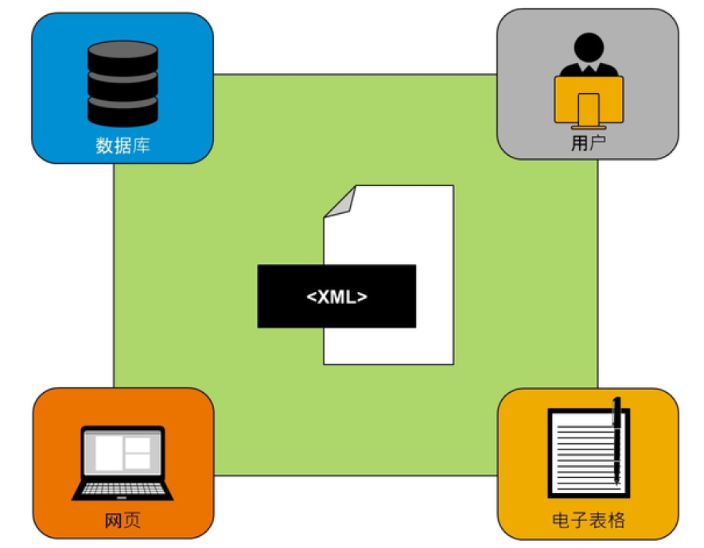
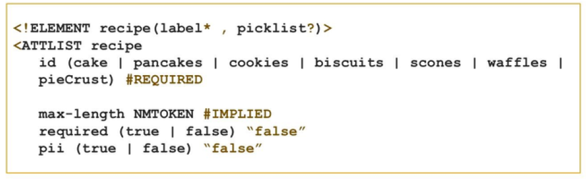
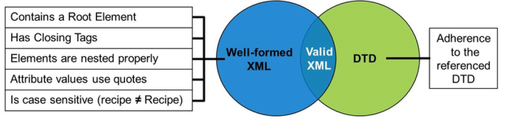

# 在SAP SuccessFactors中使用XML

[[toc]]

::: tip 本节目标

- 描述可扩展标记语言(XML) 及其用途
- 解释可扩展标记语言(XML) 和文档类型定义(DTD) 文件之间的关系
- 识别格式良好的可扩展标记语言(XML) 的组件
- 定义键值可扩展标记语言(XML) 术语
:::

## XML



XML 是可扩展标记语言(Extensible Markup Language)的缩写（标准的正式名称）。它旨在在一个灵活的框架中处理严格的数据。XML 很特殊，因为它不包含预定义的标记。XML 标记仅由用户定义，这使其成为一种可扩展语言。

除了灵活性和可扩展性外，XML 是计算机用于在不同类型的信息系统之间传输数据的语言，通常不会兼容。XML 作为语言的另一个优势在于， 人类的阅读和理解相当容易。

您可能熟悉其他标记语言：HTML。虽然XML 和HTML 都是标记语言，但HTML 设计用于在 Web浏览器中显示数据。XML 的目标是存储和传输数据。

### XML 树 XML Tree

XML 结构为一个树，其中家庭成员称为元素。元素描述所包含的数据。在“示例XML”中，根元素描述了其包含的内容。元素可以包含子元素，也可以具有属性。

XML 树始终以根元素开头。与家庭一样，XML 具有父项和子项。

示例XML

``` xml
<note>
<to>George</to>
<from>John</from>
<heading>Reminder</heading>
<body color="purple">Don't forget the meeting!</body>
</note>
```

示例 XML反映 XML 中的树结构。

使用XML 的其他两个主题是标签和属性。

#### 标签 Tags

XML 中的标记是用户定义的，如示例 XML所示。

标签必须始终在嵌套时打开和关闭。必须始终在其父标签的打开和关闭标签中打开并关闭子标签。

#### 属性 Attributes

属性命名为simple-type(简单的类型)定义，不能包含其他元素。在示例 XML中，属性显示为紫色。属性的一些常见示例如下：语言、是否需要项目，以及最大字符长度。

### 文档类型定义 (DTD) Document Type Definition (DTD)



DTD 是一个文件，用于声明哪些元素和引用可以出现在XML 文档的什么位置。此外，DTD 还定义了元素的内容和属性。

由于XML 标记是自定义标记，并且每个文档可以不同，因此DTD 是必需的，以便计算机或设备可以使用接收的XML 文件。通过DTD，可以使用创建者想要的任何标记来标记数据。发送数据时，接收计算机只能查看DTD 或schema(模式)以便能够转换数据。

在“示例 DTD”一图中，您可以看到部分示例 DTD。您可以看到存在含标识的元素，例如蛋糕、饼干、饼干等，您还可以查看这些元素的一些属性。例如，如果要使元素成为必需元素，则可以使用属性required=“true”。

### XML验证 XML Validation



使用XML 时，了解两种XML 验证也很重要。格式正确的XML 表示文档遵循正确的XML 语法。 XML 有一些规则，您可以在“XML 验证”一图中看到这五个条件。

有效的XML 更加严格。有效的XML 格式良好，并遵循DTD 中规定的所有规则。好消息是XML编辑器在您点击验证时自动检查。

### XML词汇 XML Vocabulary

检查整个“人员档案(People Profile)”中 XML 中使用的以下术语。

|术语 Term|定义 Definition|
|-----|-----|
|树结构<br/>Tree Structure|XML 形成的模型。XML 以根元素和分支（如具有父元素和子元素的族树）开头。<br/>The model for XML formation. XML starts with a root element and branches like a fami- ly tree with parent and child elements.|
|元素<br/>|元素描述所包含的数据。元素还可以具有属性且包含子元素。<br/>An element describes the data that it con- tains. Elements may also have attributes and contain sub-elements.|
|属性<br/>|指定的简单类型定义，不能包含其他元素。这些值始终包含在引号中。<br/>Named, simple-type definitions that cannot contain other elements. The values are al- ways contained in quotation marks.|
|文档类型定义(DTD)<br/>|声明XML 文档允许的元素和属性的文档。<br/>A document that declares the allowed ele- ments and attributes of an XML document.|
|验证<br/>|不包含错误的XML。格式正确的XML 语法正确。有效的XML 具有正确的语法并遵循DTD。<br/> XML that does not contain errors. Well- formed XML has correct syntax. Valid XML has correct syntax and follows the DTD.|
