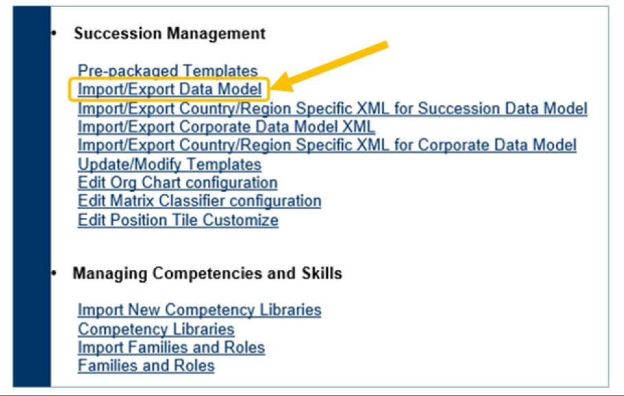
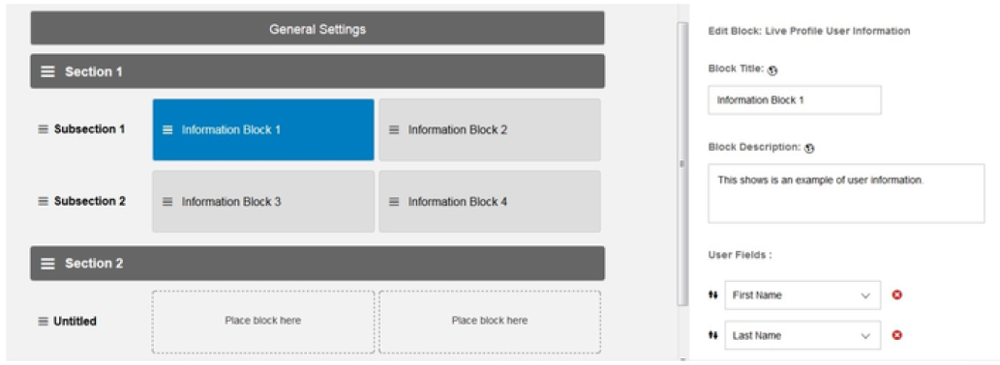

# 配置人员档案

[[toc]]

::: tip 本节目标

- 描述人员档案
- 检查配置流程
- 配置标准元素
- 配置自定义字段和过滤
- 配置人员档案布局
:::

## 人员档案 People Profile


SAP SuccessFactors People Profile 通过集成的资源库提供相关的社区，丰富员工信息，从而将员工连接起来，并支持人才决策。“人员档案”有时也称为“实时档案”。

通过“人员档案”，您可以在一个简单的合并页面上查看和编辑员工的整个档案，并立即采取措施。您可以快速找到最重要或最新的信息，并在需要时下钻以查看更多详细信息。响应式SAP Fiori 设计意味着人员档案调整以适应您的设备，以便在台式机、平板电脑或智能手机上进行最佳查看。

管理员可以使用便捷的拖放配置工具为您的公司设置人员档案。您可以选择要在页面顶部突出显示的数据字段，并控制公司概要内容的布局和组织。个人资料中员工数据的可见性由基于角色的权限控制。

“People Profile”（人员档案）页面分为多个部分(sections)、子部分(subsections)和块(blocks)。相关信息分组在“块”中，并直接显示在页面背景上。在第一个视图中隐藏详细信息，以减少混乱并使页面更易于快速扫描。可以展开或折叠子部分和块，以根据需要显示或隐藏详细信息。

### 导航到人员档案 Navigate to People Profile

要导航到员工个人档案，请执行以下操作：

1. 在实例的左上角，单击导航菜单并选择我的员工文件(My Employee File)。

2. 这将带您进入您的“人员档案”

3. 您可以查看您的个人信息，例如姓名、电子邮件、位置等。此页面中列出的字段因您公司的配置以及您的权限级别而异。

### 档案抬头 Profile Header


“人员档案”包括可配置页面标题，显示员工的档案照片和基本信息。


向下滚动页面时，抬头将缩小为折叠状态，并置顶到页面顶部，以便于导航，如此处所示。

### 信息块 Information Blocks


“人员档案”页面由“档案抬头”和一个或多个档案“部分(sections)”组成。每个部分都包含一个或多个“子部分(subsections)”。每个子部分依次包含一个或两个“块(blocks)”。

某些块是预定义的，并且不可配置，例如“继任(Succession)”块，而其他块是可定制的，允许您配置要显示的数据，例如“用户信息(User Info)”或“背景(Background)”块。

大多数块占子部分宽度的一半，因此，大多数情况下，您可以在每个子部分中放入两个块。某些块（例如“徽章(Badges)”或“技能(Skills)”）占据子部分的整个宽度，因此，在这些情况下，“块”和“子部分”实际上是相同的。下图显示了人员档案页面的一个示例。档案抬头位于顶部，背景为蓝色，后接一个部分。此部分包含两个子部分，每个子部分两个块。

### 移动浏览器上的响应显示 Responsive Display on Mobile Browsers


人员档案采用“响应式”设计，根据可用的显示大小优化页面布局，在平板电脑或智能手机上提供更好的用户体验。

“人员档案”上的部分、子部分和块的布局会自动调整，以便根据设备上的屏幕大小进行最佳查看。在桌面上重新调整浏览器窗口大小时，响应界面也会进行调整以适应浏览器窗口的大小。

## 人员档案配置 People Profile Configuration

人员档案使用管理员中心(Admin Center)和继任者数据模型(Succession Data Model)配置。继任者数据模型是一个XML 文件。如果您之前没有使用XML 的经验，请查看上一课“描述可扩展标记语言 (XML) 的基础知识”。

### 配置流程 The Configuration Process

配置“人员档案”需要“管理员中心”和“继任者数据模型”。下表详细介绍了与“人员档案”配置相关的每个工具的功能。

<table>
<tr>
<td>管理中心(Admin Center)</td>
<td>排列布局<br/>Arranges the layout</td>
<tr>
<tr>
<td>数据模型(Data Model)</td>
<td>定义人员档案中使用的标准元素<br/>定义自定义筛选字段(如果适用)<br/>Defines the Standard Elements used in the People Profile<br/>Defines custom filtering fields (if applicable)</td>
<tr>
</table>

标准元素是您在实例中看到的字段，例如姓名、雇用日期、地址、电话号码等。定义字段可以包括更改标签以及确定字段是否为必填字段。然后，您将配置标准元素的权限。这有助于系统确定谁有权访问每个字段，以及访问、读取或写入级别。例如，员工可能能够查看，但不能编辑其录用日期。

如果需要自定义过滤字段，这些字段也在数据模型中维护。

对数据模型进行适当更改并导入文件后，您可以在“管理中心”中更改字段顺序。

### XML 数据模型使用 XML Data Model Use


::: warning Note
要更新数据模型，必须使用XML 编辑器打开XML 文件。Oxygen 和 Notepad++在整个行业非常流行。XMLPad 是仅限Windows的软件，可使用CNET在线下载。
用Visual Studio Code就成了
:::

查看XML 数据模型时，您将看到三个主要元素：

标准元素：用于定义员工档案中使用的字段和标签。

背景元素： 用于定义到SM_Background表的数据字段映射（本课程不会更新此元素）。

自定义过滤器：用于将 15个自定义字段中的 1个或 1个以上自定义字段转换为可在系统中用于任务（例如报告）的过滤器。

### 数据模型的文件管理 File Management of the Data Model


在SAP SuccessFactors 中使用数据模型时，有一些文件管理注意事项。首先，我们专门为数据模型版本创建了一个文件夹。在“数据模型的文件管理”一图中，文件 A 是我们的原始数据模型(original data model)。这是备份，不应进行编辑。文件B 和C 是数据模型文件的版本 1和版本 2。使用“另存为”和创建文件版本是使用SAP SuccessFactors 数据模型的最佳实践，应始终遵循。

#### 下载数据模型 Downloading the Data Model

继任者数据模型(Succession Data Model)位于Provisioning中的“继任管理(Succession Management)”标题下。请务必注意，数据模型是上载时覆盖的单个文件。下载和更改数据模型时，必须备份原始数据模型并使用非常严格的版本控制，以避免浪费时间或出现关键错误，尤其是在客户环境中工作时。要从您的实例下载继任者数据模型，请执行以下操作：



1. 登录到“Provisioning”并选择 实例。

2. 向下滚动至继任管理(Succession Management)，然后选择导入/导出数据模型(Import/Export Data Model)。

3. 选择 “导出文件(Export File)”，然后选择 “另存为(Save As)”。


可以在配置中备份多个版本的继任者数据模型，并恢复实例的版本。此功能有助于保护配置并跟踪数据模型更改。如果出现问题，它可以加快实例恢复。

可在导入期间添加注释。然后，可以轻松下载特定版本。

系统最多保留 100 个版本的继任数据模型备份。达到限制时，删除早期版本。

::: warning Note
版本控制不记录从BCUI 进行的更改，仅适用于通过Provisioning加载的数据模型。
:::

### :tada:练习一 从配置中下载数据模型 Download the Data Model from Provisioning

您需要更改个人资料。您必须首先从Provisioning下载数据模型，然后从SAP帮助门户下载DTD文件。  
You are required to make changes to People Profile.You must first download the data model from Provisioning and then download the DTD file from SAP Help Portal.

::: warning Note
在本练习中，您将创建本课程后续练习所需的XML文件。  
从KBA2292731下载DTD文件。
:::

1. Log into Provisioning.
2. Select your company instance and download and save the data file.
    1. Click your Company Name.
    2. Scroll down to Succession Management and click Import/Export Data Model .
    3. On the Import/Export Data Model screen, select the Export file (Select 'Save',not 'Open') radio button.
    4. Click Submit .
    5. In the File Download dialog box, click Save.
    6. In the Save As dialog box, specify where you want to save your file.
    7. Click Save.

该文件保存为XML文件。记下文件位置，在下一个练习中需要它。  
The file is saved as an XML file. Make a note of the file location, you will need it in the next exercise.

### :tada:练习二 使用XML编辑器打开数据模型

您需要更改员工档案数据模型中的DTD文件路径。  
You are required to change the DTD file path in your employee profile data model.

::: warning Note
本练习要求您使用练习中配置的XML文件，从Provisioning下载数据模型和帮助门户中下载sf-form.dtd文件。该dtd也可以在SAP SuccessFactors Academy学习室简介和VLC学生JAM小组中找到。  
在本练习中，您将编辑本课程后续练习所需的XML文件。
:::

使用XML编辑器打开数据模型
Use an XML Editor to Open the Data Model

1. Make sure the sf-form.dtd file is in the same folder as your XML file.
2. Open the XML editor.
3. Open the file you saved in the previous exercise, change the DTD file path.You must change the DTD file path to refer to a DTD in your local folder instead of referring to the internal svn repository for SAP SuccessFactors since you cannot access that location.  
    Validate the XML after the change.  
    1. In the XML editor, click File Open.
    2. Navigate to the location where you previously saved the data file.
    3. In line 004, change the line <http://svn/viewvc/svn/V4/trunk/src/com/sf/dtd/sf-form.dtd?view=co> to sf-form.dtd
    ::: warning Note
    The link points to an internal SAP SF repository built in Apache Subversion (abbreviation svn) that external users cannot access.
    :::
    4. To validate the XML code, from the menu, click XML Validate .

#### 标准元素 Standard Elements


标准元素(Standard Elements)是我们定义标准、单一值字段的位置，这些字段在“人员档案(People Profile)”的“个人信息(Personal Information)”部分可见。我们在个人信息面板中看到的每个字段都与数据模型中的标准元素相关。例如，姓氏字段由示例数据模型中从行 13开始的标准元素控制。但是，元素顺序未在此数据模型中定义。

### :tada:练习三 修改标准数据元素的标签

ACE公司已决定将其员工档案中的国家/地区更改为居住国。你的任务就是这么做。为了进行此更改，您将更改xml文件中标准元素的标签。  
ACE Company has decided to change the field Country in their employee profile into Country of residence.You are tasked with doing that. In order to make this change, you will change the label of the standard element in your xml file.

::: warning Note
本练习要求您使用在练习中创建的XML文件，从Provisioning下载数据模型。
在本练习中，您将创建本课程后续练习所需的XML文件。
:::

更改标准元素的标签
Change the Label of a Standard Element

1. Open the data model file and change the Country label to Country of Residence.
    1. Open the data file you saved in a previous exercise.
    1. Search the XML document for the standard element with the ID country .
    1. Change the label for this element from Country to Country of Residence .
2. Search for the standard element ID custom01 , and change the label from Customizable Field 1 to Region .
    1. Search the XML document for the standard element ID custom01 .
    2. Change the label for custom01 from Customizable Field 1 to Region .
3. Search the standard element with the ID custom02 , and change the label from Customizable Field 2 to Marital Status .
    1. Search the XML document for the standard element ID custom02 .
    2. Change the label for custom02 from Customizable Field 2 to Marital Status .
4. Validate your changes and save the data model as a new version (_V2 in the name).
    1. From the menu bar, click XML Validate .  
        If there are any errors, review your configurations and update as required.
    2. Click File Save As.
    3. Since version control is very important, be sure to save the file as a new version.
    4. Specify a location to save the file and click Save.
5. In Provisioning, import your updated data model.You may see warning messages but the system should indicate "Template(s) has(have) been uploaded and saved.”
    1. Log into Provisioning.
    2. On the Companies screen, click your Company Name.
    3. Scroll down to Succession Management and click Import/Export Data Model .
    4. On the Import/Export Data Model screen, select the Import File radio button and click Browse.
    5. On the Choose File to Upload dialog box, navigate to the file you saved previously and click Open.
    6. On the Import/Export Data Model screen, click Submit .
6. Log out of Provisioning.
7. Log into your instance and go to Manage Permission Roles.
    1. Edit the All Employees role, click Permission ... In the category Employee Data, give the Edit permission for the fields: Country of Residence, Marital Status and Region.You will notice that the labels Customizable Field 1 and Customizable Field 2 are no longer visible because the labels were changed in the Succession Data Model.
    2. Click Done and Save Changes. Then Log out and go back to your instance.
    3. From the main menu, go to My Employee File and verify that you can edit the Country of Residence.
8. Log into your instance, and validate the custom2 (Marital Status) field.
    1. Log into your instance.
    2. Access Configure People Profile tool.
    3. Click on the grey Personal Information box. In the frame to the right you can now edit the Block information including User Fields. Go to the bottom to add a field and select Marital Status from the drop-down menu. Click Save.
    4. Select My Employee File from the main navigation drop-down on the top left. In the Personal Information portlet either click Show More or click Edit. Scroll to the bottom to locate the Marital Status field.

### 标准元素配置 Standard Elements Configuration


从Provisioning下载的数据模型中已经存在许多元素（字段）。您可以使用 XML 编辑器的搜索功能搜索这些元素。请求的第一个和最常见的任务之一是更改标准元素的标签。例如，如果第一个元素的缺省标签是Username，但您希望其读做Login，请执行以下操作：

1. 找到标准元素，Username。

2. 查找标记`<label>`并更新这些标记之间的文本，以表示 Login。进一步配置标准元素

#### 进一步配置标准元素 Further Configuration of Standard Elements


配置标准元素时，其他常见更改包括：

- 通过将required属性设置为“true”，将字段设置为必填字段。  
Making a field a required field, by setting the required attribute to “true”.

- 更改标签以反映多种语言。  
Changing labels to reflect multiple languages.

- 将下拉选单添加到字段。  
Adding a picklist to a field.

在图中必填字段，您可以看到重命名标签为Login的username元素是必填字段。

#### 配置测试 Configuration Testing


要查看实例中反映的更改，必须保存数据模型的新版本，然后将文件导入到Provisioning中。遵循下载文件时的相同说明；但是，这次只需选择导入文件即可。收到模板已成功上载的消息后，您可以登录到实例以查看更新。

从数据模型更改参数文件中的标签(Change a Label in the Profile from the Data Model)视频链接：<https:// sapvideoa35699dc5.hana.ondemand.com/?entry_id=1_6wyf6ox0>

### 自定义字段和过滤


SAP SuccessFactors 支持自定义字段和筛选。客户最多可以向“人员档案(People Profile)”添加 15个自定义元素。设置自定义筛选器时，这些元素可用于报表或执行管理功能，例如生成表单。例如，可以在报表仪表盘中使用自定义字段（如“Region”）来进一步过滤信息。

#### 自定义字段配置 Custom Fields Configuration

如前所述，共有 15个自定义字段可用。要在“人员档案”中使用这些字段，需要以下两步：

1. 在数据模型中，更改标签以满足客户需求。

2. 在“管理中心”中，配置“人员档案”以包括新的自定义字段。

#### 自定义筛选XML元素 The Custom Filters XML Element


要启用基于自定义字段的筛选，必须将`<custom-filters>`元素添加到 XML 数据模型。此元素不包含在训练实例的系统缺省数据模型中，因此必须手动添加代码，如下所示：

1. 由于此新`<custom-filters>`元素必须添加到最后一个`background-element`之后，并在第一个`element-permission`之前添加，因此请找到位置以添加自定义过滤器文件。

2. 使用相应的标准元素参考添加到自定义过滤器元素中。在上图中，您可以看到我们正在添加custom field 01过滤器。

3. 保存新版本并将更新的数据模型上载到Provisioning。

##### 查看自定义过滤字段

上载包含自定义过滤字段的数据模型后，必须在实例中启用过滤器，如下所示：

1. 在您的实例中，导航到Admin Center > Reporting > Filtering Options 。

2. 确保自定义筛选字段（在本例中为“Region”）可用且处于选中状态。

3. 导航到报表。

4. 在仪表盘中，您可以单击筛选选项旁的加号。在“查看自定义过滤字段”一图中，我们可以看到“区域”现在可用作过滤选项。

### :tada:练习四 添加自定义过滤器 Add a Custom Filter

您希望在数据模型中添加自定义过滤器。  
You want to add a custom filter in the data model.

添加自定义过滤器  
Add a Custom Filter

1. Open the data model file from the previous exercise.
    1. In XML editor, click File Open.
    2. Navigate to the file you saved in the previous exercise.

2. In the data model file, after the last background element, enter the following code:

    ``` xml
    <custom-filters>
    <filter-module id="default">
    <standard-element-ref refid="custom01"/>
    </filter-module>
    </custom-filters>
    ```

    ::: warning Note
    如果`<filter-module id="default">`已经存在，只需要在`</filter-module>`前面添加`<standard-element-ref refid="custom01"/>`
    :::

3. Validate your changes and save your updated version of the data model.
    1. From the menu bar, click XML Validate .
    2. there are any errors, review your configurations and update as required.
    3. Click File Save As.
    4. In the File name field, save the file as a new version.
    5. Specify a location to save the file and click Save.

4. Import the updated data model.
    1. If you have not already done so, log into Provisioning.
    2. From the list of companies, click your company’s instance.
    3. Under Succession Management , click Import/Export Data Model .
    4. On the Import/Export Data Model screen, select the Import File radio button.
    5. Click Browse and navigate to the updated data model file.
    6. Select the file and in the Choose File to Upload dialog box, click Open.
    7. On the Import/Export Data Model screen, click Submit .

5. Log out of Provisioning.

6. Verify that the new filter is available in Manage Employee Import.
    1. Log in your instance.
    2. Use the Action Search to navigate to Manage Employee Import.
    3. Verify that the filter by options now include Region.

## 人员档案布局配置 People Profile Layout Configuration


下图说明了如何在“配置人员档案”管理工具中配置上述档案。

::: warning Note
尽管添加了名为"Section 2"的新部分，但当前不包含任何信息块，因此尚未显示在上述档案UI 中。
:::



### 人员档案配置工具 People Profile Configuration Tool

您可以使用“配置人员档案”管理工具管理“人员档案”的内容和版式。

使用它，您可以添加和配置要包含在“人员档案”上的部分、子部分和块，并调整这些内容在页面上的布置方式。您还可以配置档案抬头中显示的信息、设置评级数据的数据源和日期范围，以及添加自定义标签的本地化翻译。

要访问配置工具，您可以使用搜索或转到Admin Center > Employee Files > Configure People Profile。

### 授予配置人员档案的权限 Granting Permission to Configure People Profile

您使用“配置人员档案(Configure People Profile)”管理工具必须被授予“管理员工文件(Manage Employee Files)”权限。要授予此权限，请完成以下步骤：

1. 转到Admin Tools > Manage Permission Roles，然后选择要授予这些权限的角色

2. 在 “管理员权限(Administrator Permissions)”部分中，选择 “管理系统属性(Manage System Properties)”选项卡。

3. 选择管理员工文件(Manage Employee Files)权限。

4. 单击完成保存更改。

### 人员档案抬头设置 People Profile Header Settings

抬头设置使您能够配置档案抬头的外观和功能。

还可以在抬头设置中启用或禁用档案完整功能。

最后，在“人员档案”中，您可以使用“配置标题字段(Configure Header Fields)”对话框配置哪些员工数据字段显示在档案抬头中。此对话框也可以在抬头设置中访问。

步骤：

1. 转到Admin Center > Configure People Profile > General Settings > Header Settings

2. 选择所需设置。有关每个设置的描述，请参阅下面的链接。

3. 保存更改。

下表描述了“人员档案”中可用的标题设置。

|设置|描述|
|配置抬头字段<br/>Configure Header Fields|打开一个对话框，允许您配置档案抬头中显示的数据字段。有关详细信息，请参阅配置抬头字段。<br/>Opens a dialog that allows you to configure which data fields are displayed in the profile header. See Configuring Header Fields for details.|
|允许员工编辑背景图像<br/>Allow employees to edit background image|如果选中，用户可将自己的背景“覆盖”图像上载到其参数文件抬头。If checked, users can upload their own back- ground "cover" image to their profile header.<br/>|
|禁用由员工上传的背景图片<br/>Disable background image uploading by employees|如果同时选中此选项和允许员工编辑背景图像选项，则用户仅可通过从图像库中选择一个来更改其背景图像。<br/>If you check both this option and the Allow employees to edit background image option, users change their background image only by choosing one from the image library.|
|管理背景图像库<br/>Manage background image library|打开现有“管理背景图像库”对话框，该对话框允许您管理图像，用户可从中选择背景“封面” 图像以用于其配置文件标题。<br/>Opens the existing Manage Background Im- age Library dialog, which allows you to man- age the images from which users can select a background "cover" image for use in their profile header.|
|允许员工上传音频文件以获取姓名发音<br/>Allow employees to upload an audio file for name pronunciation|启用“我的姓名”功能，允许用户上传短音频剪辑或输入语音拼写以显示其姓名的发音方式。要启用此功能，管理员还需要接受用户协议， 确认所有媒体内容都存储在德国的SAP 数据中心。用户未表示同意。<br/>Enable the "My Name" feature, allowing users to upload a short audio clip or enter a phonetic spelling to show how their names are pronounced. To enable this feature, ad- mins are also required to accept a user agreement acknowledging that all media content is stored in the SAP data-center in Germany. Users aren't presented with this agree.|
|允许员工上传“关于我”视频<br/>Allow employees to upload an About Me video|启用“关于我”功能，允许用户上传关于自己的简短视频。要启用“关于我”功能，管理员还需要接受用户协议，确认所有媒体内容都存储在德国的SAP 数据中心。用户不会看到此协议。<br/>Enable the "About Me" feature, allowing users to upload a short video about themselves. To enable the "About Me" feature, ad- mins are also required to accept a user agreement acknowledging that all media content is stored in the SAP data-center in Germany. Users aren't presented with this agreement.|
|允许员工输入介绍文本<br/>Allow employees to enter an introductory text|如果选中，用户可以输入关于自己的短文本， 最多包含 500 个字符，该短文本在档案抬头中可见。<br/>If checked, users can enter a short text about themselves, of up to 500 characters, which is visible in the profile header.|
|显示完成百分比<br/>Show percentage complete|如果选中，则提醒用户其参数文件不完整。其完成百分比显示在档案抬头中，并且可以使用“档案完成向导”完成其参数文件。完成百分比仅在员工个人资料中可见，对任何其他人（包括管理员）均不可见。<br/>If checked, users are reminded if their profile is incomplete. Their percentage of comple- tion is shown in their profile header and they can use the "profile completion wizard" to complete their profile. The percentage com- plete is only visible on an employee's own profile and is not visible to anyone else, in- cluding administrators.|
|将所有字段设置为缺省展开<br/>Set all fields as expanded by default|如果选中，当员工访问“人员档案”页面时，将显示他们有权在页面上访问的所有内容。员工可以根据需要选择在块中显示更少或更多个内容。<br/>If checked, when employees access the Peo- ple Profile page, all the content that they have permission to access on the page are displayed. Employees can choose to show less or more content in blocks as needed.|
|选择档案文件上显示的名称格式。<br/>Choose the name format displayed on the profile.|您可以选择在SAP SuccessFactors Employee Central 中配置的名称格式之一以在个人资料标题中显示<br/>You can select one of the name formats con- figured in SAP SuccessFactors Employee Central to display in the profile header|


### 配置抬头字段 Configuring Header Fields

您可以使用抬头设置来配置哪些员工数据字段显示在个人资料抬头中。

配置抬头字段对话框仅用于配置档案抬头的外观。您可以选择与公司最有用和最相关的字段，并在概要页面顶部更加突出显示。

默认情况下，档案标题包含以下基本员工信息：照片、显示名称、用户名、标题、部门、部、地点、时区、本地时间、电子邮件、两个选定的电话号码以及到Facebook或LinkedIn的链接。您最多可以添加三个其他自定义字段。

请记住，所有这些员工数据也由基于角色的权限控制。如果登录用户无权查看特定档案中的特定字段，则该字段不会显示在抬头中。如果要隐藏系统中任何位置的特定字段，或者希望特定字段仅对特定用户可见，而对其他用户不可见，则可以使用基于角色的权限来执行此操作。

#### 添加自定义抬头字段 Adding Custom Header Fields

您最多可以向档案抬头添加三个自定义数据字段

自定义抬头字段可以是在系统的数据模型中定义的任何基本用户信息字段。您不仅限于数据模型中的十五个“可自定义字段”，还可以选择任何定义的“标准”和“用户信息”字段。这些字段与个人资料上的自定义“用户信息”块（和 Portlet）中可用的字段相同，并且存在于基本员工数据CSV导出中。

步骤：

1. 转到Admin Center > Configure People Profile > General Settings.

2. 选择配置抬头字段(Configure Header Fields)链接。

3. 在配置标题字段对话框中，选中其中一个自定义字段复选框。

4. 在下拉菜单中，选择所需字段。

5. 单击保存以保存更改。

### 隐藏或显示档案照片 Hiding or Showing the Profile Photo

您可以决定是否在“人员档案”的抬头中隐藏或显示员工档案照片。

个人资料照片与抬头中任何其他员工数据字段的处理方式相同，例如员工的职称或地点。与其他数据字段一样，您可以通过两种方式控制个人资料照片在标题中的可见性。

如果要从标题中完全删除照片，可以针对所有用户取消选中配置标题字段对话框中的照片复选框。

如果您希望照片对系统的某些用户可见，但对其他用户不可见，则应在配置抬头字段(Configure Header Fields)对话框中选中照片复选框，然后通过基于角色的权限控制照片的可见性。

### 徽章块 Badges Block

表彰是一个很好的动力。除常规的绩效和薪酬管理流程外，员工可以通过授予徽章来互相认可。此操作可在“人员档案”的“徽章(Badges)”块中完成。

徽章的背景应在继任者数据模型(Succession Data Model)中。

``` xml
<background-element id="sysScoreCardBadge" type-id="49">
<label>徽章</label>
<label xml:lang="de-DE">SF-Abzeichen</label>
<label xml:lang="fr-FR">徽章 SF</label>
</后台元素>
```

权限应从RBP 的“员工数据”类别中给出，并且块应添加到“配置人员档案(Configure People Profile)”中。管理员可以从Action Search > Manage Badges创建自定义徽章。

最多可以启用 20 个徽章。这包括自定义和预定义徽章。


### 人员档案块的深层链接 Deep Links to People Profile Blocks

深度链接可用于将用户直接发送到员工的特定“人员档案”块。用户可以直接访问“人员档案”中的特定块，并节省在档案页面上查找相关信息的工作量。

深层链接可用于所有类型的块，并且可以在任何可能的超链接中使用，其中包括：

- 电子邮件通知

- SAP SuccessFactors 应用

- 离线内容

### :tada:练习五 配置员工档案 Configure Employee or Associate Files

您已经更改了标准元素的标签，并添加了一个自定义过滤器，现在您希望更改“员工文件”选项卡中的可用员工信息。在前面的练习中，您已将单词Employee替换为单词Associate。您的员工文件现在可以有不同的名称。  
You have changed the label of standard element and added a custom filter and now you wish to change the available employee information in the Employee Files tab. You have replaced the word Employee with the word Associate in earlier exercise. Your Employee Files could have a different name now.

添加“地区”和“婚姻状况”字段，并将它们进一步上移到“名字”字段之后。您将使用配置人员配置文件工具来完成此操作。  
Add Region and Marital Status fields and move them further up after the First Name field. You will use Configure People Profile tool to do that.

配置员工文件  
Configure Employee Files

1. Log into your instance.

2. Use the Action Search to navigate to Configure People Profile or on the Admin Center screen, navigate to Employee Files Configure People Profile.

3. On the Profile Section, click on the Personal Information sub-section and Personal Information block.

4. At the right side, under User Fields click on add field.

5. Add Region in the list of fields and move it under the Last Name field.

6. Click Save on the bottom right.

7. Check the layout in your People Profile by navigating to My Employee File.
