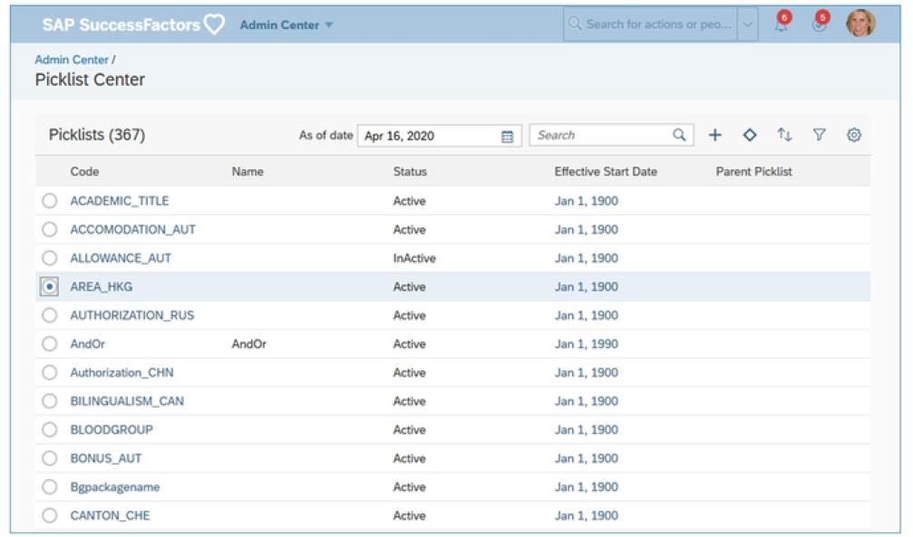

# 选项列表

[[toc]]

::: tip 本节目标

- 介绍SAP SuccessFactors 中的选项列表
:::

## 选项列表 Picklists

选项列表是用户可从中选择的一组可配置选项，通常在下拉菜单或智能搜索列表中。您可以定义系统中使用的选项列表，以限制用户可以在表单中输入的值，防止他们输入无效值。选项列表还可以具有“父子”关系，其中子选项列表中的选项与父选项列表中的选项相关联。它们也称为“级联选项列表”。

例如，在用户必须选择国家/地区的地方，他们可能还需要选择该国家/地区内的州或省。您希望国家下拉选项中的选项取决于国家/地区选择，而不是对所有国家/地区的所有可能的州和省有一个很长的列表。这样，用户只能选择位于所选国家/地区内的州或省。为此，您可以将国家/地区选项列表设置为“父项”，并将每个相应的州或省选项列表设置为其“子项”。

过去，不同SAP SuccessFactors 解决方案中的选项列表是使用不同的工具管理的：用于旧选项列表的选项列表导入/导出工具，以及用于MDF选项列表的元数据框架(MDF) 工具。管理旧选项选单非常繁琐且容易出错。

为了缓解这种困难，我们正在标准化在系统中管理选项列表的方式。现在，套件中的所有选项列表都将通过统一、易用的Picklist Center工具进行管理，从而降低错误风险和数据损坏的可能性。为此，必须将旧的选项列表迁移到MDF。训练实例中的所有选项列表均已迁移到选项列表中心(Picklist Center)。

::: warning Note
迁移到选项列表中心仍然是一项进行中的工作。但是， 选项列表中心现在可用于所有客户，包括尚未迁移历史选项列表的客户。
原有选项列表管理工具已于 2018 年 12月 31日结束维护，并将在 2021 年 11月 18 日删除。自 2021 年 5 月 21日起，删除旧的选项列表导入作业类型。
:::

### 选项列表中心 Picklist Center

作为管理员，您可以使用选项列表中心(Picklist Center)管理选项列表。为此，您将需要选项列表管理(Picklist Management)和选项列表映射设置(Picklist Mappings Set Up)权限。

无法删除选项列表、选项列表版本或选项列表值。您只能停用选项列表、选项列表版本或选项列表值。

也可以导入和导出选项列表。如果您的实例已迁移到MDF选项列表，则可以看到添加到导出的 CSV 文件和选项列表导入模板中的新必填字段LegacyPicklistID 。

#### 选项列表字段 Picklist Fields

|字段 |描述 |
|-----|-----|
|代码 Code|用于识别选项列表的唯一业务代码。（如果您熟悉旧选项列表，这相当于选项列表编号。） Unique business key that is used to identify the picklist. (If you are familiar with legacy picklists, this is the equiv- alent of the picklist ID.)|
|父选项列表 Parent Picklist|选项列表可以有父选项列表。例如，如果在选择特定国家/地区时只能选择特定州，则国家/地区选项列表是州选项列表的父项。将旧选项列表迁移到MDF选项列表时，会为现有MDF选项列表值生成选项标识符。对于已迁移的过时选项列表选项，现有optionId存储在映射表中。 |
|显示顺序 Display Order|选项列表中列出选项列表值的顺序，例如按字母顺序或数字。 |
|名称 Name|选项列表的唯一名称。例如，如果选项列表用于地址类型（家庭、邮寄、业务、帐单等），您可以将选项列表命名为“Address Type”。 |
|状态 Status|指定选项列表是处于活动状态还是非活动状态，即选项列表是否可供使用。 |
|有效开始日期 Effective Start Date|对于不同的开始日期，选项列表可以具有不同的选项列表值集。示例：要向“位置”选项列表添加新值“纽约”，但您希望在 2017 年 1月 1日之后此选项列表可用于此位置。输入01/01/2017 作为生效日期，具有新值的下拉选单在2017 年 1月 1日之后可用。 注意：在此阶段，Employee Central UI不考虑MDF选项列表生效日期。 A picklist can have different sets of picklist values for different start dates. Example: To add a new value New York to the Location picklist but you want this picklist to be available for this location after January 1, 2017. Enter in 01/01/2017 as the effective date, the picklist with the new value is available after January 1, 2017. Note: At this stage, Employee Central UI does not respect MDF picklist effective dating.|
|旧选项列表ID Legacy Picklist ID|迁移到MDF后，可以从选项列表中心编辑过时选项列表 ID。 如果源实例和目标实例中的外部代码和旧选项列表ID的组合不匹配，则不再允许在选项列表上进行实例同步。您可以编辑过时选项列表ID 以确保它们匹配。过时选项列表标识符在所有选项列表中必须唯一。 The legacy picklist IDs can be edited from the Picklist Center after the migration to MDF. Instance sync on picklists is no longer allowed if the combinations of external code and legacy picklist ID in source and target instance do not match. You can edit the legacy picklist ID to make sure that they match. The legacy picklist ID must be unique across all picklists.|

#### 选项列表值字段 Picklist Values Fields

|字段|描述 |
|-----|------|
|外部代码 External Code|MDF外部代码。用于识别下拉选单值的唯一业务代码，例如state_Alabama 。 MDF external code. A unique business key that is used to identify the picklist value, for example, state_Alabama.|
|非唯一外部代码 Non-unique External Code|过时外部代码。与MDF外部代码不同，它可以是空白的，也可以是重复的。 Legacy external code. Unlike the MDF external code, it can be blank or duplicated.|
|父选项列表值 Parent Picklist Value|例如，如果外部代码是state_Alabama，则父选项列表值为美国。如果值为state_Alberta，则父选项列表值为加拿大。 For example, if the external code is state_Alabama, the pa- rent picklist value would be United States. If the value is state_Alberta, the parent picklist value would be Canada.|
|标签 Label|例如，如果外部代码是state_Alabama，则标签将为Alabama。 For example, if the external code is state_Alabama, the label would be Alabama.|

链接到“创建选项列表Create a Picklist”视频：<https://sapvideoa35699dc5.hana.ondemand.com/?entry_id=1_3ec7gngc>

“将选项列表关联到 SDM 中的字段Associate a Picklist to a field in the SDM”视频链接：<https://sapvideoa35699dc5.hana.ondemand.com/?entry_id=1_dxz67twj>

## 导入和导出MDF 选项列表 Importing and Exporting MDF Picklists

“导入和导出数据”工具用于导入和导出选项列表。

### 导出MDF选项列表 Exporting MDF Picklists

导出选项列表允许您使用现有配置将选项列表从一个实例迁移到另一个实例。

1. 从操作搜索中，转到导入和导出数据。  
From the Action Search, go to Import and Export Data.

2. 从选择要执行的操作选项列表中，选择导出数据。将出现与导出数据相对应的字段。  
From the Select the action to perform dropdown, select Export Data. Fields corresponding to Export Data appears.

3. 从“选择通用对象”选项列表中，选择“选项列表”。  
From the Select Generic Object dropdown, select “Picklist”.

4. 从包括相关性选项列表中，选择是以包含相关性，否则选择否。  
From the Include Dependencies dropdown, select Yes to include the dependencies else No.

5. 要导出实体标识和记录标识，请从包括不可变标识下拉列表中选择是，否则选择否。  
To export the Entity ID and Record ID, select Yes from the Include Immutable IDs dropdown else select No.

6. 要导出参考对象，请从排除参考对象下拉列表中选择否，否则选择是。  
To export the reference objects, select No from the Exclude reference objects dropdown else select Yes.

7. 要导出所有选项列表，请从选择所有数据记录下拉列表中选择是。选择 “否”时，将显示 “选择对象”下拉列表，用户可以在此处指定要导出的特定选项列表。  
To export all the picklists, select Yes from the Select all data records dropdown. On selecting No, a Select Objects dropdown appears and here you can specify the specific picklists which you want to export.

8. 单击导出。  
Click Export.

触发导出作业。您可以从Action Search > Monitor Jobs 跟踪此作业的状态。当此作业的状态为已完成时，您可以使用下载状态链接下载选择列表包。  

::: warning Note
由于选择了值的有效开始日期，因此选项列表值的导出结果可能与选项列表中心中显示的值不同。导出将始终显示存在的所有有效日期的所有记录。
:::

### 导入MDF选项列表 Importing MDF Picklists

与导出类似，您还可以导入您的选项列表。对导出的选项列表进行更改后，您可以将其导回。您可以通过两种方式导入选项列表- CSV 导入和ZIP 导入。

选择与您的情况相关的导入类型：

如果要进行细微更改（如更新现有值、更改标签、向选项列表添加值），请使用CSV 导入。  
Use CSV import if you want to make minor changes like - updating existing values, changing a label, adding values to the picklist.

如果要进行完全清除，请使用ZIP 导入，分别更改选项列表标题和值。有关第二个选项的详细信息，请查看Help Portal上的实施元数据框架(MDF) 指南。  
Use ZIP import if you want to do full purge, change the picklist headers and values separately. For more information about this second option, please review the Implementing the Metadata Framework (MDF) guide on the Help Portal.

使用CSV 导入MDF选项列表

1. 从 操作搜索->导入和导出数据。  
From the Action Search -> Import and Export Data.

2. 从 “选择要执行的操作”下拉列表中选择 “导入数据”。将显示与 导入数据对应的字段，默认选择CSV 文件选项卡。  
Select Import Data from the Select the action to perform drop-down list. Fields corresponding to Import Data appears and by default CSV File tab is selected.

3. 从选择通用对象下拉列表中选择一个选项列表。  
Select a picklist from the Select Generic Object drop-down list.

4. 单击选择文件以选择要在文件字段中导入的CSV 文件。  
Click Choose File to select the CSV file to import in the File field.

5. 从 “文件编码”下拉列表中指定文件编码。  
Specify the file encoding from the File Encoding drop-down list.

6. 从 “清除类型”下拉列表中选择 “递增加载”。  
Select Incremental Load from the Purge Type drop-down list.  
    ::: warning Note
    不允许以CSV 格式使用“完全清除”，因为这会导致数据丢失。例如，如果某个对象引用了某个选项列表，则在完全清除之后，引用将关闭。
    :::

7. 选择是，从禁止冗余日期有效记录下拉列表中删除多余的有效日期记录。否则，选择否。  
Select Yes to remove redundant effective-dated records from the Suppress Redundant Date-Effective Records dropdown list. Else, select No.

8. 选择业务代码或外部代码作为代码首选项。确保选择与导出选项列表时选择的密钥首选项相同的密钥首选项。  
Choose Business Key or External Code as the Key preference. Make sure that you select the same key preference as the one you chose when you exported the picklist.

9. 在 “使用区域设置格式”中选择 “是”，然后在 “区域设置”字段中选择区域设置。否则，选择 否  
Choose Yes in the Use Locale Format and select the locale in the Locale field. Else, choose No.

10. 如果要舍入小数值，请在启用小数舍入选项字段中选择是。否则，选择否。  
Choose Yes in the Enable Decimal Round Option field if you want to round decimal values. Else, choose No.

11. 选择用户标识或分配标识作为身份类型。确保选择与导出下拉选单时选择的类型相同的身份类型。  
Choose User Id or Assignment ID as the Identity type. Make sure that you select the same identity type as the one you chose when you exported the picklist.

12. 单击导入并在监控作业工具中检查导入状态。  
Click Import and check the import status in the Monitor Job tool.

### :tada:练习六 使用选项列表中心创建新选项列表 Creating a New Picklist Using the Picklist Center

您的客户已决定在“人员配置文件”中的“区域”字段中附加一个选择列表。您正在选择列表中心创建一个新的选择列表。在下一个练习中，您将学习在field Region和这个新选择列表之间创建链接。  
Your customer has decided to attach a picklist to the Region field in People Profile. You are creating a new picklist in Picklist Center. In the next exercise, you will learn to create a link between field Region and this new picklist.

1. Use the Action Search to navigate to Picklist Center.

2. Click on the + icon to create a new picklist.

3. Fill in the data from this table.

    

4. Click Save

5. Each time, click on the + icon to add a picklist value and add the following regions: Africa (external code: AF)

    Asia (external code: AS) Europe (external code: EU) Middle East (external code: ME)

    North America (external code: NA) South America (external code: SA)

### :tada:练习七 向数据模型添加选择列表引用 Add a Picklist Reference to a Data Model

您需要向数据模型添加选择列表引用。
You are required to add a picklist reference to your data model.

::: warning Note
此练习取决于在前面的练习中创建的XML文件。
:::

1. In your XML editor, open the XML file from previous exercises and add a picklist reference to Region picklist.
    1. Click File Open.
    2. Navigate to the file latest version of the data model.
    3. Locate the standard element with the ID custom01.
    4. Insert a blank line after the `</label>` tag and before the `</standardelement>` tag.
    5. In the new line, enter `<picklist id="region"/>` .

2. Validate your changes and save your updated version of the data model.
    1. From the menu bar, click XML Validate .
    2. If there are any errors, review your configurations and update as required.
    3. Click File Save As
    4. In the File name field, save the file as a new version.
    5. Click Save.

3. Upload the new version of the Succession Data Model and test the modification in your instance.
    1. Go to Provisioning Import/Export Data Model.
    2. Make sure that the radio button Import File is selected and browse for your latest Succession Data Model xml.
    3. Click on Submit.
    4. Log in to your instance and go to the Profile. Edit the Personal Information portlet and make sure that the Region field is connected to a picklist.
