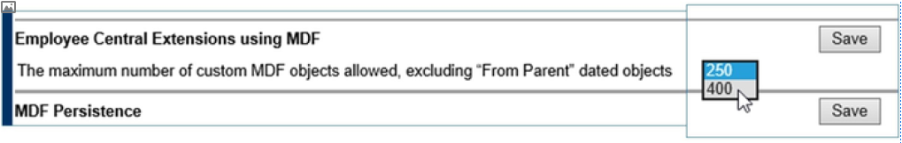
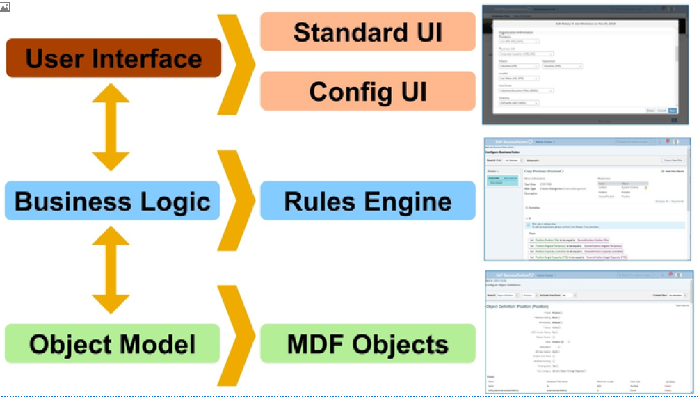
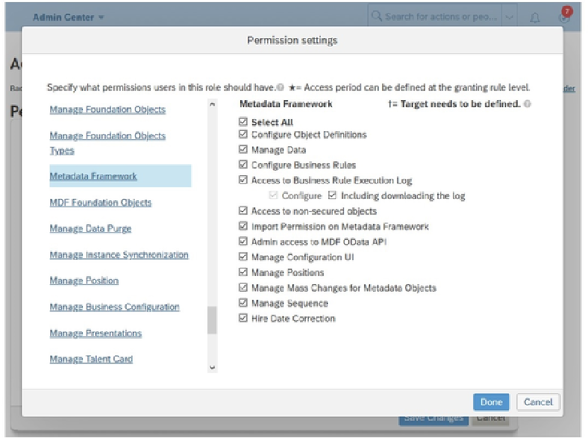
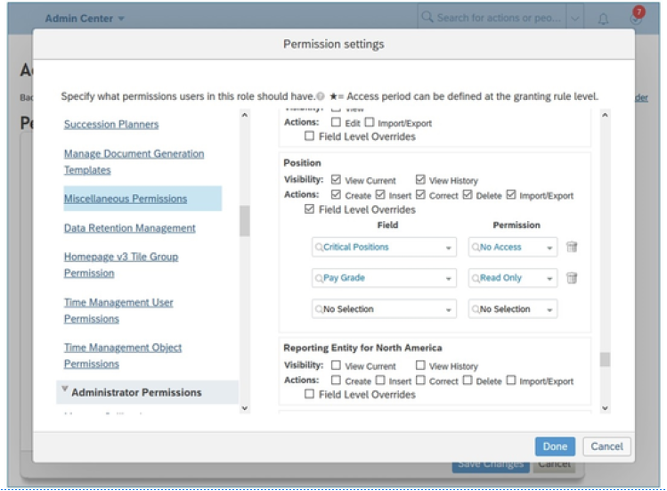

# MDF概览

[[toc]]

::: tip 本节目标

- 激活并授权MDF
:::

什么是元数据框架(Metadata Framework)？

元数据框架(Meta Data Framework,MDF) 也称为通用对象(Generic Object,GO)，是允许扩展现有SuccessFactors HXM 套件功能的平台功能。MDF能够添加新的自定义对象并维护名为通用对象的现有对象。

使用MDF，您可以创建和管理对象、链接对象，甚至创建对象层次。MDF 与工作流、规则引擎和报表完美集成。它还具有内置功能，如导入和导出支持以及基于角色的权限(RBP) 。这意味着 MDF中的任何可用对象都具有所有这些功能。然后，您可以使用不同的方式以导入/导出、UI 或 oData等方式管理数据，并且您可以控制访问这些对象的人员。

使用MDF，您可以轻松扩展客户的 Employee Central (EC) 实体。它允许您定制满足客户需求所需的对象和行为。使用MDF功能构建SAP SuccessFactors 套件的几个关键应用程序，如职位管理(Position Management,)、休假(Time Off)、管理业务配置(Manage Business Configuration,BCUI) 。

管理中心提供了用于管理MDF对象的工具。

管理员默认能够创建 250 个自定义MDF对象。可通过Provisioning > Company Settings将此限额提高到 400 。

## MDF 组件 MDF Components

MDF可以拥有多个不同的层(layers)。最基本的层是对象定义(Object Definition)。在此处制定对象的所有配置决策以及对象的位置叫“构建(build)”。对象行为(Object behavior)、字段(fields)、关联(associations)和安全性(security )均在对象定义中设置。

构建对象定义后，可以将业务逻辑添加到对象，使用业务规则(Business Rules)完成此操作。业务规则可用于设置默认数据，根据选择的数据设置值，引发信息或错误消息，并在保存或删除数据记录时触发操作。

构建对象并集成业务逻辑后，您可以开始导入、创建和管理与该对象相关的数据。

最后，您可以为对象创建不同的“视图(views)”或 UI。在配置UI中，您可以更改对象的布局、添加或移除字段、更新标签以及将文本或超链接添加到对象视图。

## 启用 MDF 和授予权限 Enabling MDF and Granting Permissions

### 启用MDF Enabling MDF

要启用MDF，请转到Provisioning —> Company Settings

    - 选中启用通用对象复选框。  
    Select the Enable Generic Objects checkbox.

    - 选中启用附件管理器复选框。  
    Select the Enable the Attachment Manager checkbox. Scroll up to the top of the screen and select Save Feature.

向上滚动到屏幕顶部并选择保存功能(Save Feature)。

如果要使用其他相关功能（例如工作流和规则），还必须从Provisioning中启用以下功能。

    - Employee Central基础对象  
    Employee Central Foundation Objects

    - 基于生效日期的数据平台  
    Effective Dated Data Platform

    - 启用工作流派生的业务规则  
    Enable Business Rules for Workflow Derivation

::: warning Note
要启用MDF以及扩展中心(Extensions Center)，可以使用升级中心。
:::

### 授予权限 Grant Permissions

对管理MDF配置和数据的工具的访问由(RBP) 控制。启用MDF后，您需要通过授予特定RBP权限以授予访问权限。

1. 使用Action Search导航到Manage Permission Roles。

2. 选择现有角色或创建新的Permission Role。

3. 单击“权限(Permission)”

4. 

    导航到元数据框架(Metadata Framework)部分，并选择您希望授予该角色的所有权限。最初，应将所有这些权限授予管理员角色，并且在熟悉主题后，可以决定保留或撤消这些权限。

    ::: warning Note
    还有其他RBP 部分允许用户处理使用MDF构建的对象（例如，杂项权限(Miscellaneous Permissions)或管理休假(Manage Time Off)）。如果未从Provisioning中启用相关功能，则某些权限（如“管理职位(Manage Position)”）可能不可用。
    :::

5. 在杂项权限(Miscellaneous Permissions)部分，您可以授予对管理数据的工具的访问权限，以及查看、编辑、导入和导出特定MDF对象的数据的功能。还存在“字段级别覆盖(Field Level Overrides)”选项，用于对对象的特定字段定义更严格的权限（无法访问或只读）。

    

### :tada:练习一 启用MDF和MDF权限 Enabling MDF and MDF Permissions

Your company has decided to start using MDF for configuration of their objects. Your task is to enable MDF and to give permissions to Administrators to use it.

1. Enable MDF in provisioning.
    1. In Provisioning, select Company Settings.
    2. Verify that the checkboxes Enable Generic Objects and Enable the Attachment Manager are both enabled.
    3. If you make a change click Save Feature, type your Company ID and click Confirm .

2. Set up permissions for administrators to use MDF.
    1. Use the Action Search to navigate to Manage Permission Roles.
    2. In the list of permission roles, click Administrators.
    3. On the Permission Role Detail screen, click Permission.
    4. On the left side, click Metadata Framework.
    5. Make sure all boxes are marked/checked.
    6. Click Done.
    7. Click save changes

MDF is enabled in your instance and your administrators has the permission to Configure Object Definition. As usual, after changing the permissions, it is important to log out and come back to the instance to make sure that the new permissions will be reflected.
