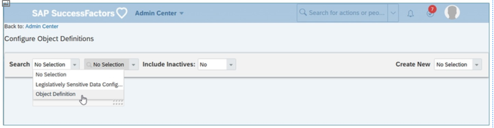
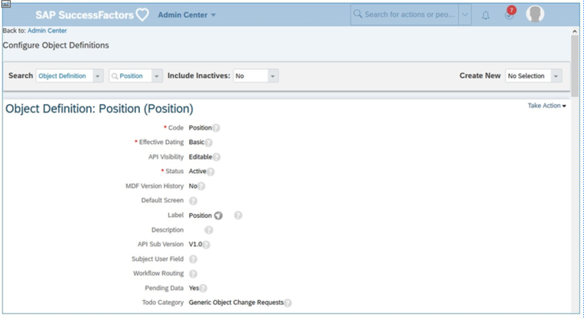
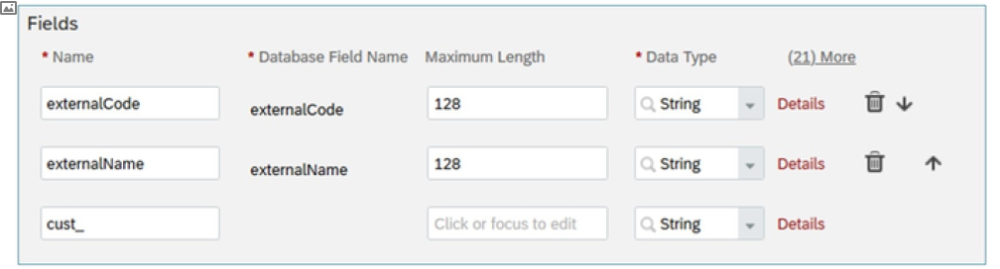
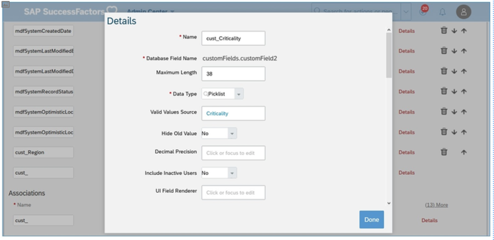
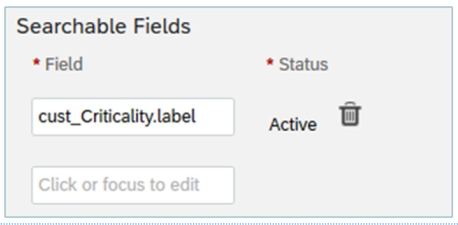
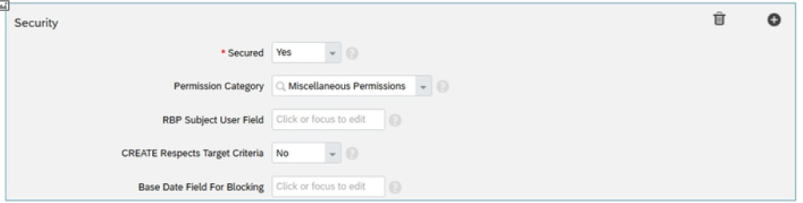
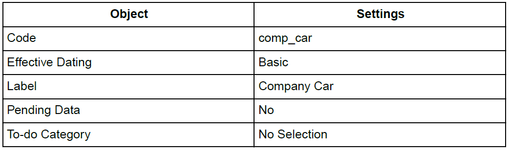
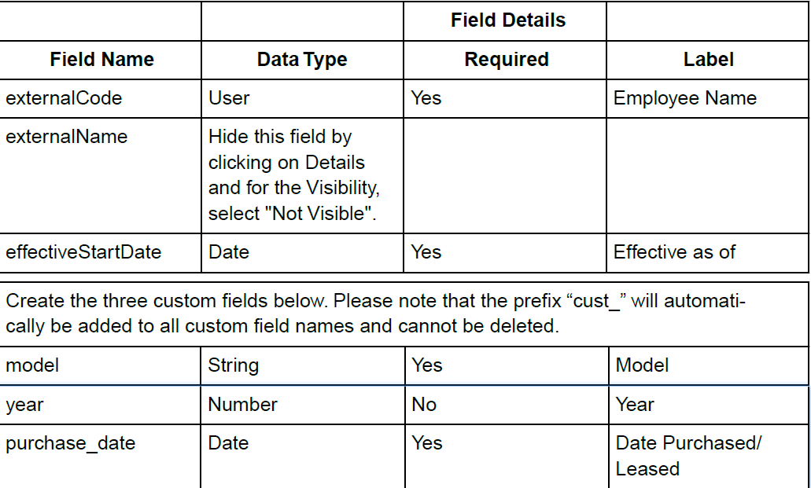

# MDF对象配置

[[toc]]

::: tip 本节目标

- 配置 MDF 对象的选项
:::

## MDF 对象配置 MDF Object Configuration

大多数MDF配置都使用“管理中心(Admin Center)”中的 UI 工具“配置对象定义(Configure Object Definitions)”进行维护。在开始使用 MDF对象或将数据填充到MDF对象之前，必须创建新的通用对象(Generic Object,GO) 定义或查看现有的通用对象定义。通用对象(GO) 有多个区域控制GO 的不同方面。

使用Action Search导航到配置对象定义(Configure Object Definition)工具，然后选择Create New: Object Definition。打开新对象定义后，将显示可配置的不同区域。

### 对象详情 Object Details

该部分确定GO的总体“行为(behavior)”。

- __CODE__：对象的唯一标识符。所有自动创建前缀为`cust_`的自定义对象。  
Unique identifier for Object. All custom object created automatically prefixed with cust_.

- __Effective Dating__：用于定义对象实例是只能具有单个记录还是基于不同日期的多个记录。请勿将此字段与审计混淆，无论此字段如何配置，都可以启用审计。  
This defines if object instance can have only single record or multiple records based on different dates. Please do not confuse this with audit can be enabled irrespective of configuration of this field.  
可用选项包括：
  - __None__：只能为给定对象实例维护单个记录。无论何时进行更改，都会覆盖之前保存的信息。  
  Only single record can be maintained for given object instance.Whenever any changes are done it overwrites previous saved information.
  - __Basic__：可维护给定对象实例的多个记录，但只能为给定日期添加一个记录。  
  Multiple records for given object instance can be maintained but only one record can be added for given date.
  - __Multiple Changes Per Day__：可在每个给定日期维护多个记录。  
  Multiple records can be maintained for on each given date.

- __From Parent__：用于子对象，以便它们与父项的有效日期匹配。对象之间的父/子关系将在关联部分中讨论。无法独立维护此类对象的对象实例，只能与父对象一同维护。  
This is used for child objects so that they will match the parent’s effective dating. Parent/Child relationships between objects will be discussed in the association section. Object instance for such object cannot be maintained independently and can only be maintained along with parent object.

- __API Visibility__：可以使用此标志通过OData API访问所有MDF对象数据和某些MDF对象配置。可用选项包括：
  - __Not Visible__：这是缺省值，不允许通过oData访问对象  
  This is the default value, object would not be allowed to be accessed via oData
  - __Read Only__：对象实例可作为“只读”访问，无需编辑功能  
  Object instance could be accessed as Read Only without edit capabilities
  - __Editable__：可使用读取和写入功能（如创建/更新/插入和删除）访问对象实例。  
  Object instance can be accessed with both Read and Write capabilities like Create/Update/Insert and Delete.

- __Status__：设置对象状态。不允许将对象状态设置为“非活动”，对象实例或记录未在系统中任何位置使用且不可见，包括规则引擎、可配置的UI 设计器和基于角色的权限。  
Set object status. It is not allowed to set object status to ‘Into Inactive, the object instance or record is not used and not visible anywhere in the system, including the rule engine, configurable UI designer, and role-based permissions.  
可用选项包括：  
  - __Active__：可使用对象。 Object can be used.
  - __Inactive__：如果存在对象实例或对象被其他活动对象引用，则无法使用此状态。此类对象将在应用程序中不可用，包括UI、规则、RBP 或导入/导出。  
  This status cannot be used if object instance exists or if the object is referenced by another active object. Such object will become unavailable in application including UI, Rules, RBP or Import/Export.

- __MDF Version History__：MDF版本历史记录允许您捕获对对象实例所做的任何更改的审计数据。任何操作（如创建、更新、插入或删除）都将在系统中添加审计记录。  
The MDF Version History allows you to capture Audit data for any changes done to object instances. Any operation such as Create, Update, Insert or Delete will add audit records in the system.  
可用选项包括：
  - __No Selection/ No__：如果选择了上述任一选项；将不会为任何操作创建审计记录。  
  If any of these options is selected; no audit records will be created for any of the operation.
  - __Delete History__：只有删除操作才能创建审计记录。  
  Only Delete operation will create audit records.
  - __Complete History__：将为所有操作（如创建、插入、更新和删除）创建审计记录。  
  Audit Records will be created for all operations like Create, Insert, Update and Delete.

- __Default Screen__：如上所述，用户可以为给定对象创建多个配置UI。如果您希望在管理数据上显示其中一个已创建的配置UI，则可以在此处分配此类配置UI。将此字段留空，将以原始格式显示。  
As mentioned, user can create multiple Configuration UIs for a given object. If you would like one of these Configuration UIs created to be displayed on the Manage Data, you can assign such Configuration UI here. Leaving this blank will display the GO in the original format.

- __Label__：这是不同UI 上显示的对象的名称。  
This is the name of the object displayed on different UIs.

- __Description__： 用于获取有关对象的简短摘要。  
This is for capturing a short summary about the object.

- __API Sub Version__： 此字段控制是否在oData API中公开技术字段。  
This field controls whether the technical fields are exposed in the oData API or not.  
可用选项：
  - __No Selection__：使用此选项时，系统将像选择V1.1那样运行  
  With this option system will behave as if you selected V1.1
  - __V1.0__：不会过多使用的系统字段将在oData API中公开  
  System fields which are not of much use, will be exposed in oData API
  - __V1.1__：不会在 oData API上公开系统字段。如果要进行新实施，建议使用此选项。  
  System fields will not be exposed on oData API. This is recommended option if you are going for new implementation.

- __Subject User Field__：定义哪个字段包含对象的主题用户信息，然后用于确定workflow路线。仅数据类型用户的字段可用于此配置。如果使用“用户”数据类型定义“External Code”，则该代码将用作此配置的默认值。  
Defines which field contains subject user information for the object, which is then used to determine workflow routing. Only fields which are of Data Type User can be used for this configuration. If External Code is defined with Data Type User, it will be used as default value for this configuration.

- __Workflow Routing__： 这允许将工作流路由到对象。如果提供了值工作流，则会针对在此类对象实例上完成的任何操作触发工作流。请注意，这需要启用Employee Central基础对象功能。  
This allows workflow routing to the object. If provided with value workflow would be triggered for any operation done on such object instance. Please note this requires Employee Central Foundation Objects feature to be enabled.

- __Pending Data__：允许控制在审批或不批准的情况下更改是否必须可用。如果已选择涉及审批的工作流路由，并且希望更改仅在审批后生效，则将此字段设置为是。  
Allows to control if changes must be available with or without approval. If you have chosen a Workflow Routing that involves an approval, and you want changes to take effect only after approval, set this field to Yes.

- __To do Category__：当“待定数据”设置为“是”时使用。这决定了“待办事项”列表工作流审批人在主页上围绕“执行”看到通知的子部分。  
Used when Pending Data is set to Yes. This determines what subsection of the To Do list workflow approvers will see notifications around this GO on the Home Page.

- __Object Category__：可使用不同的对象类别来确定对象代表的数据类型：未分类、配置、用户事务、非用户事务和技术类别。  
There are different object categories available to determine the type of data that an object represents: Uncategorized, Configuration, User Transactional, Non- User Transactional and Technical.

### 字段 Fields

此部分允许管理对象字段及其属性，例如当字段为必填字段时。缺省情况下，UI 上仅显示几个字段属性，要查看完整的详细信息，请单击每个字段行旁的详细信息链接。

- __Name__：这是字段的标识符，在当前对象定义（包括关联名称）中必须唯一。应用程序自动在前面前缀`cust_`到所有自定义字段的名称。  
This is identifier for the field and must be unique within current object definition including association names. Application automatically prefix “cust_” in front to name of all custom field.

- __Maximum Length__：仅适用于字符串、可翻译、数字和小数数据类型。它定义可为此字段输入多少个字符。“字符串”和“可翻译”字段的缺省长度为 255，数字的缺省长度为 38，小数的缺省长度为 21，但可由最终用户更改。预提供字段的最大允许值可能因对象而异，并由不同的应用程序控制。  
Applicable only for String, Translatable, Number and Decimal Data Type. It defined how many characters can be entered for this field. The default length for fields is 255 for String and Translatable, 38 for Number and 21 for Decimal but it can be changed by end user. Maximum allowed value for pre-delivered field can vary from one object to another object and controlled by different applications.

- __Data Type__：用于确定可为字段提供哪种类型的值。有几种不同的数据类型可供选择。其中包括：  
This determines what kind of values can be supplied for a field. There are several different Data Types to choose from. These include:  
  - __String__：接受任何文本。  
  Accepts any text.
  - __Translatable__：与字符串相同，但输入的值可以翻译成可用语言。  
  Same as String but value entered can be translated into available languages.
  - __Number__：仅接受没有小数值的数字。此字段值的显示将根据登录用户的所选区域设置确定。  
  Accepts only number without decimal values. The display of this field value will be determined based on the logged-in user’s chosen locale
  - __Decimal__：接受数字以及小数值。此字段值的显示将根据登录用户的所选区域设置确定。  
  Accept number along with decimal values. The display of this field value will be determined based on the logged-in user’s chosen locale.
  - __Auto Number__：系统自动为每个记录生成一个新编号。此字段应始终设置为只读，不得允许最终用户手动输入值。  
  System automatically generate a new number for each record. This field should always be set as read-only, end user must not be allowed to enter values manually.
  - __Boolean__：提供“是”或“否”作为允许值。  
  Provides Yes or No as the allowed values.
  - __Picklist__：用户必须从选项列表中配置的预定义值中进行选择。  
  User must make choice of option from pre-defined values which are configured in a picklist.
  - __Generic Object__： 创建对其他通用对象的引用，最终用户可以在输入数据时选择参考GO 的任何实例。  
  Create reference to another Generic Object and end user can select any instance of referenced GO while entering data.
  - __Foundation Object__：创建对Employee Central基础对象的引用。位置是在MDF之外管理配置的示例。  
  Create reference to Employee Central Foundation Objects. location is one such example for which configuration is managed outside the MDF.
  - __Data Source__：此字段仅用于预提供的字段，最终用户无法更改。  
  This field is used only for pre-delivered fields and cannot be changed by end users.
  - __User__：参考系统中的任何活动或非活动用户。  
  References any active or inactive user in the system.
  - __Date__：接受日期值。此字段值的显示根据登录用户的所选区域设置确定。  
  Accepts a date value. Display of this field value is determined based on on the logged-in user’s chosen locale.
  - __DateTime__： 有日期值，此字段接受时间部分（小时、分钟和秒）  
   Along date value this field accepts with time part (hours, minutes and seconds)
  - __Time__：仅接受时间部分（小时、分钟、秒）  
  Accept only time part (hours, minutes, seconds)
  - __Attachment__：允许将文档或文件上载到对象实例。  
  Allows uploading a document or file to object instance.

- __Valid Values Source__：此属性仅适用于数据类型选项列表、通用对象、基础对象和数据源。输入参考对象的标识/代码，例如，要将字段引用到国家/地区列表，则输入值“国家/地区”，以与“国家/地区GO”类似。  
This attribute is applicable only for Data Type Picklist, Generic Object, Foundation Object and Data Source. Enter the id/code of referenced object for example to reference a field to country list enter values as ‘Country’ to like it with Country GO.  
例如，如果职位对象具有名为“关键性”的字段，并且您希望在该字段和 MDF选项列表之间创建连接，则必须首先检查要链接到选项列表中心中该字段的选项列表的代码，然后在“职位”对象的“关键性”字段的“有效值源”中指定选项列表代码。  
For example, if the Position object has a field called Criticality and you want to create a connection between that field and an MDF picklist, you will first has to check the code of the picklist that you want to link to that field in the Picklist Center, and then specify the Picklist code in the Valid Values Source of the Criticality field in the Position object.

- __Hide Old Value__：对于有效日期对象，将显示从先前有效日期记录更改的字段值以及带有删除线的旧值。如果将其设置为是，则不会显示此类旧值。  
For Effective Dated Object, field values which are changed from previous effective dated records are shown along with old value with strikethrough. If this is set to Yes, then such old value will not be displayed.

- __Decimal Precision__：仅适用于小数数据类型。这指定小数点后允许的位数。  
Applicable only for Decimal Data Type. This specifies how many digits past the decimal point is allowed.

- __Show Trailing Zeros__：适用于小数数据类型。如果设置为是，则小数精度将显示尾随零（如果小数后的位数与小数精度不匹配）。  
Applicable for Decimal Data Type. If set to Yes, it will show trailing zeros for decimal precision if number of digits after decimal are not matching the Decimal Precision.

- __Include Inactive Users__：仅适用于用户数据类型。如果值设置为“是”，则将包含非活动用户以供选择。缺省值为否。
Applicable only for User Data Type. If value is set to Yes, then inactive users will be included for selection. Default value is No.

- __UI Field Renderer__：此字段可更改UI 行为，或在某些情况下可在在UI 上创建数据时针对选择显示的值。例如，设置值displayPickListWithoutExternalCode将隐藏选项菜单代码，使用displayGOWithoutExternalCode将隐藏用于 GO 选择的外部代码。请注意，这些是预提供的值，适用于特定数据类型。如果应用不正确，将导致意外行为或应用程序错误。  
This field can change UI behavior or in some cases values which can be displayed for selection while creating data on UI. For example, setting value displayPickListWithoutExternalCode will hide Code for picklist dropdown and using displayGOWithoutExternalCode will hide external code for GO selection. Please note these are pre-delivered values and are applicable for specific data type. If applied incorrectly, it will result in undesired behavior or application errors.

- __Transient__：设置为“是”可使字段成为瞬态字段。临时字段的值不存储在数据库中，而是在运行时在用户界面中填充。通常，此操作在规则的帮助下完成。例如，人员的年龄基于出生日期。  
Set to Yes to make the field transient. Values of transient field are not stored in the database but are populated at runtime in the user interface. Usually, this is done with the help of rules. For example, the age of a person is based on the Date of Birth.

- __Help Text__：这是一个可翻译选项，可在其中提供填写字段的说明。如果提供，它将在字段旁边显示图标以显示此类指令。  
This is a translatable option where instructions to filling out field can be provided. If provided it will display icon next to field to show such instruction.

- __Private or Sensitive Information__：在UI 上隐藏敏感信息以避免意外排除。如果将其设置为是，将显示实际值星号(`*****`) 。用户需要单击字段并确认以在UI 上显示值。  
To hide sensitive information on UI to avoid accidently exposer. If you set this to Yes, in place of actual value asterisks (`*****`) will be shown. User need to click on field and confirm to show the values on UI.

- __Default Value__：您可以设置为该字段显示的缺省值。并非所有数据类型都支持此属性。  
You can set default value that displays for that field. Not all Data type support this property.

- __Hide Seconds__：用于“日期时间”和“时间数据类型”。如果设置为 是，则移除秒部分。  
Used for the DateTime and Time Data Types. Removes seconds part if set to Yes.

- __Required__：如果设置为“是”，则字段将变为必填字段，并且必须为该值输入用户才能保存记录。  
If set to Yes, field become mandatory and user must be entered for this value before a record can be saved.

- __Visibility__：确定字段在UI 上是可编辑、只读还是不可见。  
Determines if field is Editable, Read Only or Not Visible on UI.

- __Status__：可将字段设置为“活动”或“非活动”。如果字段 处于非活动状态，则字段将无法在所有位置（UI/规则）使用。请注意，无法将客户定义的字段设置为非活动状态。  
Field can be set as Active or Inactive. If field is Inactive, field will not be available to use at all places (UI/ Rules) . Please note customer defined field can not be set to inactive.

- __Label__：是可翻译字段，允许定义更改显示在UI 和应用程序其他部分上的字段标签。  
Is a Translatable field which allows to Define to change the field label displayed on UI and other part of application.

- __End Of Period__：仅适用于日期时间数据类型，用于区分 00:00:00 是日期的开始日期还是结束日期。  
Applicable only for DateTime Data Type, this is to distinguish between if 00:00:00 is start of the date or end of the date.

- __Log Read Access__：如果需要跟踪读取访问的字段，则此功能尚未上线，因此目前无法使用。  
If a field need to be tracked for Read Access, this feature is not yet live so cannot be used as of now.

- __Database Field Name__：只读字段，由系统确定。  
Read-Only field and determined by system.

- __Rules__： 此部分允许向字段添加一个或多个业务规则。更改字段值时，将触发这些规则。  
This section allows to add one or more Business Rules to the field. When a field value is changed these rules are triggered.

- __Field Criteria__：设置此项可通过在此部分下指定相关字段来限制字段的可能值。  
Set this to restrict the possible values for the field by specifying the related fields under this section.

- __Condition/ Condition Values__：它允许根据在对象上可用的某些其他字段中输入的值显示或隐藏字段。  
It allows to show or hide field based on value entered on some other field available on the object.

“更改 MDF对象中字段的标签(Change a Label for a field in an MDF Object)”视频链接：<https://sapvideoa35699dc5.hana.ondemand.com/?entry_id=1_g8qgksqx>

### 关联 Associations

关联定义两个对象之间的关系。关联类型确定两个对象具有哪种关系类型及其行为。两个通用对象之间或Generic Object和Foundation object之间的MDF支持关联（使用基础包装程序(Foundation wrappers)）。

对于任何类型的关联，关系可以是“一对多”或“一对一”。例如，部门与业务单位具有“一对多”关系。“位置”只能有一个与其关联的“地理带”；这是一对一的关联。

MDF支持以下关联类型：

1. __Valid When (VW)__： 对于此关联类型，关联对象具有自己的生命周期，即使没有定义关联类型的对象，它们也存在。  
For this association type, associated objects have their own lifecycle and they exists even without the object on which it has been defined.  
这通常用于在给定对象的字段之间创建过滤功能。例如，在职位信息中，您同时具有业务单位和部门字段，在部门下拉列表中，您希望仅查看适用于所选业务单位的部门。但是，部门和业务单位可以在职位信息之外由他们自己维护。在这种情况下，您必须定义部门关联时有效，参考“业务单位”。  
This is often used to create filtering capabilities between fields on a given object. For example, on Job Information you have both Business Unit and Division fields, on Division dropdown you want to see only Departments which are applicable for selected Business Unit. But Departments and Business units can be maintained by their own outside the Job Information. In such case, you must define a Valid When association on Department referencing ‘Business Unit’.

2. __Composite__：此关联类型创建父子关系。关联的实体是子实体，不能存在于父对象之外。对于此关联类型，子对象的生效日期必须为“自父项”。此外，此类子对象只能与一个父对象关联。  
This association type creates parent-child relationship. The entity being associated is a child entity and it cannot exist outside the parent object. Child object must have effective dating ‘From Parent’ for this association type. Moreover, such child object can be association with only one parent object.  
例如，带有选项列表值的选项列表。选项列表值是选项列表的子项，如果不具有选项列表本身，创建选项列表值没有什么意义。  
For example, Picklist with Picklist values. Picklist values are child of Picklist and it does not make much sense to create Picklist Value without having a Picklist itself.

3. __Join by Column (JBC)__ ：此关联类型允许您将两个对象与“一对一”关系相关联，并且“在对象”中始终引用另一个对象。例如， 人员可以是代表真实人员的对象， 个人信息可以是另一个具有人员相关信息的对象。  
This association type allows you to associate two objects with One to One Relationship and in on object always has reference to the other object. Example Person can be one object which represent a real person and Personal Information can be another object which have some information about the person.  
在这种情况下，个人和个人信息是一对一的关系，没有个人就不能存在个人信息。但与复合用户不同，用户必须能够维护人员对象之外的个人信息。在上述示例中， 人员信息的外部代码必须参考人员对象。  
In such case Person and Personal Information will be One to One relationship and Personal Information cannot exist without a Person. But unlike composite user must be able to maintain personal information outside the person object. In above example External Code of Person Information must reference to Person Object.  
::: warning Note
不限制使用，并且仅允许某些情况。只有已具有JBC 关联的对象才能定义新的JBC 关联。
:::

### 搜索 Search

在搜索部分中，在当前图中可搜索字段(Searchable Fields)包括在之前的屏幕截图中：

您可以定义搜索MDF对象实例必须使用的字段。添加到此部分的每个字段都将包含在应用程序中的不同位置的搜索和结果中。在字段中，输入要搜索的字段名称或关联的名称。您还可以使用字段参考将其包含在搜索中。例如，如果您具有引用国家/地区对象的含国家/地区的对象字段，则可以根据国家/地区代码将cust_country.code 添加到搜索中。

当字段与选项列表相关联且您需要使用时，您可以添加字段名称（而不是标签）+ ".label"，如屏幕截图。

### 业务关键字段 Business Key Fields

business key可用于唯一识别字段。您可以在该区域中键入business key字段。您还可以通过单击相应图标删除或添加更多字段。

business key由IMPORT工具或API 读取，因此它们会忽略externalCode，而自动编号是最简单的设置方法。

### 安全 Security

通过设置安全性，可以控制哪些用户可以在对象或字段中查看、编辑或导入/导出数据。使用 MDF，您可以在更精细的在字段级别设置安全性。对于对象和字段，您可以根据系统中的角色控制访问。

或者，可以定义对象定义中的哪个字段用于确定基于角色的权限中的目标群体。可将当前对象定义中的任何用户字段指定为RBP 主体用户字段(RBP Subject User Field)。然后，可以使用指定RBP 主体用户字段值在 RBP 中创建基于用户的权限组。可将“用户(user)”类型的当前对象定义中的任何字段用作 RBP 主体用户字段。它不必是externalCode。

- __Secured__：用于确定对象是否使用RBP 设置安全性。  
This determines whether or not the object uses RBP to set security.  
如果选择是或自定义，则在RBP 权限角色中，您可以覆盖针对GO 设置的字段可见性和可编辑功能。  
If you choose Yes or Custom, then within RBP Permission Roles, you have the ability to override a field’s set visibility and editable capabilities for the GO.  
如果选择否，仍可使用RBP 授予对GO 的访问权限，但无法覆盖字段详细信息，并且GO 将按“原样”给出。  
If No is chosen, you can still use RBP to grant access to the GO, but the field details cannot be overridden and the GO will be given ‘as is’.  
::: warning Note
默认情况下，创建自定义对象Secured字段设置为是。建议将所有自定义对象保留为Secured=Yes，以便必须先授予RBP 权限，然后才能访问该对象。可以使用“访问非 RBP 安全对象(Access to Non - RBP Secured Objects)”的元数据框架权限授予对非安全对象（Secured=No）的访问。
:::

- __Permission Category__：用于指定可在RBP 权限角色中找到对象的权限部分的哪个区域。  
This specifies what area of the Permissions section in the RBP Permission Role the object the can be found.

- __RBP Subject User Field__：在当前对象定义中指定任何用户字段。然后，该值可用于在RBP 中创建基于用户的权限组。  
Specify any user field in the current object definition. The value can then be used to create user-based permission groups in RBP.

创建MDF对象定义后，您可以在应用程序中创建该定义的对象实例。创建MDF对象的实例是使用数据填充对象的方法。从操作搜索转到管理数据(Manage Data)。

管理数据中的搜索结果显示创建的记录，以及在配置的工作流中等待审批的记录。

“导出现有 MDF对象(Export existing MDF Objects)”视频链接：<https://sapvideoa35699dc5.hana.ondemand.com/?entry_id=1_8m3mnh64>

### :tada:练习二 创建一个公司车辆对象 Creating a New Company Car Object

It is time to create a Generic Object to capture the details around company cars. It must include the following fields:

- Employee Name
- Effective as of Model
- Year
- Purchase Date
- Condition

1. Use the Action Search to navigate to the Configure Object Definitions tool.

2. Click Create New Object Definition .

3. To create your Company Car Object, use the information provided in the tables below.

    

    

4. Secure your Generic Object.

    1. Scroll down to the Security section.

    2. Make sure that the field Secured is set to “Yes”.

    3. For the field Permission Category, select Miscellaneous Permissions.

5. Save your Generic Object.

6. Give your administrator the permission.

    1. From the Action Search, navigate to Manage Permission Roles.

    2. Select your administrator roles and click on Permission .

    3. Go to the category Miscellaneous Permissions under the category User Permissions.

    4. Find the Company Car Object and select the permissions: View Current, View History, Create, Insert, Correct, Delete, Import/Export.

    5. Click Done and then Save Changes.

    6. Log out and go back to the instance in order to make sure that permissions are reflected.

7. Test your new object by navigating creating a company car.

    1. From the Action Search, navigate to the Manage Data.

    2. Select Create New: Company Car.

    3. Select the employee of your choice.

    4. Select the first day of the current month for the Effective as of field.

    5. For the Model, type ABC.

    6. For the year, indicate the current year.

    7. For the date Purchase/Leased field, indicate the first day of the current year.

    8. Click Save.
