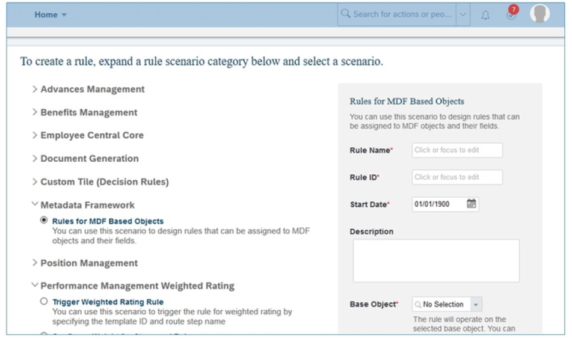
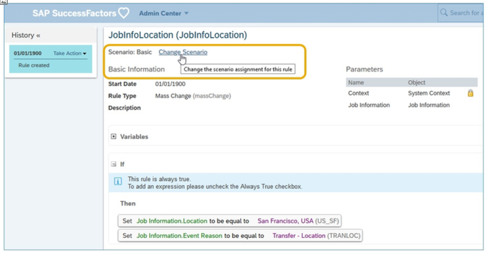

# 业务规则

[[toc]]

::: tip 本节目标

- 定义业务规则
- 确定使用规则引擎配置业务规则的用例
:::

## 业务规则概览 Business Rules Overview

您可以使用规则引擎(Rules Engine)为各种模块和功能配置业务规则逻辑。

业务规则可以涵盖法律规定（“在美国工作的员工需要 FLSA 状态”）、公司政策（“所有迁往伦敦办事处的员工都获得高生活成本的补偿”或其他要求）。由于特定客户需求，规则可高度定制，并基于客户先前制定的决策配置。

规则引擎提供易于使用的工具，用于动态配置和管理需要在GO 中出现的客户、国家或场景特定业务逻辑。

- 用户无需在技术上精通即可创建业务规则。  
Users do not need to be technically savvy to create business rules.

- 直观UI 允许用户配置需要检查的规则条件，以触发规则操作。  
The intuitive UI allows users to configure rule conditions that need to be checked in order to trigger the rule actions.

- 这些规则可以轻松更新，以满足客户不断变化的业务场景的需求。  
These rules can be updated easily to meet the needs of customer’s ever changing business scenarios.

业务规则(Business Rules)在规则引擎中定义，系统在运行时执行这些规则。从技术上讲，规则引擎基于元数据框架(MDF)，但使用其自己的在“管理工具”部分中工具：“配置业务规则(Configure Business Rules)”。

规则可用于将验证添加到用户输入的详细信息或自动填充某些字段数据（例如，时区信息可基于位置信息自动填充）。

定义规则的方法有两种：

1. 基本规则（不推荐，因为它容易出错）  
Basic Rules (Not Recommended as it is error prone)

2. SF 定义的场景（推荐）  
SF defined scenarios (Recommended)

### 规则事件 Rule Events

业务规则可以附加到不同的事件。这些事件包括：

- __Initialize Rules__：在所有其他规则之前触发初始化规则；此类规则可用于自动填充不同字段的缺省值。它们仅在创建新记录（初始化）时运行。  
Initialization rules are triggered before all other rules; such rules are useful to autofill default values for different fields. They only run when a new record is created (initialized).

- __Validate Rules__：验证规则是在提交对象更改后但在保存更改之前触发的。您可以使用这些规则来验证用户输入的字段值。这些操作在保存规则之前执行。使用导入和导出数据UI 导入MDF数据时，验证操作会触发与MDF对象相关联的验证规则，并返回数据中发现的错误。然后，管理员可以通过验证发现任何数据问题并在导入之前对其进行更正。事实上，验证规则在验证和导入操作期间执行。  
Validate rules are triggered after a change to an object is submitted but before the change is saved. You can use these rules to validate field values entered by user. These are executed before Save Rules. When you import MDF data using the Import and Export Data UI, the validate operation triggers the validate rules associated with the MDF objects and returns errors found in the data. Administrators can then catch any data issues through validation and correct them before importing it. In fact, the validate rules are executed during both validate and import operations.

- __Save Rules__：保存规则在用户保存更改时触发。可以使用这些规则在保存之前填充或更改字段值，并且基于用户输入值。例如，您希望根据国家/地区值选择自动填充地区字段。  
Save rules are triggered when a user saves changes. You can use these rules to populate or change field values before saving and they are based on user inputs values. For example, you want to auto populate region field based on country values selection.

- __Post Save Rules__：保存对象后触发保存后规则。当您想要向用户发送警报消息时，使用这些规则。它们不用于设置字段值。  
Post Save rules are triggered after changes to an object have been saved. These rules are used when you want to send an alert message to the user. They are not used to set a field value.

- __Change Rules (onChange)__：在字段级别使用。无法将对象与更改规则相关联。更改特定字段的值时触发更改规则。您可以使用此规则在更改后填充其他字段。例如，您可以根据对“位置”字段的更改，用特定值填充“国家/地区”字段。  
They are used at the field level. Objects cannot be associated with change rules. Change rules are triggered when a value for a particular field is changed. You can use this rules to populate another field after the change. For example, you can populate the Country field with a certain value based on a change to the Position field.

- __Delete Rules__：删除对象记录后触发删除规则。  
Deletion rules are triggered after an object record is deleted.

- __On Load Rules__：此类规则对于计算的瞬态字段非常有用。这是UI 特定的规则，在加载UI 后执行。例如，根据给定对象上提供的不同字段计算工资总额。  
Such rules are useful for transient fields which are calculated. This is UI specific rules and gets executed once the UI is loaded. An example could be calculating total salary based on different fields available on given object.

- __UI Rules__： 此类规则仅适用于可配置用户界面。这些是根据特定条件使特定字段成为必填、可见或隐藏的UI 特定规则。当用户执行导入时，将不会应用此类规则。  
Such rules are applicable only for Configurable UI. These are UI specific rules to make certain field required, visible or hide based on certain condition. Such rules will not be applied when a user does the import.

验证和保存规则中的警告消息显示在工作流规则执行的工作流确认消息之前。  
Warning messages from the validate and save rules are shown before the workflow confirmation message from workflow rule execution.  

可更改现有规则的基础场景。您可以将场景从基本更改为应用程序特定，或从一个应用程序特定的场景更改为另一个应用程序特定场景。
The underlying scenarios of existing rules can be changed. You can change the scenario from basic to application-specific, or from one application-specific scenario to another application-specific scenario.

### MDF 提醒事件 MDF Alert Event

Alerts 可帮助您在业务事件时主动通知员工、经理或HR 管理员，以便他们能够在正确的时间启动必要的活动。

仅当规则目的类型为Alert时，才能在基于MDF对象的业务规则中执行触发MDF Alert Event()函数。

只有在批准工作流后，才会为具有工作流的MDF对象触发警报，而不是在执行工作流时触发。

### 确定使用规则引擎配置业务规则的用例 Identify Use Cases for Configuring Business Rules Using the Rules Engine

1. __工作流 Workflow__：您可以定义规则，当经理或员工更改员工数据时，自动确定正确的工作流。为此，创建工作流基础对象并将其分配到规则引擎UI 中的规则。例如，如果工资增长超过 10%，则可以触发备选工作流。  
You can define rules that automatically determine the right workflow when the manager or employee changes employee data. To achieve this, you create a workflow foundation object and assign it to the rule in the Rules Engine UI. For example, you can trigger an alternate workflow if the salary increase is over 10%.

2. __传播 Propagation__：您可以定义传播规则，以使系统自动将数据从一个字段复制到另一个字段。这样，您可以在系统的多个位置拥有相同的数据，同时仅保留一个数据记录。例如，您可以将职位代码传播到职位MDF对象。  
You can define propagation rules to have the system automatically copy over the data from one field to another field. This way you can have the same data in several places of the system, while keeping just one data record. For example, you can propagate the job code to the Position MDF object.

3. __计算 Calculations__：您可以使用规则引擎支持的各种功能定义自动执行计算的规则。例如，您可以获取员工的当前年龄，您可以计算当前日期和员工出生日期之间的差异。  
You can define rules that automatically perform calculations using the various functions the Rules Engine supports. For example, you can get an employee's current age, you can calculate the difference between the current date and the employee's birth date.

4. __验证 Validation__：可以使用验证规则让系统在保存前检查用户的输入。您可以将字段设置为必填，也可以触发错误消息。例如， IF... 该国家/ 地区是USA，THEN... 需要FLSA 状态。  
You can use validation rules to let the system check the user's input before saving. You can set a field to mandatory, or you can trigger error messages. For example, IF... the country is USA, THEN... the FLSA status is required.

5. __资格 Eligibility__：您可以定义哪些员工应包含在奖金计划或薪酬计划表中。为此，您必须将“浮动工资”或 “薪酬”模块与 Employee Central集成。例如，规则可以是：  
You can define which employees should be included in a bonus plan or compensation planning form. To achieve this, you have to integrate the modules Variable Pay or Compensation with Employee Central. For example, the rule could be:  
IF... 员工类型不等于“合同”、“临时”或“联合”并且员工是定期的  
并且比率类型为“每小时”和“有薪”并且雇用日期晚于 2010 年 10 月 1日并且重新雇用日期晚于 2010 年 10 月 1日并且员工状态为活动或STD   
THEN... 此员工应符合条件（针对特定薪酬表单）  
IF... the employee type does not equal Contract, Temporary or Union AND the employee is regular  
AND the rate type is 'Hourly' and 'Salaried' AND the hire date is after 10/01/2010 AND the rehire date is after 10/01/2010 AND the employee status is Active or STD  
THEN... this employee should be eligible (for a specific compensation form)

6. __缺省值 Defaulting Values__：您可以定义特定字段的缺省值。例如，如果管理员为公司COMP_USA 添加新员工，则该员工将自动有资格获得库存，初始库存授予设置为 200 。  
You can define default values for specific fields. For example, if the Admin adds a new employee for the company COMP_USA, the employee is automatically eligible for stock, and the initial stock grant is set to 200.

### 更改规则方案的向导 Wizard to Change the Scenario of Rules

由于基于有意义场景的规则非常重要，尤其是为了最大限度地减少客户可能遇到的配置问题。

在引入应用程序特定场景之前，业务规则是使用缺省基本场景创建(default Basic scenario)的。由于此场景不提供任何可用于配置规则的各种对象、参数和操作的指南，因此生成的规则通常会产生错误。因此，我们建议您将基于基本场景的现有规则改为特定于应用程序的规则场景。

将场景从基本(Basic)更改为应用程序特定场景后，无法将其更改回基本。因此，在更改场景之前，建议您始终先导出当前规则定义。这样，如果新规则方案未按计划工作，您将获得一些结果。
