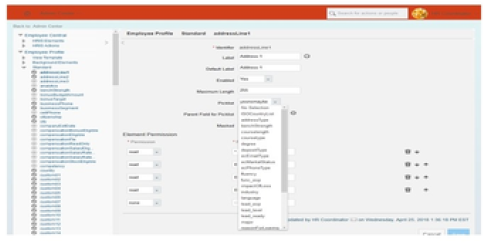

# 管理配置文件中的业务配置工具和MDF块

[[toc]]

::: tip 本节目标

- 定义业务配置 UI
- 激活和权限 BCUI
- 使用 BCUI
- 在人员档案中添加自定义 MDF 块
:::

## 业务配置 UI Business Configuration UI

业务配置UI (BCUI) 允许管理员使用其最终用户UI 维护继任数据模型(Succession Data Model )的某些元素，而不是在XML文件中维护这些元素。由于BCUI 在“管理中心”中可用，因此管理员可以进行配置更改，而之前必须联系有权访问Provisioning的顾问。

BCUI 涵盖以下常见用例：

- 更改标签  
Changing labels

- 添加或更改翻译  
Adding or changing translations

- 激活字段  
Activating fields

- 更改字段的显示顺序  
Changing the display sequence of fields

- 更改字段可见性  
Changing the visibility of fields

- 将字段设置为“必填”  
Setting fields to “required”

- 添加自定义字段  
Adding custom fields

- 定义规则限制  
Define rules

### 限制 Limitations

在设置业务配置UI 之前，应考虑以下限制：

- 客户使用业务配置UI (BCUI) 之前，您必须上载客户要使用的数据模型。建议您下载现有的继任者数据模型用于备份。

    加载 XML前必须在Provisioning -> Company Setting中激活Enable Business Configuration in Admin Tools.

- 在“选项列表中心(Picklist Center)”创建选项列表后，客户只能从 BCUI 分配选项列表。客户无法从BCUI直接创建选项列表。

### 启用业务配置UI Enabling the Business Configuration UI

业务配置UI 是Provisioning选择性加入功能。要启用BCUI，需要遵循不同的步骤。

1. 上载继任者数据模型  
    Uploading the Succession Data Model  
    需要在配置中上载继任者数据模型xml 文件。  
    上载数据模型之前，建议下载现有继任者数据模型以进行备份。  
    从Provisioning中选择公司。在 继任管理(Succession Management)下，选择导入/导出数据模型(Import/ Export Data Model.)。  
    选择导入文件选项，然后单击选择文件。  
    在系统中搜索数据模型并上载。  
    单击提交。  
      
    如果上载失败，则显示原因。解决问题并再次上载数据模型。  
    ::: warning Note
    在当前数据模型的上载和同步完成之前，不要上载其他数据模型。这样做可能会导致BCUI 和继任者数据模型之间存在差异。
    :::

2. 启用业务配置UI  
    Enabling Business Configuration UI  
    BCUI 提供了一个无需编辑XML 即可更新继任者数据模型的界面。BCUI 允许管理员在不使用实施顾问的情况下更改配置。  
    从Provisioning中，选择要使用的公司。  
    在编辑公司设置(Edit Company Settings)中，选择公司设置(Company Settings)。  
    确保已启用启用通用对象(Enable Generic Objects)，或者如果尚未启用，则启用。搜索 在管理工具中启用业务配置( Enable Business Configuration in Admin Tools)并将其启用。  
    向上滚动，然后单击保存功能。输入公司编号并点击确认。  
    

3. 将继任者数据模型与元数据框架(MDF) 同步  
    Synchronizing the Succession Data Model with Metadata Framework (MDF)  
    业务配置UI (BCUI) 提供用于更新继任者数据模型的界面。继任者数据模型包含有关不同MDF元素的信息。将UI 中的更改传播到XML 非常重要。使用同步作业完成此操作。  
    从Provisioning启用 BCUI 后，必须创建作业(job)以将BCUI 与继任数据模型同步。这是一次性任务。首次同步运行后，BCUI 的未来更新将自动推送到继任者数据模型。继任者数据模型和BCUI 同步后，即使已从XML 中删除了HRIS 和标准元素，BCUI 也会显示。但是，这些删除的元素显示为已禁用。  
    需要注意的是，BCUI 在同步期间是锁定的。  
    不要在同步期间尝试编辑配置。这可能会导致BCUI 和继任者数据模型之间存在差异

    1. 创建作业
        从Provisioning 转到“管理计划作业(Manage Schedule Jobs)”单击创建新作业  
        在作业名称(Job Name)字段中，提供标识作业类型的名称，以帮助您以后识别作业。  
        在作业负责人(Job Owner)字段中，提供拥有作业的管理员姓名。  
        对于作业类型(Job Type)下拉菜单，选择同步业务配置(Synchronize Business Configuration)。请注意， 同步业务配置作业不需要指定附加参数。  
        转到作业发生次数和通知(Job Occurrence & Notification)部分。在 “发生次数(Occurrence)”中，选择 “一次(Once)”。  
        BCUI 同步作业必须调度为仅运行一次。首次运行同步后，继任数据模型XML 的任何后续上传将自动触发此作业。  
        定义开始日期(Start Date)。  
        关于其他收件人的电子邮件标识和在作业开始时发送通知电子邮件(Send a notification email)，截至目前，BCUI 同步作业不支持电子邮件。
        
        单击创建作业(Create Job)。您将转到管理计划作业页面(Manage Schedule Jobs)。

    2. 运行作业  
        从Provisioning中，转到 管理计划作业(Manage Scheduled jobs)。从作业清单中，搜索您创建的作业。  
        在此作业的操作列中，选择提交以根据计划的时间运行作业，或选择立即运行以立即运行作业。  
        作业触发。  
        

    3. 监控作业  
        在“Provisioning”中，从 管理作业调度器(Managing Job Scheduler)转到监控作业(Monitor jobs)。从作业清单中，搜索您启动的作业。  
        您可以在状态(Status)列下检查作业的状态。  
        已完成(Completed)状态表示成功，而失败(Failed)表示作业未成功。  
        如果作业不成功，则检查详细信息以识别问题、修复问题并重新启动作业。  
        有时，即使“同步”作业成功且状态为“已完成”，某些元素可能没有同步。在这种情况下，单击详细信息链接以查看未在BCUI 中同步的元素列表。  
          
        当继任数据模型和元数据框架不同步时，该怎么办？  
        使用BCUI 时，可能会发现继任者数据模型与MDF不同步。要解决不一致，您可以尝试：  
        如果从BCUI 添加的字段不在Admin Center > Manage Permission角色中，您可以再次导出和重新导入继任者数据模型。  
        如果BCUI 已锁定，则可能是由于继任者数据模型和MDF不同步。再次上载SDM 并检查 BCUI 是否已解锁。如果不是，则Provisioning中手动触发 MDF对象定义到数据库同步作业。  
        手动添加数据模型XML 中的字段但不显示在BCUI 中时，建议您刷新元数据使用Admin Center > OData API Metadata Refresh and Export中的工具。

4. 为业务配置UI 设置基于角色的权限  
    Setting Up Role-Based Permissions for Business Configuration UI  
    BCUI 的管理员需要RBP 中的以下权限：在Metadata Framework下：

    - Manage Data 管理数据
    - Access to non-secured objects 访问非安全对象
    - Import Permission on Metadata Framework Manage Configuration UI 元数据框架的导入权限
    - Configuration UI 管理配置UI
    - Configure Object Definitions 配置对象定义

    在Manage Business Configuration下  
    为BCUI 中应可用的不同类型的元素选中必要的复选框。添加如屏幕截图：
    
    

### :tada:练习三 启用业务配置UI和设置管理权限 Enable the Business Configuration UI and Setup Admin Permissions

Your customer has decided to start using BCUI for configuration of their Employee Data. Your task is to set it up for them.

1. Enable BCUI in Provisioning
    1. Log on to Provisioning and select the company from the list.
    2. Select Edit Company Settings -> Company Settings.
    3. Select the following check box: Enable Business Configuration in Admin Tools.
    4. Scroll up and click Save Feature.
    5. Click again on the name of your company at the top left corner, just below “up to company listing” link.
    6. Scroll down to succession management.
    7. Re-upload the latest version of your Succession datamodel.

    Your BCUI is enabled now and will be available for use in the instance.

2. Create the job to synchronize the Succession Data Model with Metadata Framework (MDF).
    1. From Provisioning go to Manage Schedule Jobs.
    2. Click Create New Job.
    3. In the Job Name field, provide a name that identifies the type of job in order to help you identify the job later.
    4. In the Job Owner field, provide the name of the administrator who will own the job.
    5. For the Job Type dropdown, select Synchronize Business Configuration .
    6. In Occurrence, select Once.
    7. Define a Start Date in the future.
    8. Click Create Job.

3. Run and Monitor the Job.
    1. From Provisioning, go to Manage Scheduled jobs.
    2. From the list of jobs, search for the job you created.
    3. In the Actions column for this job, select Run It now to run the job immediately.
    4. Go to Monitor jobs and verify that the job has the status "Completed". If this is not the case, solve the issues following the indications in this lesson and run the job again.
 
4. Add the necessary permissions for the administrators to use BCUI.
    1. Use the Action Search to navigate to Manage Permission Roles.
    2. In the list of permission roles, click Administrators.
    3. On the Permission Role Detail screen, click Permission.
    4. On the left side, click Metadata Framework.
    5. Make sure the following are permitted:
        1. Manage Data
        2. Access to non-secured objects (previously known as 'Read/Write Permission on Metadata Framework')
        3. Import Permission on Metadata Framework
        4. Admin access to MDF OData API
        5. Manage Configuration UI
    6. On the left side, click Manage Business Configuration, Make sure all objects are allowed on all level except the “field overrides”.
    7. Click Done and save your changes.

### 使用业务配置 UI Using the Business Configuration UI

您可以从管理中心访问BCUI：

使用操作搜索导航到管理业务配置工具(Manage Business Configuration tool)。

在屏幕左侧，将显示包含可使用BCUI 配置的元素的活动清单。

其中提供了多个部分。在本次培训中，我们对“员工档案(Employee Profile)”部分感兴趣。在这里，您可以找到显示在员工档案的不同组件(Portlets)中的标准元素。

在屏幕右侧，可维护实际元素。该图显示了BCUI 的布局。屏幕左侧的复选标记表示该元素已使用。

#### 配置标准元素 Configuring Standard Elements

员工档案部分显示所有可配置标准元素。配置标准元素的典型用例：

- 更改标签
- 更改或添加标签的翻译
- 禁用或启用元素

注意：

禁用标准元素时，将取消激活该元素并将其从继任者数据模型中移除。因此，此元素不再是任何 XML 下载或导出的一部分。我们建议您在生产系统中禁用任何HRIS 元素之前测试此更改。

##### 检查权限 Checking Permissions

启用标准元素后，验证是否已将正确的权限应用于激活的元素（字段），否则将保持不可见。平台中用于员工档案的权限位于RBP 的“员工数据权限(Employee Data)”部分。

##### 将选项列表添加到标准元素 Adding a Picklist to Standard Element

可以使用BCUI 将CSV 选项列表添加到标准元素。单击任何标准元素后，其中一个可用选项为选取列表(Picklist)。只需打开下拉列表，选择选项列表(picklist)并保存更改。

要使字段在人员档案上可见，或更改字段的顺序，请使用上一模块中介绍的“配置人员档案(Configure People Profile)”工具。

#### BCUI 中支持的操作

BCUI 允许您在不编辑XML 的情况下编辑继任者数据模型，但并非所有操作都受支持。

### :tada:练习四 使用业务配置UI Using Business Configuration UI

The customer wants to make an adjustment to the profile. You will use BCUI to adjust the label of a custom field and link that field to an existing picklist.

1. Use the Action Search to navigate to Manage Business Configuration.

2. Change the label for the custom02 field from Marital Status to Matrimonial Status.
    1. Click Standard to open the list of standard elements.
    2. Click custom02 and modify both the label from Marital Status to Matrimonial Status.
    3. Make exactly the same change for the default label.

3. Link the custom02 field to the existing picklist ecMaritalStatus.
    1. For the field picklist select from the drop down menu ecMaritalStatus.
    2. Click Save.

4. Test your modifications from the end user view in My Employee Files.
    1. From the main navigation menu go to My Employee File.
    2. Click on the pen icon to edit the Personal Information block.
    3. Verify that the field Marital Status was changed with Matrimonial Status and that it is now associated with a picklist.

## 配置档案中的自定义 MDF 块 Custom MDF Blocks in the Profile

### 管理配置UI Manage Configuration UI

要在档案中添加自定义MDF块，首先需要为通用对象配置UI。

管理配置UI(Manage Configuration UI) 是元数据框架中提供的核心功能，允许为任何选定的MDF对象创建自定义UI。现在，使用此功能，我们可以利用在任何MDF对象的员工档案部分创建块(Block)UI 的选项。

为MDF对象创建配置UI 的步骤如下： 

1. 选择要为其创建配置 UI 的MDF对象

2. 转到管理配置UI(Manage Configuration UI)  
    

3. 单击“新建(Create New)”

4. 在选择基本对象下拉列表中选择所需对象，然后输入要为正在创建的UI 选择的标识（下方的屏幕截图）。单击 “基本对象(Base Object)”后，将创建默认视图，并以所有字段和一级复合子项作为组。

    将鼠标悬停在组上时，可以看到以下屏幕截图上突出显示的工具栏选项： 
    - 添加字段 Add Field- 单击此工具栏项目向组中添加字段
    - 添加链接 Add Link- 单击此工具栏项目以在访问组的URL 时添加链接
    - 添加组 Add Group- 单击此工具栏项目以将组添加到组
    - 编辑属性 Edit Properties- 单击此工具栏项目以打开组的属性
    - 删除 Delete- 单击此工具栏项目以删除组
    

5. 完成配置后，单击Save 按钮以保存MDF对象的配置UI。

#### 配置档案中的自定义MDF块 Custom MDF Blocs in the Profile

只能为“人员档案”中将externalCode 码设置为User数据类型的对象创建实时档案 MDF BLock。当 externalCode不是用户数据类型字段时，在“配置人员档案(Configure People Profile)”中选择“屏幕标识符(Screen ID)”的选项不可用。创建UI 后，按照以下步骤在人员档案中添加自定义MDF块。

1. 从“操作搜索”中，转到“配置人员档案(Configure People Profile)”  
From the Action Search, go to Configure People Profile

2. 在可用块(Available Blocks)的搜索区域中，查找“实时档案 MDF信息”块。如果搜索“MDF”，将出现。  
In the Search area for Available Blocks, look for “Live Profile MDF Information” block. It will appear if you search “MDF”.

3. 将块拖放到所需的可用空间。  
Drag and drop the block into the desired available space.  

4. 选择UI 屏幕标识并单击保存。  
Select the UI screen ID and click Save.  

5. 完成上述步骤后，Portlet 将开始显示在“配置文件”页面上。如果自定义块不是标准 Portlet 的一部分，则应用常规RBP 行为。  
Once the above steps are completed, the portlet will start to appear on the Profile Page. If the custom block is not part of a standard portlet, normal RBP behavior applies.

