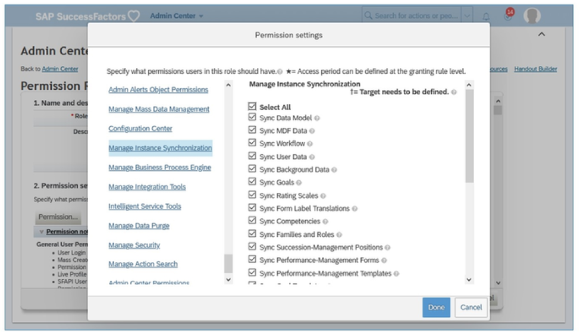
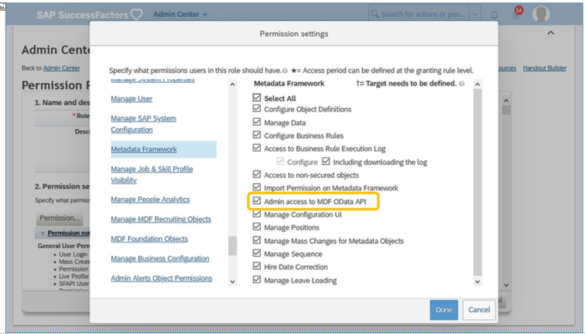
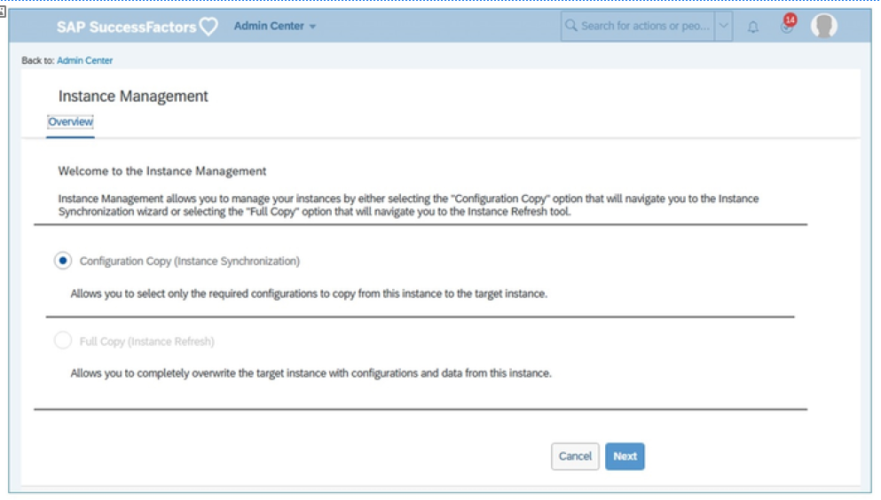
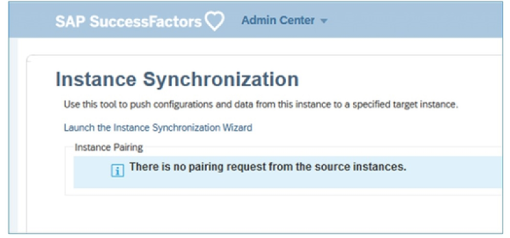
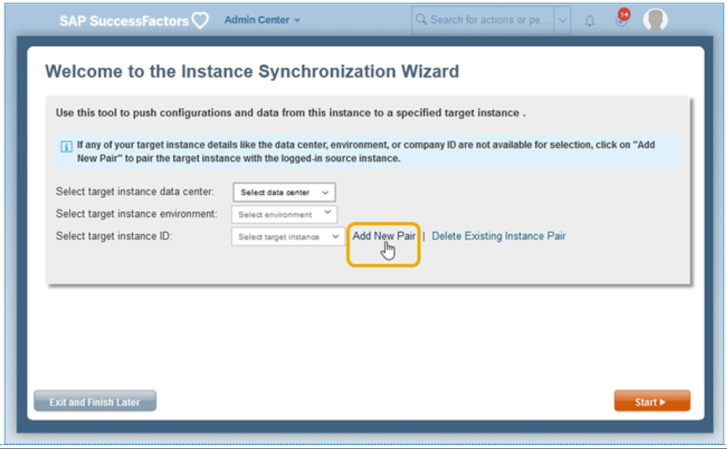
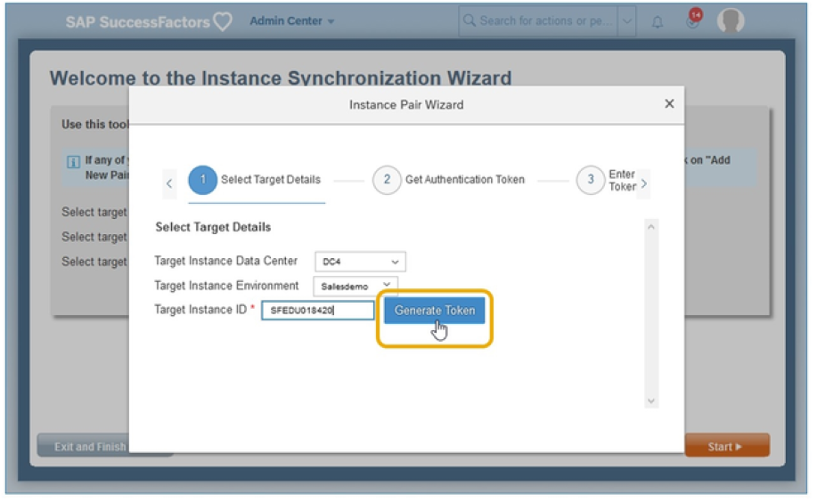
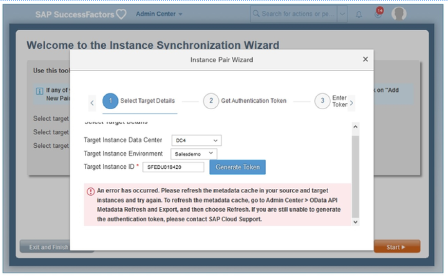
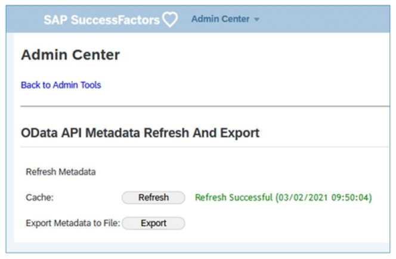

# 实例同步

[[toc]]

::: tip 本节目标

- 解释实例同步
- 启用实例同步
- 标识同步权限
- 对源实例和目标实例配对
- 刷新 OData API 元数据
:::

## 实例同步概览 Instance Synchronization (Instance Sync) Overview

实例同步(Instance Synchronization)是指在多个SAP SuccessFactors 实例之间复制配置。它允许将新配置从一个实例推送到另一个实例，例如从测试实例推送到生产实例。

SAP SuccessFactors 提供多个实例同步工具以将配置设置从一个实例复制到另一个实例。

- “实例同步向导”用于设置和运行新的同步作业。  
Instance Synchronization Wizard is used to set up and run new sync jobs.

- “管理同步包”用于查看、编辑和运行先前保存的同步作业。  
Manage Sync Packages is used to view, edit, and run your previously saved sync jobs.

- 实例同步监控器工具用于监控同步作业状态和查看同步报告。  
Instance Synchronization Monitor Tool is used to monitor sync job status and view sync reports.

实例同步使用“推送(push)”模型，这意味着配置设置有选择地从指定的源实例推送到另一个指定的目标实例。配置无法从源“拉取(pulled)”到目标。实例同步工具支持部件级权限控制以及跨不同数据中心的同步。

可对系统进行设置以支持单向(one-way)同步或双向(two-way)同步。

- 在单向同步中，您在实例上选择作为源和其中一个作为目标，并且只有源可以启动同步。  
In a one-way sync, you choose on instance as the source and one as the target and only the source can initiate a sync.

- 在双向同步中，两个实例既可以是源，也可以是目标，允许它们来回复制配置。例如，当开发、测试和生产有三个实例时，测试实例可能同时是在开发中启动的同步作业的目标，也是目标为生产的同步作业源。
In a two-way sync, both instances can be a source as well as a target, allowing them to copy configurations back and forth. For example, when there are three instances for Development, Test, and Production, the test instance might be both the target of sync jobs initiated in Development and the source of sync jobs targeting Production.

使用实例同步工具迁移MDF配置（选项列表、通用对象、可配置UI、对象定义、MDF规则）(Picklists, Generic Objects, Configurable UIs, Object Definitions, MDF Rules)。查看KBA 2088055 。

### 启用实例同步 Enabling Instance Synchronization

实例同步工具可以从升级中心在系统中启用。为要管理的所有源实例和目标实例启用实例同步非常重要。启用“实例同步”后，便无法再将其禁用。

### 实例同步权限 Instance Synchronization Permissions

需要实例同步管理员权限才能访问源实例中的“实例同步”工具并将部件同步到目标实例。这些权限使用基于角色的权限在“管理员中心”中设置。

要访问同步工具，必须授予您在实例之间至少同步一种类型的工件的权限。任何有权同步至少一个部件的用户都可以访问和使用源实例中的所有实例同步管理工具。

::: warning Note
实例同步权限按工件授予。也就是说，您可以单独为系统中启用的每种类型的实例同步部件授予权限。例如，可能允许一名用户同步绩效和目标表单模板，而允许另一个用户同步权限角色和权限组。管理员只能同步已为其授予相应权限的部件。
:::

从操作搜索中，转到管理权限角色(Manage Permission Roles)，然后选择管理员角色，然后单击权限... 按钮。在管理实例同步(Manage Instance Synchronization)类别中，选择所有必要的部件。

要将目标实例与源实例配对，您需要MDF OData API权限的管理员访问(Admin access to MDF OData API)权限 。

## 对源实例和目标实例进行配对 Pairing the Source and Target Instances

管理员在源实例和目标实例之间同步部件之前，必须配对实例。配对实例是一次性任务。这是一个三步流程：

1. 从源实例生成验证令牌  
Generating an authentication token from the source instance

2. 从目标实例中复制生成的验证令牌  
Copying the generated authentication token from the target instance

3. 在源实例中添加身份验证令牌  
    Adding the authentication token in the source instance  
    将目标实例与源实例配对的第一步是从源实例启动验证令牌生成。有两个前提条件：  
    - 必须在源实例中启用Admin access to MDF OData API permission权限
    - 必须在源实例和目标实例中启用“实例同步(Instance Synchronization)” 

4. 从操作搜索中，转到实例同步向导(Instance Synchronization Wizard)。  
  
缺省情况下，为配置复制(Configuration Copy)（实例同步(Instance Synchronization)） 选择单选按钮。单击下一步。  

5. 要添加对，请单击链接启动实例同步向导，然后单击添加新对(Add New Pair)。  
  

6. 选择目标实例详细信息：
    - 目标实例数据中心 Target Instance Data Center
    - 目标实例环境 Target Instance Environment
    - 目标实例标识 Target Instance ID  
    然后点击生成令牌(Generate Token)

### 刷新 OData API 元数据

在此阶段可能会出现错误消息，要求刷新源实例和目标实例中的元数据缓存。

从操作搜索中，转到OData API元数据刷新和导出(OData API Metadata Refresh and Export)并单击刷新。

此操作应在源实例和目标实例中完成。

## 用于同步 MDF 对象的限制 Guardrail to Synchronize MDF Objects

您可以将MDF数据工件从一个实例同步到另一个实例。但是， 有限制。如果MDF对象的记录少于 50,000 ，同步将完全完成。您必须细化搜索筛选器以在需要时查找特定记录。该限制可用于提高系统稳定性并避免系统中断。

## 基于角色的权限部件 Role-Based Permission Artifacts

可以在实例之间同步基于角色的权限角色。即使源实例和目标实例之间存在任何差异，也是如此。但是，在这种情况下，实例同步已完成，但有警告。您必须手动更新目标实例中的差异。

链接到“实例同步(Instance Sync)”视频：<https://sapvideoa35699dc5.hana.ondemand.com/?entry_id=1_6xzr9suw>

::: warning Note
自 2021 年 5 月 21日起，MDF选项列表部件在实例同步中已弃用，因为这可能会导致目标实例中出现差异。作为替代，可以使用导入和导出数据工具。
:::
