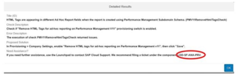

# 配置检查工具

[[toc]]

::: tip 本节目标

- 了解配置检查工具
:::

## 使用配置检查工具 Using Configuration Check Tool

如果您的SAP SuccessFactors 应用程序以意外方式运行，则可能存在配置或数据冲突：您有一些数据不一致或配置错误。检查工具可快速识别这些类型的问题，从而可以避免支持工单(提票)。如果问题很严重，您可能仍需要创建支持工单，但在严重情况下，检查工具也会为您节省时间，因为检查工具可以导出检查的结果和您的配置。因此，支持工程师可以更快地识别问题。

出现此类问题的原因可能有多种：

- 某些数据不一致  
Some data is inconsistent

- 系统未正确配置  
The system is not configured correctly

使用检查工具，您可以识别错误内容，而不是简单地创建支持工单。检查工具：

- 找出问题所在，问题有多糟糕  
Finds out what is wrong and how bad the problem is

- 建议解决方案  
Suggests a solution

保留检查结果的历史记录，用户可以在检查工具用户界面中查看检查运行的历史记录。

除此之外，检查工具还可以生成所有可用检查的列表。这通过检查工具中的帮助功能提供，并提供所有检查的高级汇总。不仅限于用户有权访问的检查。

### 为什么如此重要？

此列表为想要了解检查工具完整功能的任何用户提供有用的产品内支持文档摘要。不会向用户提供通常不会通过标准SAP 帮助文档渠道共享的信息。

### 配置检查工具的权限

配置检查工具具有自己的权限。特定权限包括：

- 访问检查工具权限授权用户访问工具。  
The Access Check Tool permission authorizes users to access the tool.

- “允许配置导出”权限授权用户在需要创建支持消息的情况下将配置信息附加到支持消息。  
The Allow Configuration Export permission authorizes users to attach configuration information to a ticket in cases where they need to create one.

- “允许检查工具快速修复”权限授予用户修复配置和数据问题的权限。  
Allow Check Tool Quick Fix permission authorizes users to fix configuration and data issues.

要设置所需的权限，请转到管理员中心并选择Set User Permissions > Manage Permission Roles。选择要维护权限的角色，选择权限，然后向下滚动直到看到检查工具角色。进行适当的设置。

“在检查工具中运行检查(Run a check in the check tool)”视频链接：<https://sapvideoa35699dc5.hana.ondemand.com/?entry_id=1_qvfxamwa>

### :tada:练习一 使用配置检查工具 Use the Configuration Check Tool

Some of your colleagues are reporting errors when running ad-hoc reports. Your task is to troubleshoot and resolve the issue or raise a ticket.

Before you start, make sure you have the required permissions to access the Configuration Check tool as described in previous lesson. If needed, add permissions to Administrators group. Remember: Once permissions are added, you will need to log out and log back into the system for changes to take effect.

1. Give your administrator role all the necessary permissions to fully use the Check Tool.
    1. From the Action Search, go to Manage Permission Roles.
    2. Open your administrators role and click on Permissions.
    3. Find the category Check Tool and select all the available permissions.
    4. Click Done, Save Changes, log out and come back to your instance.

2. Access the Check tool.  
    Use the Action Search to navigate to Check tool.

3. Run the check of your Role-Based Permissions.
    1. From the Application dropdown, select the Role-Based Permissions to run a check for.
    2. The list of checks is automatically updated depending on the application selected.
    3. Select all of the rows.
    4. Click “run X checks” on the bottom right.
    ::: warning Note
    you can run as many checks as you want. The Run Checks button at bottom right gets updated to tell you how many you have selected.
    :::

4. Look at the Detailed results and decide what next steps to take.  
    On completion of the check, the Configuration Check tool displays results. The results can be any of these:  
    - No inconsistencies found. All checks have successfully passed.
    - X inconsistences found, where "X" is the number of inconsistencies. In cases where inconsistences are found, you see either a yellow warning icon or a red alarm icon.
    - The yellow icon is a warning that something not too serious is wrong. The system proposes a solution.
    - The red icon indicates that the problem is serious. You must take action, which might include creating a Support ticket.
    - If creating a customer incident make sure it is under the relevant category, and do provide the component value you copied from the Need Assistance? Section as shown below:
    
