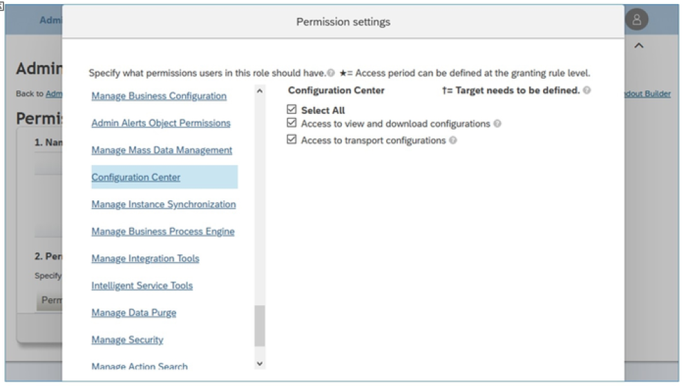
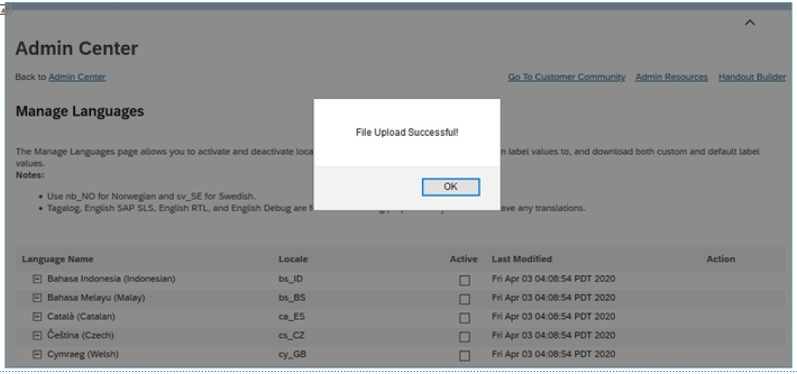
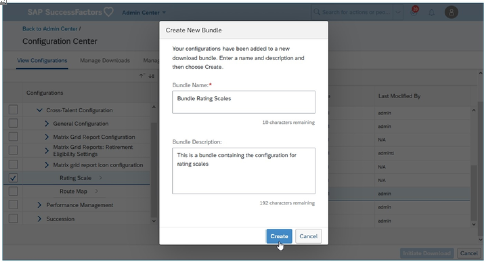
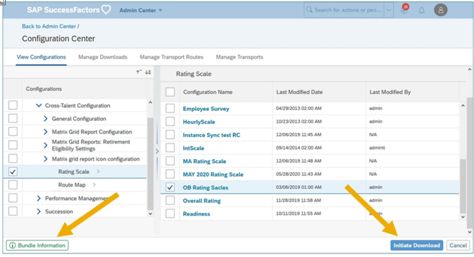
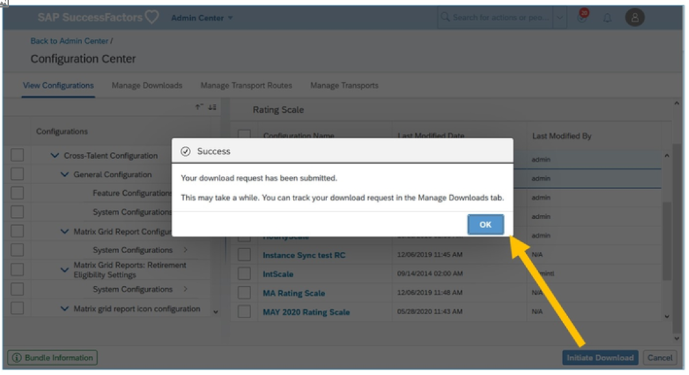
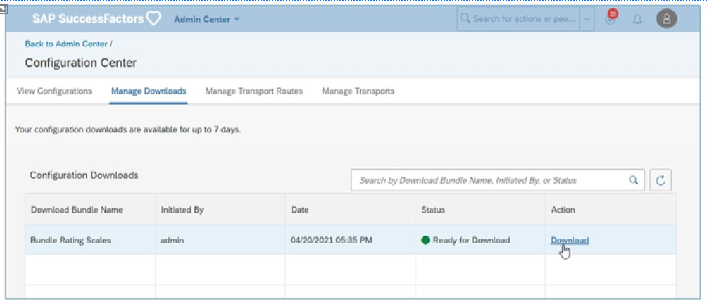

# 配置中心

[[toc]]

::: tip 本节目标

- 定义配置中心
- 确定前提条件
- 查看配置
- 下载配置
- 确定配置中心中的其他选项
:::

## 配置中心概览 Configuration Center Overview

配置中心提供SAP SuccessFactors 中支持的配置的整体视图。

通过配置中心，我们可以：

- 查看SAP SuccessFactors 应用程序配置  
View SAP SuccessFactors application configurations Download the configurations on our machine

- 在我们的计算机上下载配置  
Transport configurations and configuration bundles from the source tenant to the target tenant.

将配置和配置包从源租户传输到目标租户。这适用于：

- SAP SuccessFactors Employee Central人员档案  
SAP SuccessFactors Employee Central People Profile

- SAP SuccessFactors 人才管理Qualtrics  
SAP SuccessFactors Talent Management Qualtrics

## 确定前提条件

存在多个前提条件。首先，必须启用相应的模块，以使其在配置区域中可用。

- 对于SAP SuccessFactors Employee Central[SuccessFactors 员工中心]： Provisioning中的 Employee Central V2[员工中心 V2]  
For SAP SuccessFactors Employee Central: Employee Central V2 from Provisioning

- 对于SAP SuccessFactors Talent Management[SuccessFactors 人才管理]：绩效评估智能表以及 Provisioning中的继任管理  
For SAP SuccessFactors Talent Management: Performance Appraisal Smart Form and Succession Management from Provisioning

- Qualtrics：升级中心的Qualtrics 员工体验此外，还需要从 Provisioning中启用以下切换：  
    Qualtrics: Qualtrics Employee Experience from the Upgrade Center Moreover, the following switches need to be enabled from Provisioning:
  - 启用通用对象  Enable Generic Object
  - 启用附件管理器  Enable the Attachment Manager

确保已在平台功能设置页面中启用以下设置：

- 管理配置中心中的流转步骤，以查看流转步骤  
Manage route maps in Configuration Center to view the Route Maps

- 管理配置中心中的评级尺度，以查看评分量表  
Manage rating scales in Configuration Center to view the Rating Scales

关于权限，请为以下MDF对象启用 “管理员访问 MDF OData API权限”或 “查看”和 “编辑杂项权限”：  
Regarding the permissions, enable the Admin access to MDF OData API permission or the View, and Edit Miscellaneous Permissions for the following MDF objects:  

- ExportConfigRequest
- TransportConfigRequest
- ExportConfig1ode
- ImportBundle
- ImportConfigRequest
- ImportLogEntry
- BundleDefinitionConfig1ode
- ConfigBundleDefinition

您还需要与配置中心相关的权限。

::: warning Note
跨人才配置将评级范围或路由图从源租户传输到目标租户时，如果目标租户中存在具有相同名称的评级范围或路线图，则会将其替换为传输的评级范围或路线图。
:::

## 使用配置中心查看 SAP SuccessFactors 应用程序配置 Viewing SAP SuccessFactors Application Configurations Using the Configuration Center

您可以查看以下配置类型：

- 功能配置：指配置设置  
Features Configurations: This refers to the Provisioning settings

- 系统配置：指的是SAP SuccessFactors 应用程序中的设置，以及每个设置如何基于系统自动创建或由用户MDF对象定义定义的系统设置文件相互交互  
System Configurations: This refers to the settings in the SAP SuccessFactors application and how each setting interacts with each other based on a system settings file created automatically by the system or defined by the user MDF Object Definitions

- MDF对象定义：提供查看和管理数据库对象定义、对象关系和对象层次的选项。  
MDF Object Definitions: This gives the option to view and manage database object definitions, object relationships, and object hierarchy.

- 流转步骤  
Route Maps

- 评级范围  
Rating Scales

从操作搜索中，转到配置中心。

转到查看配置(View Configurations)标签，然后从下拉列表中选择配置区域(Configuration Area)

下钻到配置组并选择配置类型。您可以在屏幕的右侧面板中查看配置列表。

## 使用配置中心下载 SAP SuccessFactors 应用程序配置 Downloading SAP SuccessFactors Application Configurations Using the Configuration Center

按照以下步骤下载配置：

1. 从操作搜索转到配置中心。  
From the Action Search go to the Configuration Center.

2. 从视图配置转到下载模式。  
From View Configuration, go to Download Mode.

3. 从下拉列表中选择配置区域并下钻到配置组。  
Choose a Configuration Area from the dropdown and drill down to the configuration group.

4. 选择要下载的配置。您无法查看或下载可见性设置为不可见的MDF对象定义。  
Select the configurations you wish to download. You cannot view or download MDF Object Definitions whose visibility is set to Not Visible.

5. 在创建新包窗口中输入包名称和包描述。  
    Enter the Bundle Name and the Bundle Description in the Create New Bundle window.

    

6. 选择创建。下载配置包之前，您可以通过分别选中或取消选中配置复选框将配置添加到同一包或从同一包中移除配置。  
    Choose Create. Before downloading the configuration bundle, you can either add configurations to the same bundle or remove configurations from the same bundle by selecting or deselecting the configuration checkbox respectively.

    

7. 选择启动下载。  
Choose Initiate Download.

随即显示确认消息，您将重定向到管理下载选项卡。

您的配置最多可下载 7 天。

在管理下载选项卡中跟踪每个下载请求的状态：

- 待定  Pending
- 可供下载  Ready for Download
- 失败  Failed
- 进行中  In Progress

## 配置中心中的其他选项 Other Options in the Configuration Center

配置中心还可用于：

- 将配置从源租户传输到目标租户  
Transport configuration from the source tenant to the target tenant

- 传输配置时编辑配置包  
Edit the configuration bundle when transporting the configuration

- 将源实例与目标实例与“管理传输路由”配对  
Pair the source instance with the target instance with Manage Transport Route

- 验证租户收到的配置  
Validate the configuration received by a tenant

有关这些选项的更多信息，请查看Help Portal中此处的指南。
