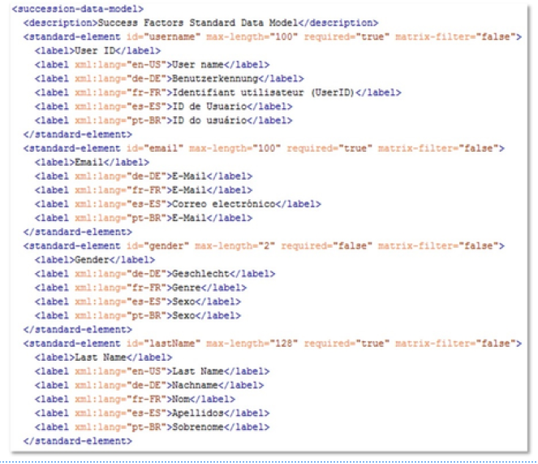

# 实施翻译

[[toc]]

::: tip 本节目标

- 描述翻译流程
- 在翻译工作簿中收集需求
- 在配置中设置语言
- XML 模板
- 在“人员档案”中实施翻译
- 描述本地化流程
:::

## 翻译成功标准 Translation Success Criteria

以下是成功翻译的重要条件：

- 指定一名翻译主管，该负责人将充当单一联系点，负责协调不同语言的翻译。翻译负责人应熟悉正在翻译的模块，以便根据需要向译员解释上下文。  
Appoint a translations lead who will act as single point of contact and be responsible for coordinating the translations across the different languages. The translations lead should be familiar with the modules being translated so they can explain the context to the translators as necessary.

- 与项目团队就翻译流程计划达成一致，包括交付内容、时间表和资源可用性。  
Agree on the plan for the translations process with the project team, including deliverables, timelines, and resource availability.

- 确保测试人员接受如何在实例中导航的培训。本地测试人员必须熟悉模块或流程，才能有效地验证译文。  
Ensure that the testers are trained in how to navigate in the instance. The local testers must be familiar with the module or process so that they can validate the translations effectively.

- 确保在翻译工作开始之前签核最终配置。  
Ensure that final configuration is signed off before translation work starts.

- 确保进行跨团队协调。如果涉及多个工作流，请确保商定通用条款。  
Ensure that there is cross-team coordination. Where multiple work streams are involved, ensure that common terms are agreed upon.

- 为防止系统性能降低（3 层），请最小化系统文本定制。  
To prevent a slowdown in system performance (3 Tier), minimize customization of system texts.

- 对所有翻译和反馈使用一个文档（翻译工作簿）。  
Use one document (translation workbook) for all translations and feedback.

## 翻译流程概览 Translation Process Overview

典型翻译流程中的步骤如下：

1. 客户获得语言包。  
The customer obtains a language pack.

2. 客户获取并打开翻译工作簿。  
The customer obtains and opens up the translation workbook.

3. 客户提供翻译。  
The customer provides the translations.

4. 顾问配置客户提供的译文。  
The consultant configures the translations provided by the customer.

5. 客户测试翻译并提供签核。  
The customer tests the translations and provides sign-off.

## 翻译流程前提条件 Translation Process Prerequisites

在开始翻译之前，需要考虑以下重要事项：

首先使用缺省语言（英语）完成并测试每个详细信息。

在开始翻译之前，完成所有配置至关重要。如果客户继续更改功能和缺省（英语）标签，则无法使配置工作簿保持最新。完成所有标签和功能，并在翻译开始前执行足够的测试。

客户负责提供翻译，而顾问负责提供工作簿。

SAP SuccessFactors 不提供翻译服务。客户负责提供译文，并根据其配置测试这些翻译。不要尝试为客户翻译任何内容。

查看合作伙伴门户上按语言包提供的SAP SuccessFactors 产品和详细语言矩阵。

这些矩阵显示每个语言包的模块支持和功能支持。并非所有语言都支持所有的模块或功能。不要假设所有语言都支持Writing Assistant、Spell Check、Legal Scan 等。

实现条理。

协调翻译时，最好组织起来。提前计划，将足够的时间收集配置的文本和标签到翻译工作簿文件中。确保客户还提前计划所有资源，以便在此期间专门进行翻译和测试。请注意当地假期和假期计划。例如，许多中国员工在一月或二月休长假，而德国的许多员工都在八月休延长假 期。确保项目中的每个人都留出满足项目里程碑的时间。严格遵循计划。如果不合并文档或里程碑，则很难控制流程。

## 翻译流程站点 Translation Process Site
 

如果使用缺省语言（英语）配置模块，则需要对其进行翻译。转换标签时，必须转到配置标签的源。每个模块的翻译流程有所不同。以下是目标管理、绩效管理和员工档案翻译的基础知识：

目标管理翻译

- XML 模板或管理中心  
XML template or Admin Center

- 目标库导入文件  
Goal Library import file Performance Management translations

绩效管理翻译

- XML 模板  
XML template

- 管理中心
Admin Center

- 流转步骤
Route Maps

- 评级范围
Rating Scales

人员档案翻译

- XML 模板（数据模型）  
XML template (data model)

- 管理中心（配置人员档案、BCUI、选项列表中心）  
Admin Center (Configure People Profile, BCUI, Picklist Center)

对于“目标管理”，您可以预期在 XML 文件或“Admin Center > Manage Templates”工具中进行大部分目标计划模板的翻译。如果您正在使用“目标库”功能，可能还需要加载其他文件。

对于绩效管理翻译，您需要完成表单标签翻译csv 文件。这包括将消息键值插入XML 并将包含已翻译标签或文本的.csv 文件加载到“管理中心”。您还需要翻译路线图和评级尺度(Route Maps and Rating Scales)中的标签。

对于“人员档案”或“继任数据模型”翻译，您需要使用 XML 文件以及“管理员中心”。

## 语言配置元素 Language Configuration Elements

语言配置的元素如下：

### 缺省语言包 Default Language Pack

包含错误消息、菜单、翻转文本等。基本上您未使用缺省语言（英语）配置的所有文本。修改属于默认语言包的文本不属于翻译项目。我们阻止客户对这些系统文本提出过多请求，因为键值可以与实例中不同位置显示的标签相关联，而在一个位置更改标签在其他地方可能没有意 义。此外，如果替换的文本过多，系统可能会较慢。也就是说，可以使用名为管理语言的工具修改系统文本。

### XML 模板翻译 XML Template Translation

包含使用缺省语言（英语）配置的所有文本。模板名称、标签和文本直接在XML 中配置。管理模板提供一些翻译选项，但这些不是 100% 等同于XML。

### 管理中心翻译 Admin Center Translation

文本替换、评级范围、路线图、配置员工文件所有直接配置缺省语言（英语）的控制标签。

### 应用内翻译 In-App Translation

在应用程序中进行编辑。主页互动程序、帮助和教程页面以及公司资源页面由管理员直接在页面上进行翻译。

::: tip Tip
配置翻译时，不要忘记在翻译文件之前、期间和之后下载备份副本。如果直接在应 用程序中翻译某些内容，则应在翻译文本之前和之后在配置工作簿中保存一个副本。  
在应用程序中进行编辑。“主页”磁贴、“帮助和教程”页面和“公司资源”页面由管理员直接在该页面上进行翻译。
:::

::: warning Note
配置翻译时，很可能需要使用Open Office。这是因为 Microsoft Excel会破坏某些语言中的特殊字符。Open Office允许您使用所有文件（特别是 .csv），而无需损坏字符。此外，请注意，如果计算机上没有正确安装所有语言包，在使用某些语言时可能 会出现问题。
:::

## 语言包 Language Packs

顾问验证合同中包含的语言包。SuccessFactors 工作声明或计划文档列出了顾问负责实施的语言。

启用语言包后，语言将显示在“设置”菜单下的“语言”中。

## 翻译工作簿 The Translation Workbook

收到配置签核后，顾问负责提供翻译工作簿。顾问使用默认语言（英语）为客户配置的文本和标签填写模板。在PartnerEdge—> Implement —> Tools & Assets —> Foundation —> Configuration Workbooks中提供了翻译工作簿模板。

::: tip Tip
这是翻译过程中制作所有表单模板、目标计划模板、数据模型和其他待翻译文件的 备份副本的好点。对于无法轻松下载的区域，请截取缺省语言（英语）文本的屏幕 截图，并将其全部保存在一个文件中。
:::

### 翻译工作簿详细信息 Translation Workbook in Detail

工作簿是带有每个模板和模块的标签的Microsoft Excel文件。

顾问负责使用英语或缺省语言翻译填写工作簿。浏览每个模板并列出您配置的每个字段名称、介绍文本和标签。将它们放在工作簿的表的“英语”列中。在每个附加列标题中，输入客户的语言包。对您负责翻译的每个模板和模块重复上述步骤。

如果要输入翻译流程的每个里程碑的截止日期，则提供项目计划标签。

测试计划标签供客户概述其测试计划。SAP SuccessFactors 不提供客户的测试脚本。

端到端检查测试实例中的客户配置，确保未错过任何文本。可能很难返回并检索缺少的附加翻译。

### 翻译工作簿和HTML Translation Workbook and HTML

如果您的配置包含HTML（例如超链接、项目符号和换行符），请确保以粗体红色字体突出显示此文本。包括所有译员保持该文本完整并绕开翻译的说明。如果译员发生删除或覆盖HTML 的情况，您将无法重新创建正确的HTML 结构，并且您的模板中将出现错误。

## 客户翻译输入 Customer Translation Input

完成翻译工作簿后，接下来的步骤如下：

1. 通过电子邮件将工作簿发送给客户，或将工作簿发布到客户的SharePoint 站点。

2. 提供完成工作簿的到期日期。为客户提供明确的说明，要求他们使用每种语言翻译文本，并在约定的截止日期之前向您提供一个合并文件。您不负责合并译员的回复。客户必须对此进行协调，并确保翻译人员遵循您的指示。

3. 客户必须协调工作簿中所有文本的翻译，并在一个文件中维护这些翻译。

4. 客户填写语言翻译并发回顾问。

5. 检查客户提供的工作簿，并牢记以下问题：

    - 译员是否遵循了说明？

    - 翻译人员是否翻译了所有语言的标签和文本？

    - 译员是否有任何问题或澄清？

有时，译员希望了解单词的上下文，以便他们能够提供正确的翻译（例如：翻译已签名和归档的表单的“已完成”标签）。

如有必要，请提醒客户缺少翻译、已损坏的HTML 等。在开始配置语言之前执行此操作。

## 翻译配置 Translation Configuration

客户提供一个包含所有翻译的文件时，您可以开始配置翻译。在测试实例中配置译文。在进入生产环境之前，始终翻译测试实例中的所有内容非常重要。

### 配置中的语言包 Language Packs in Provisioning

要查找语言包列表，请登录到“配置”并单击 公司设置。通过自动配置创建实例时，应自动启用语言。如果未启用，请选中必须启用的语言包旁边的复选框，然后单击 “保存”。

### XML 模板 XML Template

对于“目标管理”翻译，当您找到配置的英语文本时，在代码（目标计划名称、类别、字段标签等）中，复制标签并添加相关语言标签，例如lang=“de_DE”。

### 员工文件配置 Employee File Configuration

配置员工档案翻译时，请直接在继任数据模型中配置标准元素和背景元素。必须为每个元素添加含标签的行。对于背景元素，还会在数据模型中翻译每个列标签。

::: tip Tip
发生复制和粘贴错误。经常保存并上载数据模型，这样就不会花费很长时间配置来 接收错误消息，因为某些内容可能不容易发现。至少应在翻译工作之前、期间和之后备份数据模型。
:::

“翻译档案中的字段”视频链接：<https://sapvideoa35699dc5.hana.ondemand.com/?entry_id=1_n9gxfnpd>

“翻译选项列表值并测试翻译”视频链接：<https://sapvideoa35699dc5.hana.ondemand.com/?entry_id=1_s5hyrwru>

### :tada:练习一 实施翻译 Implement Translations

You want to implement some translations for configuration labels and test your changes in the instance.

1. From Provisioning, activate the French language (fr_FR).
    1. Log into provisioning, click on the name of your company and go to Company Settings.
    2. Make sure that the checkbox for Language Packs is enabled or enable it if it is not already the case.
    3. Activate Français (French) SF French (fr_FR).
    4. Click on Save Feature, type your company ID and click confirm.

2. Translate the word Region into Zone Géographique from the instance
    1. From the Action Search go to Manage Business Configuration.
    2. Open the list of Standard Elements and click on custom01.
    3. For the label, click on the globe icon.
    4. Add the words Zone Géographique for French.
    5. Click Done and Click Save.
    6. Go to provisioning and download the Succession Data Model to your desktop and open it with your favorite xml editor. Although you could continue to find and replace labels in the BCUI if you do it in XML you can use search and replace functionality to make the changes faster.
    7. Do a Ctrl+F to find the custom01 standard element and copy the code that was added for the French translation.
    8. Paste this code for the custom02.
    9. Replace the label for custom02 in French with Situation Matrimoniale.
    10. Save your Succession Data Model as a new version.
    11. Import it in Provisioning.

3. Add the translation for the ecMartitalStatus picklist from the Picklist Center.
    1. From the Action Search go to the Picklist Center.
    2. With the Picklist Search, find the ecMaritalStatus picklist.
    3. Edit the picklist by clicking on it and click on the word Active.
    4. Click on each value and each time use the globe icon to translate the four labeles in French: Widow = Veuf/Veuve Single = Célibataire Married = Marié(e) Divorced = Divorcé(e)
    5. Click Save for each French translation you add..

4. Test the translation you implemented.
    1. From the name menu go to Settings.
    2. Click on Change Languages and select the radio button for Français (French), then click on Switch.
    3. From the main navigation menu, select Mon fichier employé.
    4. Click on the pen icon to see the different labels including those for the picklist.
    5. Click Annuler and back to the name menu, click Paramètres , then Changer de langue.
    6. Select the radio button for English US (English US) and click Basculer.

### 主页磁贴翻译

要为主页设置语言，请执行以下操作：

1. 使用操作搜索导航到管理主页工具，找到您的自定义欢迎磁贴并单击编辑自定义磁贴图标。  
    随即打开编辑自定义磁贴窗口。  
    Use the Action Search to navigate to Manage Home Page tool, locate your Custom Welcome Tile and Click on Edit Custom Tile icon.  
    The Edit Custom Tile window opens.

    ::: tip Tip
    在实施项目期间，此任务可以委派给客户项目组以鼓励客户了解有关系统的更多信息。
    :::

2. 选择语言并添加翻译。  
Select the language and add translations.

### 公司资源 Company Resources

1. 要设置公司资源页面的语言，请执行以下操作：  
    On the Company Resources page, click the Edit icon.  
    ::: tip Tip
    在实施项目期间，此任务可以委派给客户项目组以鼓励客户了解有关系统的更多信息。
    :::

2. 在公司资源页面，单击编辑图标。  
Choose the language.

### 帮助和教程 Help and Tutorials

要为“帮助和教程”页面设置语言，请执行以下操作：

1. 在帮助和教程页面上，单击编辑图标。  
    On the Help & Tutorials page, click the Edit icon.  
    ::: tip Tip
    在实施项目期间，此任务可以委派给客户项目组以鼓励客户了解有关系统的更多信息。
    :::

2. 选择语言。  
Choose the language.

### 电子邮件通知模板 E-Mail Notification Templates

要设置通知的语言，请执行以下操作：

1. 在电子邮件通知模板屏幕上，选择通知类型。  
On the E-Mail Notification Templates screen, choose the notification type.

2. 在右窗格中，单击切换到。  
In the right-hand pane, click Switch to .

3. 选择语言。  
Select the language.

::: tip Tip
在实施项目期间，此任务可以委派给客户项目组以鼓励客户了解有关系统的更多信息。
:::

## 客户测试 Customer Testing

客户负责测试实例，并在约定的截止日期之前合并所有反馈或变更。顾问可以提供指南，但客户负责创建测试脚本和执行全面的测试。对于客户而言，让测试人员只关注语言非常重要，不要考虑有关配置决策或流程设计的任何反馈。这些主题适用于迭代测试和用户验收测试(UAT) ，但不适用于翻译测试。

## 客户批准 Customer Approval

如果客户请求更改系统文本，或包含工作簿中未找到的文本，则应使用SharePoint 和合作伙伴门户上提供的“翻译反馈”模板。请求项目团队验证语言测试人员的所有系统文本更改，并确保该文本未在工作簿的任何位置列出。在向您发送不必要的请求之前，项目团队还应筛选出不必要的变更，并与测试人员沟通。

客户必须为您提供以下内容：

- 截屏：看到此文本的区域的全页截图  
A full page screenshot of the areas where they see this text

- 当前英语文本  
The current English text

- 整个当前{LANGUAGE} 文本。需要全句子或段落。  
The current {LANGUAGE} text in its entirety. Full sentences or paragraphs are required.

- 他们提出的全部变化。需要全句子或段落。  
 Their proposed changes in entirety. Full sentences or paragraphs are required.

提醒客户您并未使用他们购买的所有语言，因此对于所有问题或系统文本更改，您需要带有屏幕截图的非常详细的请求。此外，提醒客户并非所有系统文本都可以更改。
