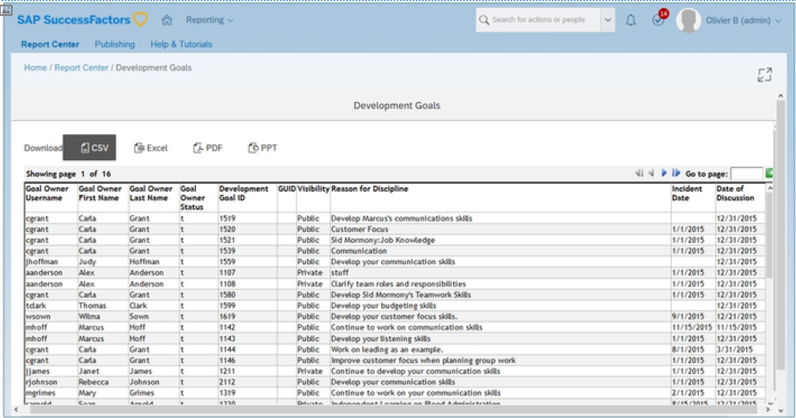
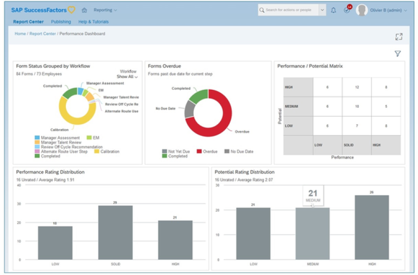
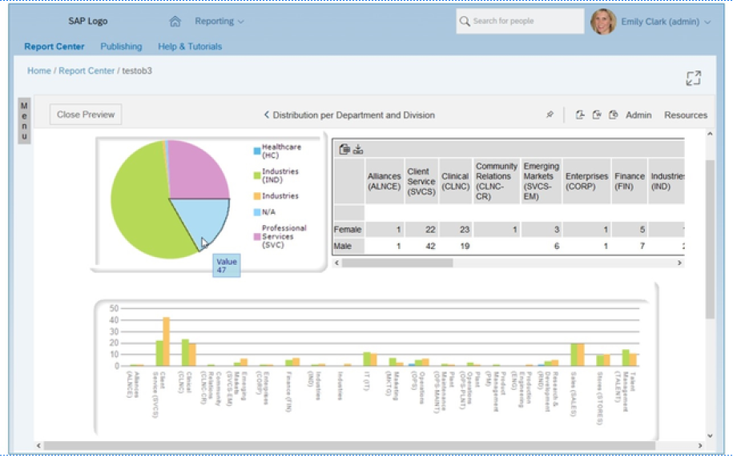
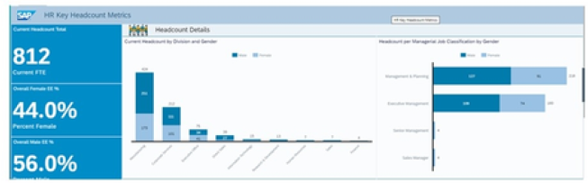
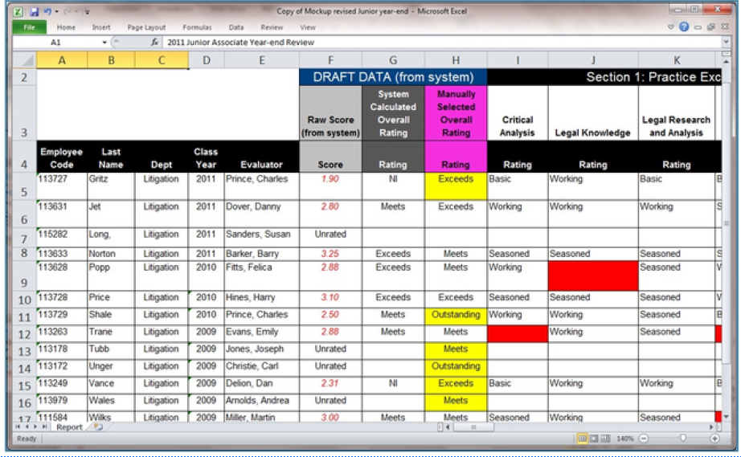
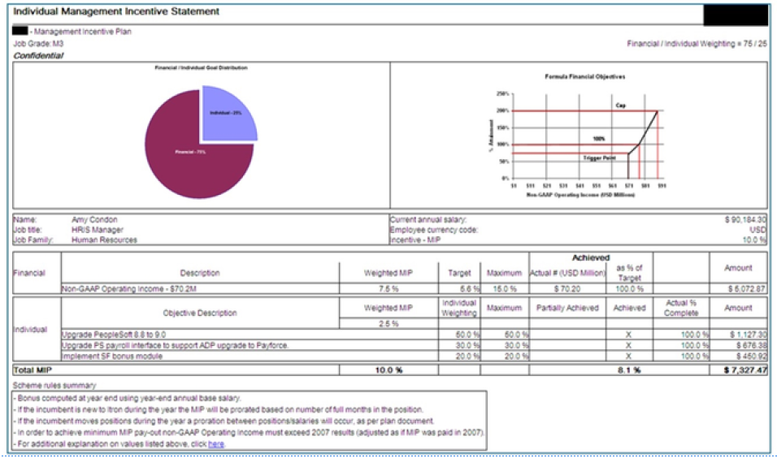
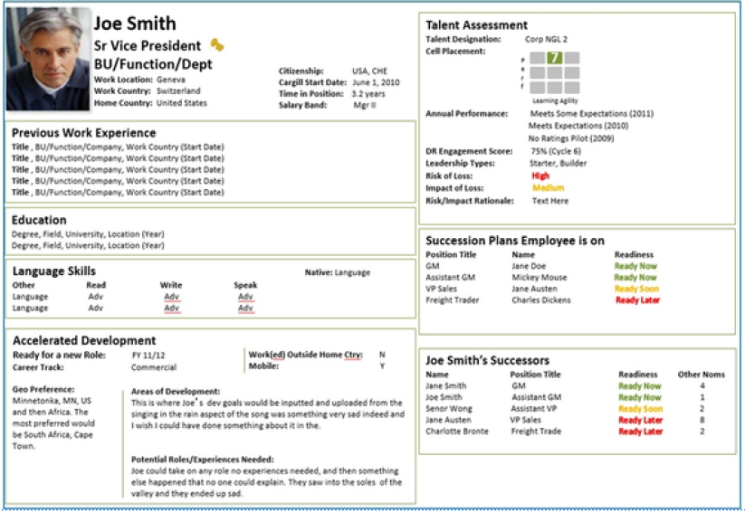

# 人员分析工具概览

[[toc]]

::: tip 本节目标

- 识别自助报告工具
- 确定自定义报表工具
:::

## 自助服务报表工具 Self Service Reporting Tools

### 表报表 Table Report

有四种主要的自助服务报表工具：

在报告中心(Report Center)之前，这被称为特别报告(Ad Hoc Reports)。

- 清单报表 List Reports

- 简单数据提取 Simple Data Extractions Excel

Excel、CSV、PDF、PPT

数据源：除LMS 和自定义MDF外的所有模块报表表用于简单的数据提取。  
Data Source: All modules excluding LMS and custom MDF The report tables are used for simple data extractions.

它们设计为极简易用，允许您从SAP SuccessFactors 模块中轻松选择数据，并将其输出到一个简单的表中。然后，可根据需要轻松导出此表。

### 仪表盘和磁贴 Dashboard & Tiles

- 在线仪表盘 Online Dashboards

- 主页磁贴 Home Page Tiles

- 跟踪关键流程 Track key processes

- 从统计图钻取至列表 Drill from chart to list

- 通过移动设备交付 Deliver on mobile

数据源：除LMS 和自定义MDF外的所有模块仪表盘和磁贴用于动态跟踪组织内的关键流程。

磁贴提供可在SAP SuccessFactors 套件中嵌入的简单图表输出。可以使用磁贴构建器向导构建磁贴，该向导指导用户完成构建可视化对象的流程。

构建磁贴时，可以自定义磁贴支持钻取至详细信息(DtD) 功能和DtD列。磁贴可以包括SAP SuccessFactors Live 数据和Workforce Analytics数据。构建后，这些磁贴可以包含在仪表盘中，嵌入到主页或洞察面板中，也可以在SAP SuccessFactors Mobile App上提供。

仪表盘提供了一种在单一位置轻松收集和可视化多个功能板块的方法。使用信息面板功能板块可以显示在一个页面上，轻松比较多个KPI（关键绩效指标）。

### 画布报告 Canvas Report

在报告中心之前，这被称为在线报告设计器。

- 可打印  
Printable

- 多页  
Multi-pages

- 已格式化  
Formatted

- 列出报表  
List reports

- 图表和图形  
Charts and graphs

- 计算所得列  
Calculated Columns

- 高级报告中的聚合计算所得列  
Aggregated calculated columns in Advanced Reporting

数据源：EC、人才、MDF和LMS  
Data Sources: EC, Talent, MDF & LMS

格式：Excel、CSV、PDF、PPT、DOC、电子邮件  
Format: Excel, CSV, PDF, PPT, DOC, Email

报表画布用于为所有模块创建可打印和可重复使用的报表。我们可以将组件轻松拖放到报表页面上。这些组件可以包括表、统计图、图像或文本。

使用这些组件，可以使用来自SAP SuccessFactors 解决方案的数据创建丰富的多页报表。其中包括实时详细报表数据、LMS 数据、EC 高级报告数据或劳动力分析度量和维度数据。

### 故事报告 Story Report

- 现代可视化  
Modern visualizations

- 实时SAP SuccessFactors 数据  
Live SAP SuccessFactors data

- 跨模块的智能连接  
Intelligent joins across modules

- 基于角色的安全访问  
Secure, role-based access

- 以人为本的数据隐私和保护  
People-centric data privacy and protection

- 画布报告的替换  
Replacement for Canvas reports

数据源：除Recruiting Marketing、Recruiting Posting、Learning、Onboarding 1.0、 Payroll 以外的所有数据源（扩展路线图）  
Data Sources: All but Recruiting Marketing, Recruiting Posting, Learning, Onboarding 1.0, Payroll (roadmap to expand)

格式：CSV、PDF、XLS  
Format: CSV, PDF, XLS

## 自定义报表工具 Custom Reporting Tools

### 由BIRT 提供支持的自定义报告 Custom Reports powered by BIRT

有三种主要的自定义报表工具：

- 可打印图表/ 表/ 列出具有自定义SQL 要求的数据透视表  
Printable chart / table / list pivot-table with custom SQL requirements

- 离线模板构建器  
Offline Template Builder

- BIRT 报表也可以由客户构建，但需要高度的技术技能  
BIRT reports can also be built by customers but require a highly technical skillse

BIRT 支持的自定义报表用于高度格式化的或复杂的可打印报表。

### 薪酬报表 Compensation Statements

- 自定义可打印薪酬报表  
Custom Printable Compensation Statement

- 报告薪酬数据/ 决策  
Report on compensation data / decision

薪酬报表用于通过薪酬决策生成凭证。

### Pixel Perfect 人才卡(PPTC)  Pixel Perfect Talent Cards (PPTC)

- 自定义可打印员工档案  
Custom Printable Employee Profile

- 经验、简历或继任计划摘要  
Summary of experience, resume or succession plan

PPTC 用于定制个人资料的外部分配或提供人才相关数据的经验汇总。

::: warning Warning
劳动力分析也被视为SAP SuccessFactors 报告工具之一。但是，它不在本文档的范围内，并且有专门的培训。THR89 是SAP SuccessFactors Workforce Analytics和计划功能顾问Academy的培训。THR96 是SAP SuccessFactors Workforce Analytics 技术顾问Academy的培训。实质上，这是用于时间趋势指标、基准和钻取层次结构的工具。
:::
