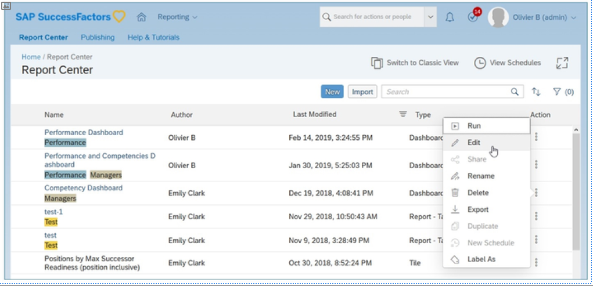
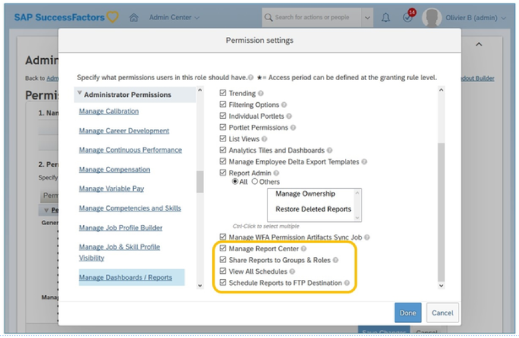
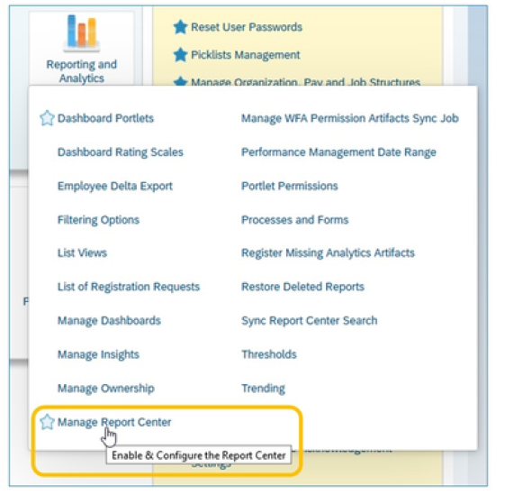
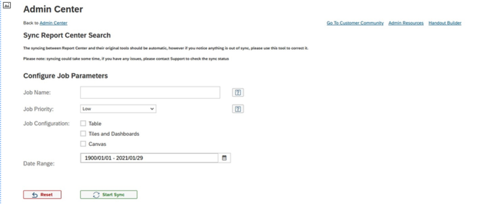
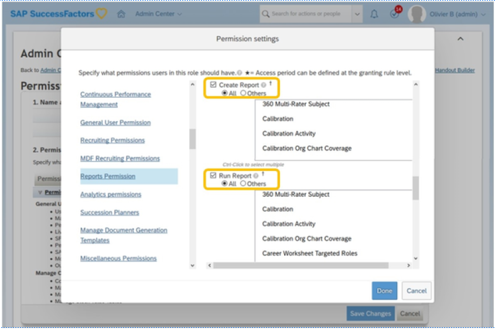
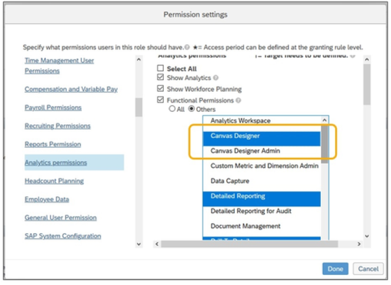
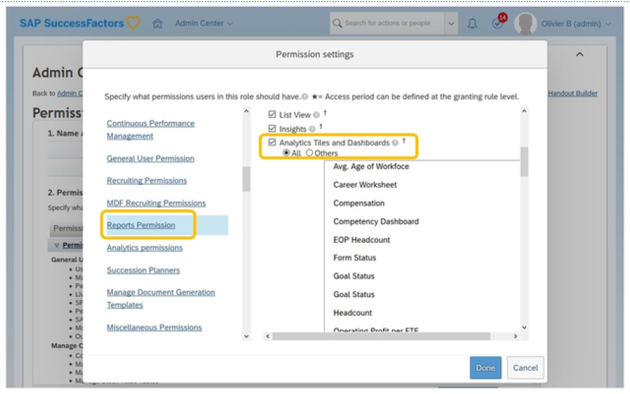

# 报表中心简介-所有其他报表工具的网关

[[toc]]

::: tip 本节目标

- 权限报表中心管理员和用户
:::

## 报表中心 Report Center

报表中心集中了来自SAP SuccessFactors 中不同分析工具的所有报表组件。这使管理员和用户可以在中央位置编辑和运行报表。它基于SAP Fiori 界面原则设计。

### 报表中心-配置检查工具 Report Center - Configuration Check Tool

报表中心配置检查确定是否：

- 报表中心已启用  
Report Center is enabled

- “报表中心搜索”已启用  
Report Center Search is enabled

- 公司分配到Solr 群集  
Company is assigned to a Solr cluster

- 报表中心正在使用Solr 进行列表  
Report Center is using Solr for listing

- 公司的Solr 集合可访问  
Solr collection for the company is accessible

## 为管理报表中心分配管理权限 Assigning Administration Permissions to Manage the Report Center

启用“报表”中心后，您可以允许管理员管理报表中心的某些方面。您可以在“管理中心”中向“管理报表中心”工具分配权限：

1. 转到“管理员中心”>“管理角色权限”  
    Go to Admin Center > Manage Role Permissions

2. 选择适当的角色  
    Select the appropriate role

3. 选择权限...  
    Choose Permission...

4. 转到管理权限/ 管理仪表盘/ 报表  
    Go to Administrative Permissions/Manage Dashboard/Reports

5. 启用以下内容：  
    Enable the following:
    - 管理报表中心- 访问管理报表中心工具。  
    Manage Report Center- access Manage Report Center tool.
    - 向组和角色共享报表- 与组和角色共享报表，而不仅仅是单个用户。  
    Share Reports to Groups & Roles - share reports with goups and roles, not just individual users.
    - 查看所有计划- 查看所有用户拥有的计划。  
    View All Schedules - view schedules owned by all users
    - 将报表计划到FTP 目标－ 计划通过FTP 传送报表。  
    Schedule Reports to FTP Destination - schedule a repor to be delivered via FTP.

### 管理报表中心 Manage Report Center

启用管理报表中心工具后，管理员可以：

- 启用报表中心搜索功能：启用报表中心中的搜索框。  
Enable Report Center Search Functionalit:yEnable search box in the Report Center.

- 使用SOLR 加载报表中心：使用SOLR 技术（搜索引擎）生成“报表中心”列表页。  
Use SOLR to load Report Cente:rUse SOLR technology (a search engine) to generate Report Center listing page.

- 显示层次结构中的标签：允许您保留在“报表中心”的“标签”视图上嵌套标签的层次结构显示，即使层次结构中的标签与报表无关。启用后，您可以在标签视图中展开每个标签，以查看关联的报表和/ 或层次结构中的下一个标签。禁用时，您只能使用相关报表展开标签。无报表的嵌套标签与层次中的下一个标签合并，直到与报表相关联的标签合并，并显示为合并路径。  
Show labels in a Hierarchical Structur:eAllows you to retain a hierarchical display of nested labels on the Labels view in Report Center, even when labels in the hierarchy aren’t associated with reports. When enabled, you expand every label in the Labels view to see the associated reports and/or the next label in the hierarchy. When disabled, you expand only the labels with associated reports. The nested labels without reports merge with the next label in the hierarchy, up to the label that's associated with reports, and appear as merged paths.

### 报表中心搜索未返回所有费用报表 Report Center Search not Returning all Reports

不同类型报表和报表中心搜索的同步应自动进行。但是，如果搜索未返回预期结果，管理员可以手动将报表信息同步到已使用同步报表中心搜索工具设置的搜索资源库中。

此工具在Admin Center > Reporting and Analytics > Sync Report Center Search”中可用。

::: warning Note
同步可能需要一些时间，如果您有任何问题，请联系支持部门以检查同步状态。
:::

### 将用户访问权限分配到报表中心 Assigning User Access to the Report Center

配置“报表中心”的最后一步是确定谁需要访问报表中心工具并分配权限。在线创建或查看报表的用户需要访问报表中心。
确定相应员工后，将相应的RBP 权限分配给角色：

1. 转到管理员中心→ 管理角色权限  
Go to Admin Center Manage Role Permissions

2. 选择适当的角色  
Select the appropriate role

3. 选择权限...  
Choose Permission...

4. 在“用户权限”下，转到“报表权限”  
Under User Permissions, go to Reports Permission

5. 启用相应的权限：  
    Enable the appropriate permissions:

    1. 报表中心：启用对报表中心页面的访问。  
    Report Center: enable access to the report center page.

    2. 计划报表：允许用户在其报表上创建和管理计划。  
    Schedule Reports: enable a user to create and manage schedules on their reports. Understanding the Report Center Permission

### 了解报表中心权限 Understanding the Report Center Permission

报表中心尊重报表工具的RBP 权限。

报表中心具有以下工具特定要求：

- 画布报表（以前来自联机报表设计器）：  
    Canvas Reports (previously from Online Report Designer):

    1. 报表将根据报表的共享状态在“报表中心”中可见。  
    Reports will be visible in the Report Center based on the sharing status of a report.

    2. 用户必须是报表所有者或具有“画布设计者管理员”权限才能编辑或共享报表。  
    User must be the Report Owner or have the Canvas Designer Admin permission to edit or share the report.

- 功能板块和信息面板：  
    Tiles and Dashboards:  
    用户必须具有管理员权限>管理数据中心/ 报表>分析功能板块和信息面板权限才能编辑拼贴和仪表盘，并共享仪表盘。  
    User must have Administrator Permissions > Manage Dashboards / Reports > Analytics Tiles and Dashboards permission to edit tiles and dashboards and to share dashboards.

- 表格报表（以前来自特别报表）。  
    Table Reports (previously from Ad Hoc Report).  
    用户必须是“报表所有者”或具有“报表管理 - 访问所有报表”权限才能编辑或共享报表。  
    The user must be the Report Owner or have the Report Admin - Access All Report permission to edit or share reports.

- 故事报表  
Story Reports  
  - 用户必须是报表所有者，使报表与“编辑”访问权限共享，或者具有“故事管理员”权限才能编辑报表。
  - 用户必须是报表所有者，拥有通过“完全”访问权限共享的报表，或者具有“故事管理员”权限才能共享报表。

### 分配附加用户权限 Assigning Additional User Permissions

您可以为用户分配创建和运行不同SAP SuccessFactors 报表类型的功能。要为用户分配在所有或特定模块（也称为报表域）上创建和/ 或运行报表的功能：

1. 使用“操作搜索”导航到“管理权限角色”  
Use the Action Search to navigate to Manage Permission Roles

2. 选择权限角色  
Select the Permission Role

3. 单击权限  
Click Permission

4. 转到 “用户权限”→ “报表权限”  
Go to User Permissions Reports Permission

5. 选择相应权限：  
    Select the appropriate permission:

    1. 要允许创建新报表，请选择 “创建报表”，然后选择要基于其创建报表的模块  
    To allow creating new reports, select Create Report and select the modules based on which you want to create reports

    2. 要允许运行报表，请选择“运行报表”并选择要运行报表的模块  
    To allow running reports, select Run Report and select the modules based on which you want to run reports

6. 单击完成  
Click Done

如果选择特定域，例如“薪酬计划”，如果在“人员”部分中选择“其他过滤器”，您将看到基于 RBP目标群体的薪酬详细信息数据。

### 画布报表权限 Canvas Report Permissions

要为用户分配创建和/ 或运行画布报表类型的功能：

1. 使用“操作搜索”导航到“管理权限角色”  
Use the Action Search to navigate to Manage Permission Roles

2. 选择权限角色  
Select the Permission Role

3. 单击权限  
Click Permission

4. 转到用户权限分析权限  
Go to User Permissions Analytics Permission

5. 选择相应权限：  
Select the appropriate permission:

    1. 画布设计器：允许用户创建新报表并运行报表。  
    Canvas Designer:allow the user to create a new report and run the report.

    2. 画布设计器管理员：向用户分配管理员权限，以便他们可以编辑、删除、复制、共享、标签和导出画布报表。  
    Canvas Designer Admina: ssign Admin permissions to the user so that they can edit, delete, copy, share, label, and export the Canvas Report.

6. 单击完成  
Click Done

### 分析功能板块和信息面板权限 Analytics Tiles and Dashboards Permission

要为用户分配运行功能功能和“标准信息面板”报表类型：

1. 使用“操作搜索”导航到“管理权限角色”  
Use the Action Search to navigate to Manage Permission Roles

2. 选择权限角色  
Select the Permission Role

3. 单击权限  
Click Permission

4. 转到用户权限分析权限  
Go to User Permissions Analytics Permission

5. 启用分析功能板块和信息面板- 允许用户运行所有或特定功能板块和标准仪表盘  
Enable Analytics Tiles and Dashboards - to allow a user to run all or certain tiles and standard dashboards

6. 单击完成  
Click Done

::: warning Note
查看HR882 – SAP SuccessFactors People Analytics：报表和管理，获取详细权限矩阵，以在“报表中心”中创建和管理不同的报表。
:::

### :tada:练习一 报表中心权限 Report Center Permission

Give the necessary permissions to use the Report Center.

1. Give your administrator role the permission to use reporting.
    1. From the Action Search go to Manage Permission Roles
    2. Open your administrator role and click on Permission...
    3. Go to the category Reports Permissions and click on Select All
    4. Verify that in the list you have Report Center and Schedule Reports
    5. Go to the category Manage Dashboard /Reports and click on Select All
    6. Click Done and Save Changes

2. Create a manager role and give them the ability to run reports and to access the Report Center
    1. In Manage Permission Roles, click on Create New.
    2. The role name is All Managers
    3. Click on Permissions… and click on Report Permissions
    4. Select the following options: 
        - Report Center
        - Schedule Reports
        - Run Report
        Make sure that the radio button is selected for *all* domains
    5. Click on General User Permission and select User Login. Note that this permission is generally given to the all employee role and it is needed to run reports.
    6. Click Done.
    7. Add the granting by clicking on the button Add…
    8. Grant this role to Managers.
    9. To specify the target population, make sure that you have the radio button for Granted User’s Direct Reports.
    10. Select the check box to Exclude Granted User from having the permission access to him/herself.
    11. Click Done and Save Changes
    12. Log out and go back to your instance.
    