# 使用报表中心

[[toc]]

::: tip 本节目标

- 描述报表中心的功能
:::

## 报表中心的应用程序 Application of Report Center

### 报表中心概述 Report Center Overview

报表中心是用于运行和编辑报表的一站式商店。它是报表构建器工具的合并。它基于使用SAP Fiori 在UI5 中构建的新界面。使用SuccessFactors 发布计划向报表中心添加其他功能。

### 访问报表中心 Accessing the Report Center

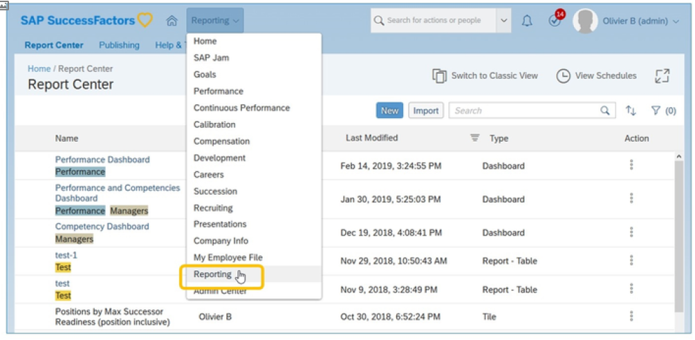

要访问报表中心，请在主导航菜单上选择报表。如果尚未启用“报表中心”并授予用户权限，则他们无法访问“报表中心”。

### 报表类型 Report Types

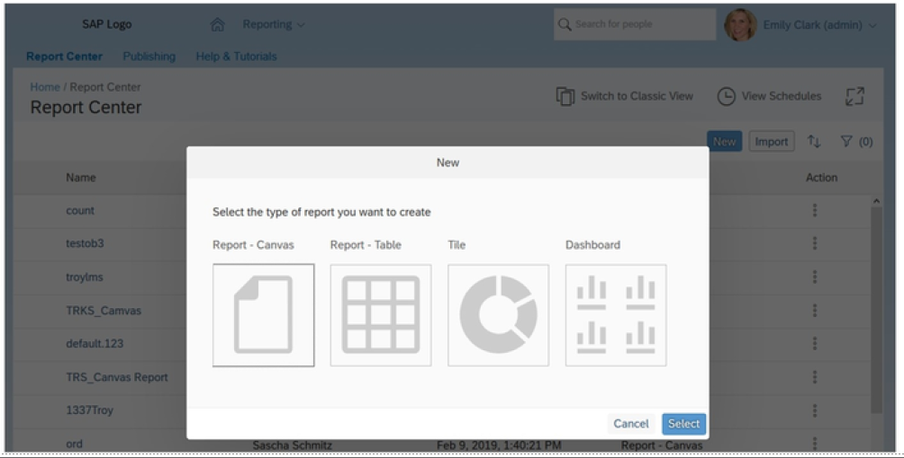

可以从“报表中心”直接构建报表，提供多种不同的报表格式，使您可以根据需要构建报表。每种格式都提供了一组独特的功能，具体取决于要构建的报表类型。

报表中心对报表中心之前存在的报表解决方案的术语进行了重新分类。 以下列表包含当前报表类型名称，后跟在启用报表中心之前的类型名称：

- Table Report = Ad Hoc Report
- Custom Report = Ad Hoc Report with a custom template
- Canvas Report = Online Report Designer Report
- Tile = Tile
- Dashboard = Dashboard

::: warning Note
您仍然可以找到参考先前报表类型的文档。
:::

### 旧版报表 Legacy Reports

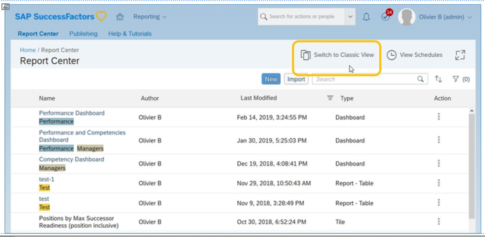

原有报表包括：

- 列表视图  List Views
- 焦点视图  Spotlight Views
- 分类报表  Classing Reporting
- 电子表格报表  Spreadsheet Reports

使用“报表中心”中的 切换到经典视图按钮可以找到这些过时报表临时报表。

### 报表中心导航 Report Center Navigation

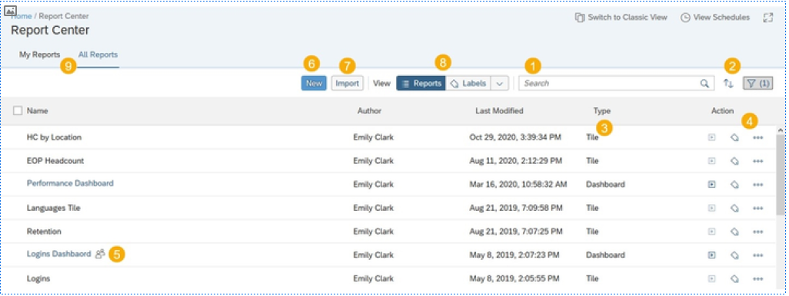

报表中心具有上图中显示的多个主要区域：

1. 搜索  
Search

2. 过滤和排序报表： 过滤器在登录之间是持久的，数量表示启用的过滤器类型（类型、作者、上次修改、标签）的数量。  
Filter and Sort reports: Filters are persistent between logins and the number indicates how many types of filters (Type, Author, Last Modified, Labels) are enabled.

3. 报表类型；画布报表、表报表、功能板块、仪表盘、自定义报表、故事报表。  
Report types; Canvas Report, Table Report, Tile, Dashboard, Custom Report, Story Report.

4. 执行操作： 操作菜单、 标签为和运行。操作描述如下。  
Perform an action: The Action Menu, Label As, and Run. The actions are described below.

5. 共享标识：人员图标表示报表已共享。  
Share indicator: The people icon represents the report is shared.

6. 创建新报表  
Create new reports

7. 导入报表定义：选择要导入的报表定义。  
Import report definition: Select a report definition for import.

8. 查看标签或报表：将报表显示为列表或按标签分组  
View Labels or Reports: Displays Reports as a List or grouped by Labels

9. 视图： 我的报表显示由您撰写或与您共享的报表。所有报表显示所有报表。只有您是报表管理员时，报表视图才可见。  
Views: My Reports displays reports authored by you or shared with you. All Reports displays all reports. The report views are only visible when you are a Report Administrator.

### 搜索报表 Search A Report

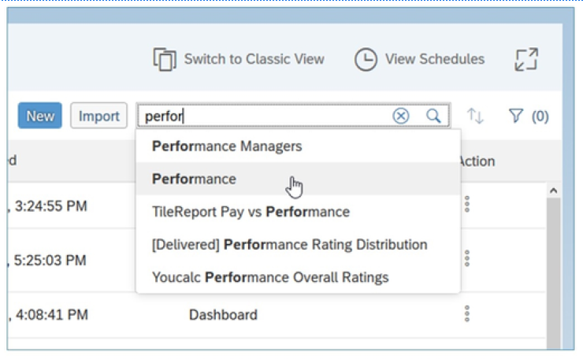

可以全屏模式查看“报表中心”窗口（这将从页面中删除页眉和页脚），并将动态响应浏览器大小。

您可以按报表或作者姓名搜索报表。搜索字段使用自动完成功能。

### 自定义标签 Custom Labels

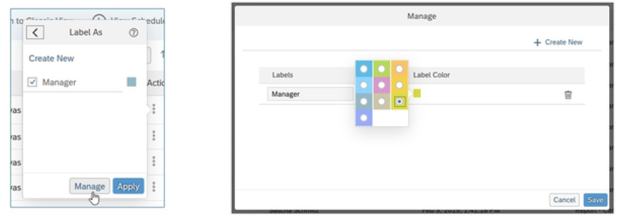

可将自定义标签添加到“报表中心”中的报表。

允许使用自定义标签提供了一种在“报表中心”内组织报表的方法。这有助于用户查找他们正在查找的报表，并对通用报表进行分组。

#### 标签分组/嵌套和报表中心视图 Label Grouping / Nesting and Report Center Views

使用报表中心时，您可以通过两个视图（ 报表和标签）查看报表。

- “报表”标签使您能够以清单格式查看报表。  
The Reports tab allows you to view reports in a list format.

- 标签选项卡使您能够以清单格式查看标签，其中报表分组在标签下。与任何标签都无关的报表分组在未标记下。  
The Labels tab allows you to view labels in a list format where the reports are grouped underlabels. The reports that are not associated with any labels are grouped under Unlabeled.

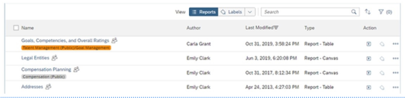

报表（正式为平面）在报表名称下显示标签。

您可以在“报表中心”中选择视图。在 “报表”视图中，标签显示在平面报表列表中的相应报表标题下方。单击标签将筛选出该标签

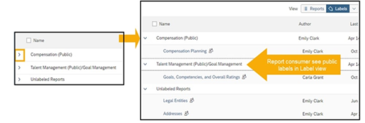

标签”视图（正式分组）显示可以展开/折叠的公共标签和私有标签。启用“标签”视图时，“报表中心”将显示公共标签和报表用户的私有标签。如果用户无权访问的任何报表，则该标签将不会显示。没有标签的报表将显示在“未标记的报表”中。

::: warning Note
报表管理员可以在管理报表中心中启用设置在层次结构中显示标签。启用后，即使层次中的标签与报表无关，嵌套标签也会按层次顺序显示。您可以在标签视图中展开 每个标签，以查看层次结构中的相关报表和/ 或下一个标签。
:::

### 排序和过滤 Sorting and Filtering

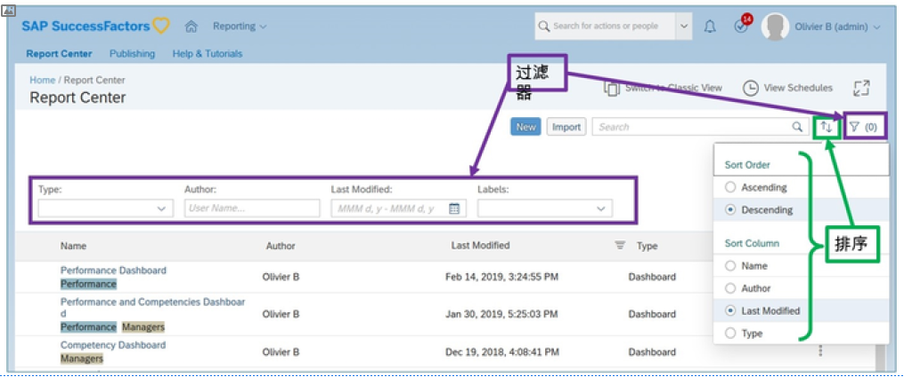

报表中心用户可以按作者、修改日期、标签或类型筛选报表列表。在更改或清除之前，此筛选器设置将在登录/ 注销会话中保持“粘性”。过滤器图标将指示当前应用的过滤器选项数。结果可以按报表名称、作者、修改日期或类型排序。

### 创建新报表 Creating New Reports

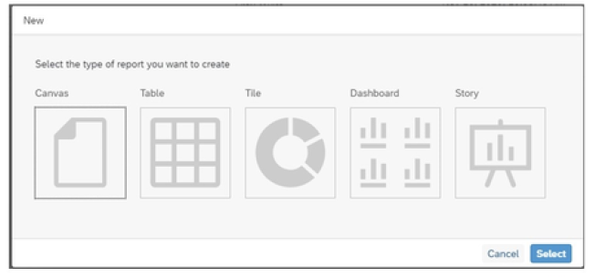

通过报表中心创建报表有助于在一个位置进行报表管理，包括查找、管理和创建报表。要创建新报表：

1. 转到报表中心>新建  
Go to Report Center > New

2. 选择适当的模板（画布、表、磁贴、仪表盘或故事）  
Select an appropriate template (Canvas, Table, Tile, Dashboard, or Story)

3.单击选择  
Click Select

::: warning Note
有关如何创建不同报表类型的详细信息，请参阅HR882 SAP SuccessFactors People Analytics：报表和管理。请参阅相应部分。
:::

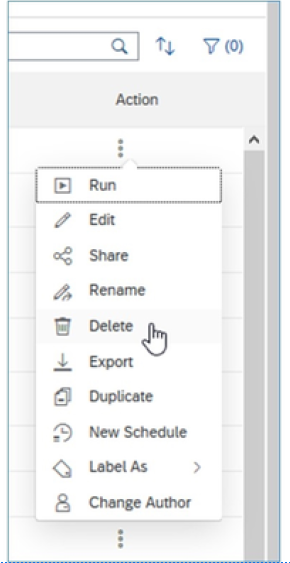

报表中心操作菜单允许用户：

- 运行报表 Run the report
- 编辑报表 Edit the report
- 与其他用户共享 Share with other users
- 重命名报表 Rename a report
- 删除单个报表 Delete an individual report
- 导出报表 Export a report
- 复制报表 Duplicate a report
- 计划报表 Schedule a Report
- 向报表分配标签 Assign Labels to a report
- 更改作者 Change Author

::: warning Note
权限和报表类型可能会阻止所有操作选项在报表中可用。
:::

您可以使用报表中心从运行和编辑报表。无法从报表中心运行磁贴，而是应查看部署这些磁贴的位置：主页、移动设备或仪表盘。

链接到“创建表格报表(Create a table report)”视频：<https://sapvideoa35699dc5.hana.ondemand.com/?entry_id=1_xiyk698>

“共享表格报表(Share the table report)”视频链接：<https://sapvideoa35699dc5.hana.ondemand.com/?entry_id=1_zqwoyxtk>

### 导出多个报表 Exporting Multiple Reports

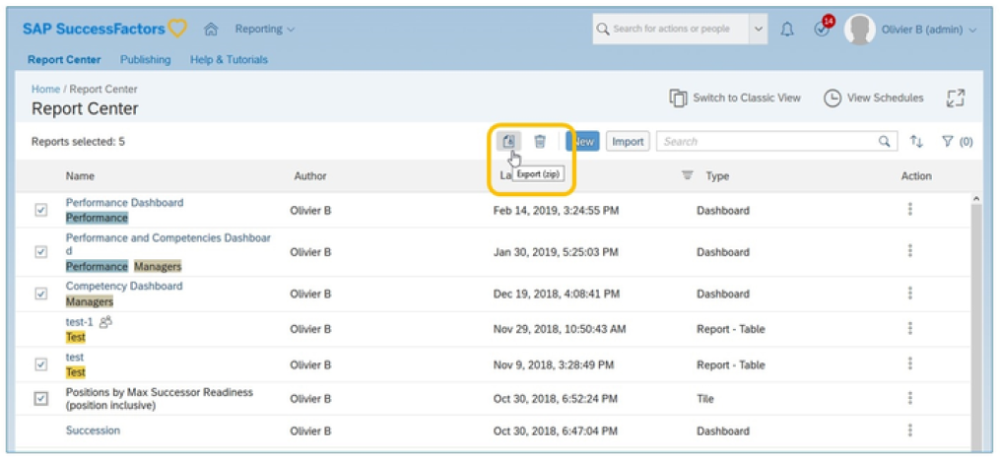

具有导出报表权限的报表管理员可以通过单击每个报表名称左侧的复选框，然后单击导出图标来选择和导出多个报表。

最多可同时将 50 个报表导出到单个zip 文件。这在跨实例传输报表时非常有用。

### 删除多个报表 Deleting Multiple Reports

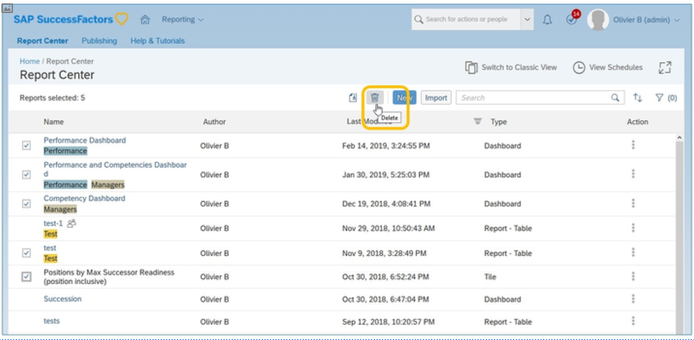

具有删除报表权限的报表管理员可以通过单击每个报表名称左侧的复选框，然后单击删除图标来选择和删除多个报表。

### 共享报表 Sharing Reports

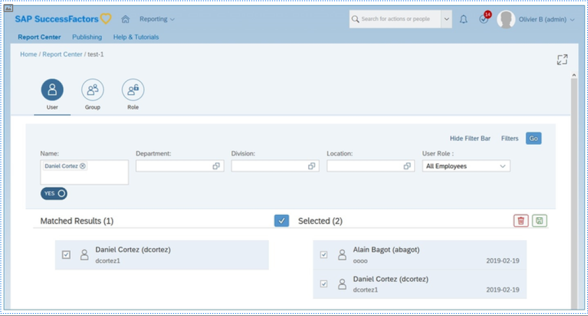

用户可以从“报表中心”与“用户”、“RBP 角色”、“组”和“动态组”共享报表。

如果你有权编辑表或画布报表，则 “共享”操作将处于活动状态。故事报表要求与用户完全访问共享报表，或者是报表的所有者。查找并选择要与其共享报表的单个用户。

#### 与组共享报表 Sharing Report With Groups

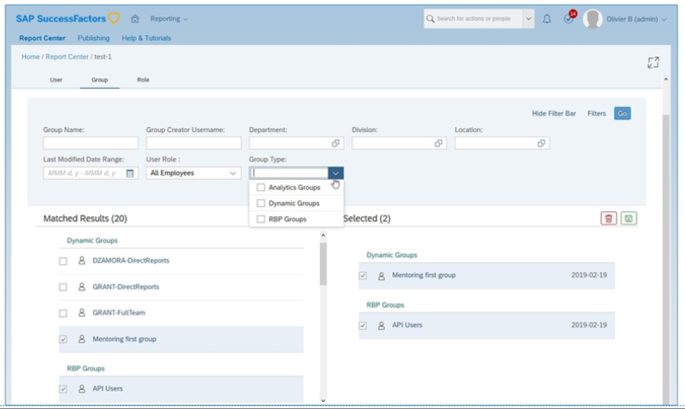

查找并选择要与其共享报表的RBP 组或动态组。

您需要 “向组和角色共享报表(Share Reports to Groups & Roles)”权限才能与组共享报表。

#### 与角色共享报表  Sharing Report With Roles

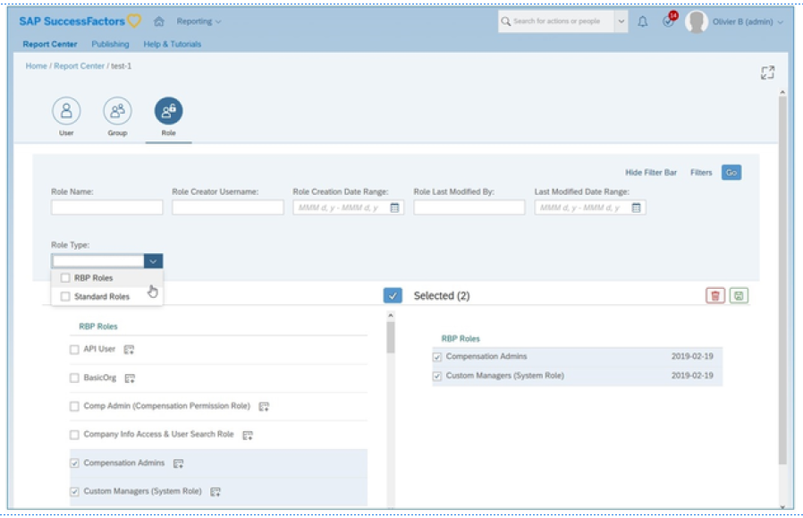

要与角色共享，请查找并选择RBP 角色以共享报表。 您需要 “向组和角色共享报表”权限才能与组共享报表。

### 计划报表 Scheduling Reports

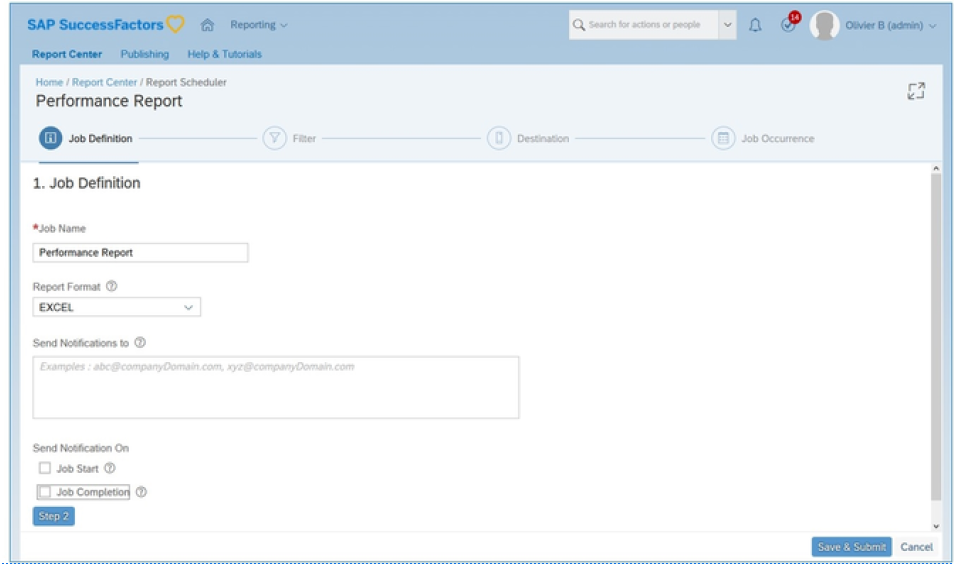

离线计划数据密集型报表，以便稍后下载或发送到SFTP （安全文件传输协议）站点。用户必须具有计划报表的权限。只有具有 “将报表计划到 FTP 目标(Schedule Reports to FTP Destination)”权限的用户才能计划将报表发送到FTP。

要计划报表：

1. 从“操作”菜单转到“新建计划”。  
    Go to New Schedule from Action menu.

2. 在作业定义标签上填写所需详细信息。  
    Fill the required details on Job Definition tab.

    1. 输入作业名称。  
    Enter the Job Name.

    2. 选择报表格式。  
    Select the Report Format.

    3. 输入要发送通知的电子邮件地址。这些电子邮件地址不会收到生成的计划报表。您可以选择在作业开始或作业完成时发送通知。  
    Enter the e-mail addresses you want to send notifications. These e-mail addresses do not receive the resulting scheduled report.You can choose to send notifications on Job Start or Job Completion.

3. 在 “过滤器”选项卡上，为报表设置过滤器。  
    On Filter tab, set the filters for the report.

4. 在 “目标”选项卡上，选择 “脱机”以稍后从 “查看计划”部分下载报表，或计划将报表发送到文件传输协议（FTP）。  
    On Destination tab, select either Offline to download the report later from the View Schedules section or schedule a report to be sent to File Transfer Protocol (FTP).

#### 目标SFTP ，在计划上配置SFTP Destination SFTP, configuring SFTP on a Schedule

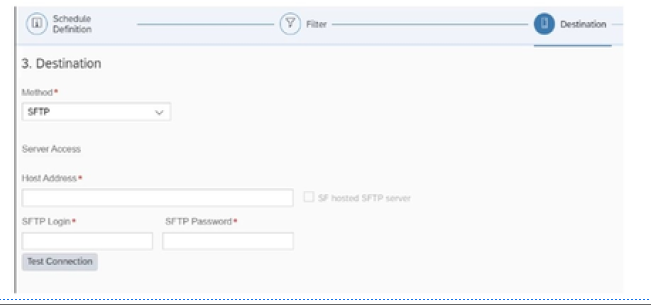

选择安全文件传输协议(SFTP) 作为目标后。

1. 输入主机地址、 SFTP 登录和SFTP 密码。  
Enter the Host Address, SFTP Login, and SFTP password.

2. 输入导入或导出文件所在的文件路径。  
Enter the File Path where the import or export file is located.

3. 输入扩展名为的 “文件名”，例如 New_Report.xlsx，然后选择表报表的 “日期格式”。  
Enter the File Name with extension, for example, New_Report.xlsx, and select the Date Format for table reports.

::: warning Note
对于画布报表，输入 “文件夹名称”。日期格式不可用。
:::

### 作业发生 Job Occurrence

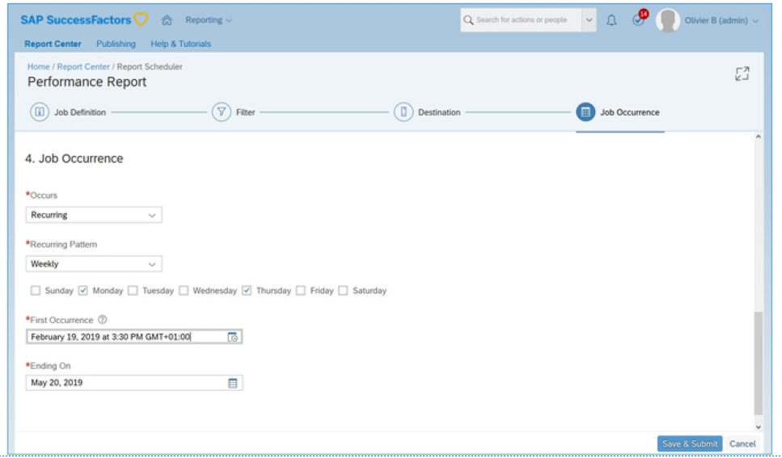

在 “作业发生”选项卡上，选择报表应运行的频率以及报表的首次计划出现次数。作业会在每次出现的指定时间运行。

### 查看计划 View Schedule

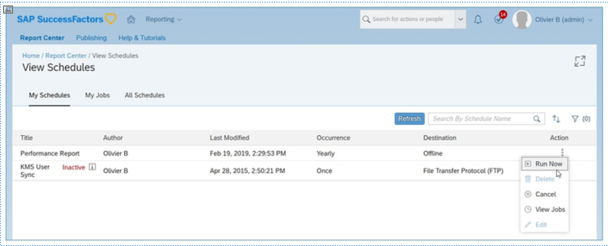

在查看日程表页面上，查看您已设置的日程表和正在运行的作业。您可以在操作菜单中执行以下操作：

- 运行计划 Run the schedule
- 删除计划 Delete the schedule
- 取消作业以使其处于非活动状态 Cancel the job to make it inactive
- 查看单个计划的作业 View jobs for an individual schedule
- 编辑计划 Edit the schedule

“查看计划”有多个视图可供用户使用：

- 我的计划：列出您设置的所有计划。  
My Schedules:Lists all the schedules set up by you.

- 我的作业：根据您在创建计划时设置的作业发生次数列出所有作业。从“操作”菜单中，您可以查看“作业详细信息”或下载报表。  
My Jobs:Lists all the job based on the job occurrence set by you when creating a schedule. From Action menu, you can see the Job Details or download the report.

- 所有计划：列出实例中的所有计划。  
All Schedules:Lists all schedules in your instance.

计划重要信息：

- 现有配置计划（激活报表中心之前）将在“报表中心”中可用。  
Existing Provisioning schedules (before activation of Report Center) will be available in Report Center.

- 现有报表发放人计划在“报表中心”中不可用。  
Existing Report Distributor schedules will not be available in Report Center.

- 新创建的报表中心计划将不会显示在报表分配器中。  
Newly created Report Center schedules will not appear in Report Distributor.
